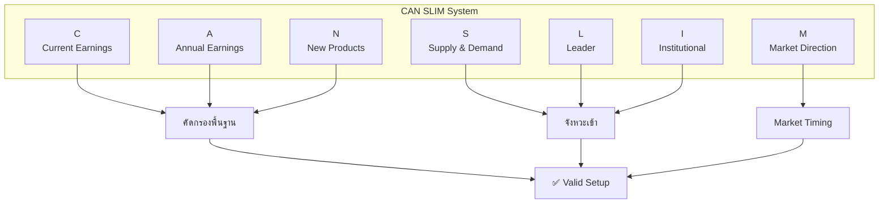
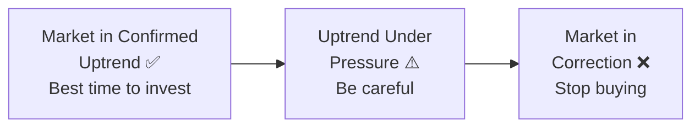
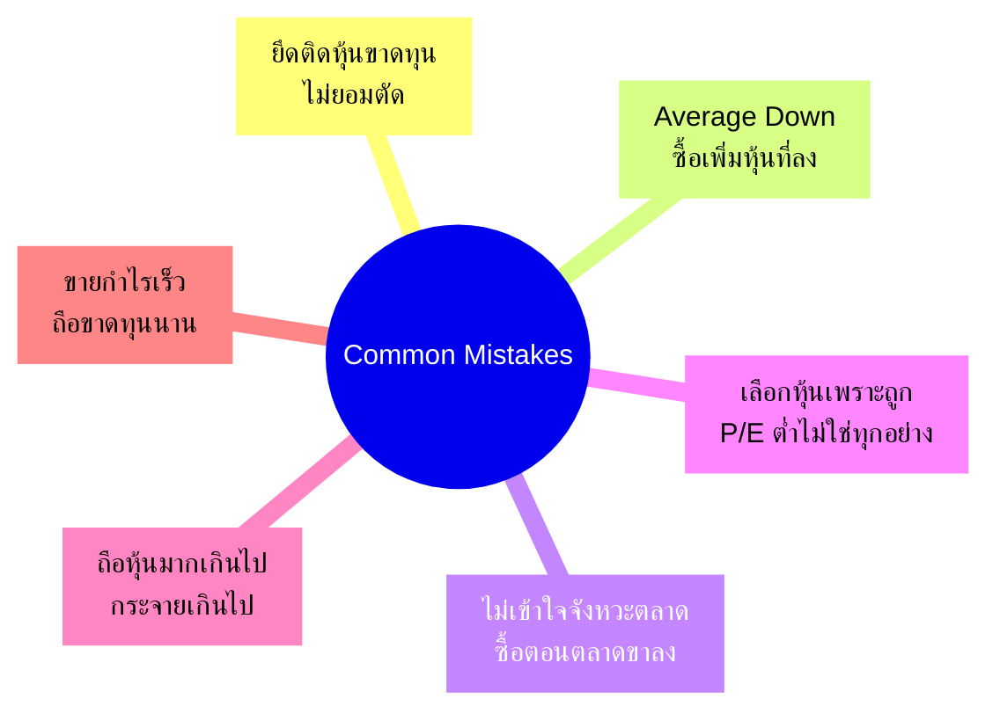

# CAN SLIM - The 7-Point Growth Stock System

> **"Buy stocks that show strong earnings growth and are being accumulated by institutional investors, just as they break out of sound base patterns on heavy volume."**
> — William J. O'Neil, *How to Make Money in Stocks*

---

## 🎯 Executive Summary

**CAN SLIM** = กลยุทธ์การลงทุนในหุ้นเติบโต 7 ขั้นตอนที่ได้รับการพิสูจน์แล้วจากการศึกษาหุ้นชั้นนำกว่า 500 ตัว ตั้งแต่ปี 1880-2009

| Element | Description |
|:---|:---|
| **Creator** | William J. O'Neil (Founder, Investor's Business Daily) |
| **Track Record** | Proven system from 1880-2009 study |
| **Best Period** | 1998-2009: Best performing strategy per AAII |
| **Focus** | Growth stocks with momentum |
| **Key Edge** | Fundamental + Technical combination |
| **Core Rule** | Cut losses at 7-8% |

### ทำไมต้องอ่าน

> **O'Neil ไม่ได้สร้างระบบจากทฤษฎีในห้องเรียน แต่มาจากการศึกษากราฟหุ้นหลายพันตัวด้วยมือ ทดสอบจริงในตลาด และนำไปใช้สร้างความมั่งคั่งจริง**

CAN SLIM ถูกยกย่องว่าเป็น **กลยุทธ์ลงทุนที่ให้ผลตอบแทนดีที่สุดระหว่างปี 1998-2009** โดย American Association of Individual Investors

---

## 🔤 CAN SLIM: 7 หลักการสำคัญ

### ภาพรวมระบบ



---

## 📊 C = Current Quarterly Earnings (กำไรรายไตรมาสปัจจุบัน)

### แนวคิดหลัก

> **[[กำไรต่อหุ้น]] (EPS) ในไตรมาสล่าสุดควรเพิ่มขึ้นอย่างน้อย 25%** เมื่อเทียบกับไตรมาสเดียวกันของปีก่อน

หากกำไรเร่งตัวขึ้นในหลายไตรมาสติดต่อกัน ยิ่งเป็นสัญญาณดี

### ประเด็นสำคัญ

> [!INFO] Key Statistics
> - หุ้นที่ทำผลงานโดดเด่นมีกำไรเพิ่มขึ้นเฉลี่ย **70%** ก่อนที่ราคาจะพุ่งขึ้นอย่างมาก
> - ไม่เพียงมองแค่ 25% ควรมองหาบริษัทที่มีการเติบโตของกำไร **50%, 100%** หรือสูงกว่านั้น
> - เปรียบเทียบกับคู่แข่งในอุตสาหกรรม - บริษัทที่เติบโตเร็วกว่าคู่แข่งมักเป็นผู้นำตลาด
> - **กำไรต้องมาจากการดำเนินงานจริง** ไม่ใช่จากการขายสินทรัพย์หรือเล่นบัญชี

### ตัวอย่าง

**Priceline.com:** เพิ่มกำไรจาก 96 เซนต์เป็น 2.03 ดอลลาร์ต่อหุ้นระหว่างปี 2004-2006 → ราคาหุ้นพุ่งขึ้น 3 เท่าในอีก 5 ไตรมาสถัดมา

### 🔑 Key Quote

> **"ไม่มีเหตุผลที่หุ้นจะขึ้นถ้ากำไรในไตรมาสปัจจุบันแย่ ทำไมต้องยอมรับกำไรที่พอใช้ ในเมื่อหุ้นที่ดีที่สุดมีกำไรเพิ่มขึ้นมากก่อนราคาจะพุ่ง"**

---

## 📈 A = Annual Earnings Growth (การเติบโตของกำไรรายปี)

### แนวคิดหลัก

> **กำไรรายปีควรเพิ่มขึ้นอย่างน้อย 25%** หรือมากกว่าในช่วง 3-5 ปีที่ผ่านมา โดยกำไรต่อหุ้นรายปีควรเพิ่มขึ้นทุกปีอย่างต่อเนื่อง

### ประเด็นสำคัญ

> [!IMPORTANT] Annual Growth Requirements
> - หุ้นที่ทำผลงานโดดเด่นมีอัตราการเติบโตของกำไรเฉลี่ย **24%** ต่อปีในช่วง 5 ปีก่อนหน้า
> - กำไรต้องเพิ่มขึ้นอย่างสม่ำเสมออย่างน้อย **3 ปีติดต่อกัน**
> - **ROE (Return on Equity)** ควรอยู่ในระดับสูง แสดงถึงการใช้ทุนอย่างมีประสิทธิภาพ
> - ดูทั้งการเติบโตของยอดขายและกำไร ไม่ใช่แค่กำไรอย่างเดียว

### ตัวอย่างประวัติศาสตร์

| หุ้น | Annual Growth | Result |
|:---|:-:|:---|
| **Xerox** | 32% ต่อปี | พุ่ง 700% (1963-1966) |
| **Wal-Mart** | 43% ต่อปีอย่างต่อเนื่อง | พุ่ง 11,200% (1977-1990) |

---

## 🆕 N = New (สิ่งใหม่)

### แนวคิดหลัก

> **บริษัทควรมี "สิ่งใหม่" ที่มีผลบวกต่อบริษัท** ไม่ว่าจะเป็นผลิตภัณฑ์ใหม่ บริการใหม่ ผู้บริหารใหม่ การเปลี่ยนแปลงในอุตสาหกรรม หรือราคาหุ้นทำจุดสูงสุดใหม่

### ประเด็นสำคัญ

> [!TIP] What Counts as "New"
> - "สิ่งใหม่" เป็นตัวขับเคลื่อนการเติบโตและดึงดูดความสนใจของนักลงทุน
> - **ผลิตภัณฑ์หรือบริการใหม่** ที่สร้างความต้องการในตลาด
> - **ผู้บริหารใหม่** ที่มีวิสัยทัศน์นำการเปลี่ยนแปลงสู่องค์กร
> - การเข้าสู่ตลาดใหม่หรือการขยายธุรกิจ
> - **การทำจุดสูงสุดใหม่หลังจากพักฐาน (base)** อย่างน้อย 7 สัปดาห์ - เป็นจุด "buy point" ที่สำคัญ

### ทำไมสำคัญ

> นวัตกรรมและการเปลี่ยนแปลงสร้างโอกาสในการเติบโตแบบก้าวกระโดด และดึงดูดสถาบันการเงินเข้ามาลงทุน

---

## 📊 S = Supply and Demand (อุปสงค์และอุปทาน + Volume)

### แนวคิดหลัก

> **ควรเลือกหุ้นที่มีจำนวนหุ้นที่ออกจำหน่ายไม่มากเกินไป และมีความต้องการซื้อที่แข็งแกร่ง** โดยเฉพาะจากสถาบัน

### ประเด็นสำคัญ

> [!INFO] Supply & Demand Rules
> - O'Neil แนะนำให้เลือกหุ้นที่มี **market cap ต่ำกว่า 25 ล้านหุ้น** (หุ้นขนาดเล็ก-กลางมักมีศักยภาพเติบโตสูงกว่า)
> - **ดูปริมาณการซื้อขาย (Volume)** - ปริมาณที่เพิ่มขึ้นแสดงถึงความสนใจของสถาบัน
> - เฝ้าดู **Accumulation/Distribution Rating** - ตัวชี้วัดว่ามีสถาบันกำลังสะสมหุ้นหรือไม่
> - หุ้นที่มีหุ้นลอยน้อย เมื่อมีความต้องการเพิ่มขึ้น ราคามักจะพุ่งได้เร็ว

### สัญญาณที่ต้องระวัง

| ⚠️ สัญญาณเตือน | คำอธิบาย |
|:---|:---|
| **Dilution** | การออกหุ้นเพิ่มทุนจำนวนมาก |
| **Volume ลดลง** | ปริมาณการซื้อขายลดลงอย่างต่อเนื่อง |
| **Insider Selling** | ผู้บริหารขายหุ้นจำนวนมาก |

---

## 👑 L = Leader or Laggard (ผู้นำหรือผู้ตาม)

### แนวคิดหลัก

> **ลงทุนในหุ้นผู้นำของอุตสาหกรรม** - หลีกเลี่ยงหุ้นผู้ตามและอุตสาหกรรมที่อ่อนแอ

### ประเด็นสำคัญ

> [!IMPORTANT] How to Find Leaders
> - ใช้ **Relative Strength (RS) Rating** วัดความแข็งแกร่งของราคาหุ้นเทียบกับตลาดในช่วง 12 เดือน
> - O'Neil แนะนำให้เลือกหุ้นที่มี **RS Rating อย่างน้อย 80-90**
> - หุ้นผู้นำมักมี:
>   - การเติบโตของกำไรสูงกว่าคู่แข่ง
>   - ส่วนแบ่งตลาดเพิ่มขึ้น
>   - ผลิตภัณฑ์/บริการที่เหนือกว่า
>   - การจัดการที่แข็งแกร่ง

### กฎสำคัญ

> [!WARNING] Don't Buy Laggards!
> - อย่าซื้อหุ้นผู้ตามเพียงเพราะ **"ถูกกว่า"** - ถูกมักมีเหตุผล
> - เมื่ออุตสาหกรรมฟื้นตัว หุ้นผู้นำมักจะเด้งแรงกว่าผู้ตาม **2-3 เท่า**

---

## 🏛️ I = Institutional Sponsorship (การถือหุ้นของสถาบัน)

### แนวคิดหลัก

> **หุ้นควรมีการถือหุ้นจากสถาบันที่มีคุณภาพ** โดยเฉพาะการถือหุ้นที่เพิ่มขึ้นในไตรมาสล่าสุด

### ประเด็นสำคัญ

> [!INFO] Institutional Sponsorship Guidelines
> - สถาบัน (กองทุน ธนาคาร บริษัทประกัน) มีเงินจำนวนมากที่จะขับเคลื่อนราคาหุ้น
> - ดูจำนวนสถาบันที่ถือหุ้น - ควรมีอย่างน้อย **10-20 สถาบันคุณภาพดี**
> - สังเกตการเปลี่ยนแปลง - **การที่สถาบันเข้าซื้อเพิ่มเป็นสัญญาณบวก**
> - หลีกเลี่ยงหุ้นที่มีการถือหุ้นจากสถาบันมากเกินไป (overowned) - เมื่อตลาดปรับตัว หุ้นเหล่านี้จะถูกขายทิ้งเร็ว

### สมดุลที่ดี

> มีสถาบันถือหุ้นพอสมควร แต่ไม่มากเกินไปจนไม่มีที่ว่างสำหรับสถาบันใหม่

---

## 🌊 M = Market Direction (ทิศทางตลาด)

### แนวคิดหลัก

> **แม้หุ้นจะมีคุณสมบัติครบทั้ง 6 ข้อแรก แต่ถ้าตลาดโดยรวมอยู่ในแนวโน้มขาลง หุ้นก็มักจะร่วง** เพราะ **3 ใน 4** หุ้นมักเคลื่อนไหวตามทิศทางตลาด

### ประเด็นสำคัญ

> [!CRITICAL] Market Timing is Everything
> - ติดตาม **S&P 500** และ **Nasdaq** เป็นประจำ
> - ซื้อหุ้นเมื่อตลาดทำจุดสูงสุดใหม่เป็นการลงทุนที่ดี
> - แต่เมื่อตลาดกำลังตก **อย่าคาดหวังว่าจะเลือกหุ้นที่ขึ้นได้** - หุ้นส่วนใหญ่จะร่วงตามตลาด
> - เรียนรู้จุดหมุนตลาด (**Follow-Through Day**) - วันที่ตลาดขึ้นพร้อมปริมาณการซื้อขายสูง หลังจากขาลง
> - **CANSLIM ทำงานได้ดีในตลาดกระทิง (bull market) เท่านั้น** - ในตลาดหมี ควรถือเงินสดหรือลงทุนน้อยมาก

### 3 สถานะตลาด



| สถานะตลาด | Action | Description |
|:---|:---|:---|
| **Market in Confirmed Uptrend** | ✅ เวลาที่ดีที่สุดในการลงทุน | Follow-Through Day แล้ว |
| **Uptrend Under Pressure** | ⚠️ ระมัดระวัง ลดการลงทุนใหม่ | Distribution signals เริ่มปรากฏ |
| **Market in Correction** | ❌ หยุดซื้อใหม่ ปกป้องกำไร | Distribution Day count ≥ 5-6 |

---

## 🛡️ Part 3: กฎทองการบริหารความเสี่ยง

### กฎตัดขาดทุน 7-8%

> **กฎที่สำคัญที่สุดของ CANSLIM: ตัดขาดทุนที่ 7-8% จากจุดซื้อ ไม่มีข้อยกเว้น** เพื่อลดการสูญเสียและรักษากำไรที่มี

### ประเด็นสำคัญ

> [!WARNING] The 7-8% Rule is Non-Negotiable
> - นักลงทุนส่วนใหญ่ไม่ได้เสียเงินจากการเลือกหุ้นผิด แต่เสียเงินจากการถือหุ้นที่ขาดทุนนานเกินไป
> - การตัดขาดทุนรวดเร็วทำให้คุณมีเงินทุนเพื่อจับโอกาสใหม่
> - หากหุ้นลงมาถึง **-7%** จากจุดซื้อ = สัญญาณว่าจังหวะซื้อผิดหรือตลาดอ่อนแอ
> - หากรอให้ขาดทุน -20%, -30% หรือมากกว่า จะต้องใช้ผลตอบแทน 25%, 43% หรือมากกว่าเพื่อคืนทุน

### Recovery Table

| ขาดทุน | ต้องทำกำไรเพื่อคืนทุน |
|:-:|:-:|
| -20% | +25% |
| -33% | +50% |
| -50% | +100% |
| -75% | +300% |

> **"ตัดขาดทุนเร็ว ปล่อยกำไรวิ่ง"**

---

## 📊 Chart Pattern: Cup with Handle (ถ้วยกับด้ามจับ)

> **รูปแบบกราฟที่ William O'Neil พัฒนาและแนะนำในหนังสือปี 1988** เป็นรูปแบบต่อเนื่องแนวขาขึ้น (bullish continuation pattern) ที่บ่งชี้จุดซื้อที่มีศักยภาพสูง

### ลักษณะของรูปแบบ

#### ① ส่วนถ้วย (Cup)

```
ราคา
  │        ╱───╲
  │      ╱       ╲
  │    ╱           ╲
  │  ╱               ╲
  │╱                   ╲
  └───────────────────────► เวลา
      U-shape (ไม่ใช่ V-shape)
```

| Characteristic | Description |
|:---|:---|
| **รูปร่าง** | เป็น **U กลมๆ** คล้ายชาม - ไม่ใช่รูปตัว V ที่แหลมจัด |
| **ความลึก** | 1/3 หรือน้อยกว่าของการขึ้นก่อนหน้า แต่อาจลึกถึง 1/2 |
| **เวลา** | อย่างน้อย **7 สัปดาห์** ในกราฟรายสัปดาห์ |
| **สมดุล** | ถ้วยที่สมบูรณ์มีจุดสูงสุดทั้งสองข้างใกล้เคียงกัน |

#### ② ส่วนด้ามจับ (Handle)

```
ราคา
  │           ┌─┐
  │          ╱  ╲
  │         ╱    ╲─────► Breakout!
  │        ╱
  │   ╱───╲
  │  ╱     ╲
  │ ╱       ╲
  └──────────────► เวลา
   Handle (1-4 weeks)
```

| Characteristic | Description |
|:---|:---|
| **ตำแหน่ง** | หลังจากจุดสูงด้านขวาของถ้วยเกิดขึ้น จะมีการ pullback สั้นๆ |
| **Depth** | Retrace ไม่เกิน **1/3** ของการขึ้นของถ้วย |
| **เวลา** | มักใช้เวลา **1-4 สัปดาห์** |
| **Volume** | ควรลดลงระหว่างการสร้างด้ามจับ |

#### ③ Breakout (การทะลุขึ้น)

| Requirement | Description |
|:---|:---|
| **Volume** | ปริมาณการซื้อขายเพิ่มขึ้นอย่างมากเมื่อราคาทะลุแนวต้าน |
| **Buy Point** | จุด "Buy Point" ที่เหมาะสม |
| **Target** | ระยะจากจุดต่ำสุดของถ้วยถึงจุดสูงสุดของถ้วย |

### วิธีเทรด

> [!TIP] Trading Rules
> - รอให้ราคา **breakout** จากด้ามจับก่อนเข้าซื้อ และต้องแน่ใจว่ามี **ปริมาณการซื้อขายที่แข็งแกร่ง**
> - ตั้ง **Stop Loss** ใต้จุดต่ำสุดของด้ามจับ
> - ใช้ **Risk/Reward** อัตราส่วน **2:1** เป็นอย่างน้อย

---

## ⚠️ Part 4: ข้อผิดพลาดที่ต้องหลีกเลี่ยง

O'Neil ระบุข้อผิดพลาดทั่วไป 21 ข้อที่นักลงทุนมักทำ นี่คือข้อที่สำคัญที่สุด:

### ❌ 6 ข้อผิดพลาดร้ายแรง



| # | ข้อผิดพลาด | ทำไมผิด | Solution |
|:-:|:---|:---|:---|
| **1** | **ยึดติดกับหุ้นขาดทุน** | ปล่อยให้ขาดทุน -20%, -50% | ตัดที่ 7-8% |
| **2** | **Averaging Down** | ซื้อหุ้นที่ราคาลง | Averaging Up (ซื้อเพิ่มหุ้นที่กำลังขึ้น) |
| **3** | **ไม่เข้าใจจังหวะตลาด** | ซื้อเมื่อตลาดขาลง | 75% ของหุ้นเคลื่อนไหวตามตลาด |
| **4** | **เลือกหุ้นเพราะ "ถูก"** | มองแค่ P/E ต่ำ | หุ้นที่ดีมักไม่ถูก |
| **5** | **ถือหุ้นหลากหลายเกินไป** | กระจายความเสี่ยงมาก | 4-5 ตัวสำหรับผู้เริ่มต้น |
| **6** | **ขายหุ้นกำไรเร็วเกินไป** | ตรงข้ามกับหลักการ | Cut losses short, let profits run |

### Additional Common Mistakes

| Mistake | Solution |
|:---|:---|
| ไม่มี sell rules | ตั้งกฎขายชัดเจน |
| ขาดวินัยในการ follow rules | เขียนกฎไว้แล้วปฏิบัติตาม |
| ซื้อตรงนอนจอ (การแกว่งราคา) | รอ breakout ที่มี volume |
| ไม่เรียนรู้จากความผิดพลาด | เก็บ journal ทุกดีล |
| ละทิ้งจุด stop loss | ใช้ stop loss อัตโนมัติถ้าจำเป็น |

---

## 📋 Practical Checklist

### ✅ Pre-Buy Checklist

```markdown
✅ CURRENT EARNINGS (C)
□ Quarterly EPS เพิ่มขึ้น ≥ 25% vs ปีก่อน?
□ Acceleration ในหลายไตรมาส?
□ กำไรมาจากการดำเนินงานจริง (non-recurring)?

✅ ANNUAL EARNINGS (A)
□ Annual EPS growth ≥ 25% ใน 3-5 ปี?
□ Growth เพิ่มขึ้นทุกปี?
□ ROE สูง (≥ 17%)?

✅ NEW (N)
□ มีผลิตภัณฑ์/บริการใหม่?
□ ผู้บริหารใหม่/เปลี่ยนแปลง?
□ ราคาทำจุดสูงสุดใหม่?

✅ SUPPLY & DEMAND (S)
□ Float น้อย/ปานกลาง?
□ Volume สนับสนุน (Accumulation)?
□ Insider buying แทน selling?

✅ LEADER (L)
□ RS Rating ≥ 80?
□ Top 3 ในอุตสาหกรรม?
□ Industry group แข็งแกร่ง?

✅ INSTITUTIONAL (I)
□ มีสถาบันถือ 10-20+?
□ Institutional ownership เพิ่มขึ้น?
□ ไม่ overowned?

✅ MARKET (M)
□ Market อยู่ใน Confirmed Uptrend?
□ Follow-Through Day เกิดแล้ว?
□ Distribution Day count < 5-6?

✅ CHART PATTERN
□ Cup with Handle สมบูรณ์?
□ Breakout พร้อม volume สูง?
□ Buy point ชัดเจน?

✅ RISK MANAGEMENT
□ Stop loss ตั้งที่ -7-8%?
□ Position size พอเหมาะ?
□ Ready to cut if wrong?
```

---

## 🔗 Related Concepts

- [[Jesse Stine's Superstock System]] - Microcap growth with momentum
- [[Peter Lynch's GARP Framework]] - Growth at reasonable price
- [[William O'Neil]] - System creator
- [[Swing Trading]] - Swing entry/exit techniques
- [[Momentum Investing]] - Price momentum principles

---

## 📚 References

- *How to Make Money in Stocks* (4th Edition, 2009) - William J. O'Neil
- *24 Essential Lessons for Investment Success* - William J. O'Neil
- Investor's Business Daily (IBD) - Daily ratings and screens
- AAII Journal - CAN SLIM performance studies

---

## 📊 Quick Reference Card

### CAN SLIM Mnemonic

| Letter | Stands For | Key Requirement |
|:---:|:---|:---|
| **C** | Current Earnings | Quarterly EPS ≥ +25% |
| **A** | Annual Earnings | Annual growth ≥ 25% |
| **N** | New | New products/management/highs |
| **S** | Supply/Demand | Low float, high volume |
| **L** | Leader | RS Rating ≥ 80 |
| **I** | Institutional | 10-20+ sponsors |
| **M** | Market Direction | Confirmed uptrend |

### Key Numbers

| Metric | Value |
|:---|:-:|
| Min Quarterly Growth | 25% |
| Min Annual Growth | 25% |
| Min RS Rating | 80 |
| Max Loss | 7-8% |
| Min Base Weeks | 7 |

### Cup with Handle Rules

| Element | Requirement |
|:---|:---|
| Cup Shape | U-shape (not V) |
| Cup Depth | 1/3 of prior rise |
| Handle Depth | ≤ 1/3 of cup |
| Handle Time | 1-4 weeks |
| Breakout Volume | +50% or more |

---

*Last updated: 2026-04-02*
