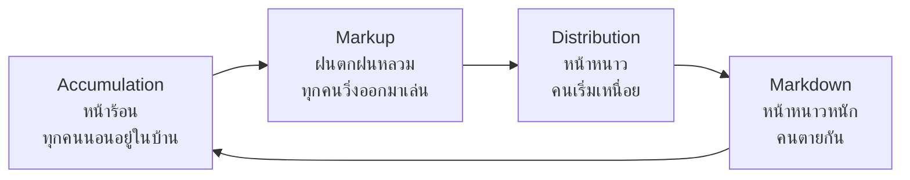
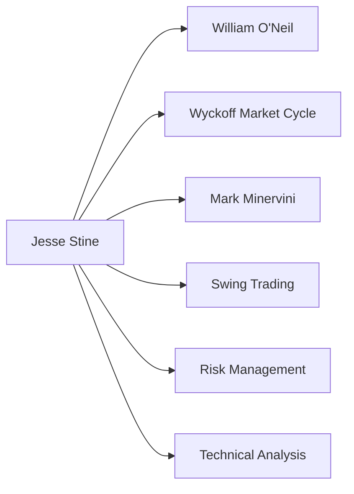

# Jesse Stine's Superstock System

## แนะนำตัว — ผมคือ Jesse Stine

ผมทำ 1000%+ return จาก Superstocks หลายครั้ง แต่ก็ Drawdown 100% มาแล้ว 2 ครั้งด้วยกัน คนส่วนใหญ่มองแต่กำไร ไม่ยอมดูความเจ็บปวดที่เบื้องหลัง ผมจะบอกความจริงทั้งหมดให้คุณ

> [!quote] Jesse Stine
> "เกมนี้ไม่ได้เป็นเรื่องของการถูก แต่เป็นเรื่องของทำเท่าไหร่ตอนถูก"

**สิ่งสำคัญที่สุด:** วิธีของผมไม่ใช่ [[Day Trading]] ไม่ใช่ [[Buy & Hold]] แบบ [[Buffett]] มันคือ **[[Swing Trading]] ระยะกลาง** (สัปดาห์ถึงเดือน) บนหุ้น [[Microcap]] ที่กำลัง [[Momentum]]

---

## Part 1 — Market Cycle: อย่ายิงกระสุนก่อนดูว่าตลาดอยู่ทีไหน

> [!info] Market Cycle คือพื้นฐานที่สุด
> ทำไมผมโดน Drawdown เหมือนกัน? เพราะฝืนเทรดตอนตลาดไม่อยู่ใน Phase ที่เหมาะสม

### เปรียบเทียบง่ายๆ: ตลาดเหมือน 4 ฤดู



ตอนเริ่มเทรด ผมก็โดนตลาดฟาดหน้าแรงๆ เพราะไม่สนใจ Market Cycle ผมคิดว่า "หุ้นดีขายได้ทุกเวลา" — ผิดซ้ำๆ

### จะรู้ได้ไงว่าตลาดอยู่ช่วงไหน?

**เครื่องมือง่ายๆ ที่ผมใช้:**

| สังเกต | Markup (เวลาล่า Superstocks) | Markdown (ออกจากตลาด) |
|:-|:-|:-|
| [[S&P 500]] / [[Nasdaq]] | เหนือ 30-Week [[Moving Average]] | ใต้ 30-Week [[Moving Average]] |
| Leading Stocks | หลายตัว [[Breakout]] พร้อมกัน | หลุด [[Support]] กันเป็นแถว |
| New High vs New Low | High > Low | Low > High |
| ข่าว | เริ่มมีข่าวดี | ข่าวร้ายโพรง |

> [!summary] กฎเหล็ก Market Cycle
> **ถ้าตลาดไม่อยู่ใน Markup Phase** ผมจะ **นิ่ง** หรือขยับขนาดเล็กๆ เท่านั้น ไม่ยอมฝืน

> [!tip] ความผิดพลาดที่ผมเคยทำ
> ปี 2010 ผมเขียน Outlook ว่า "Do Absolutely Nothing" — คนหัวเราะ แต่ผมถูก ตลาดนั่งนิ่งทั้งปี คนที่ฝืนเทรดโดน Cut เพียบ

### วิธี Track Market Cycle แบบละเอียด

> [!example] Step-by-Step Market Cycle Tracking

#### Step 1 — ดู Index ก่อน

```
Weekly Chart ของ S&P 500 หรือ Nasdaq:
- เหนือ 30-Week MA = Bull Territory
- ใต้ 30-Week MA = Bear Territory
- MA เองกำลังชันขึ้น = Strong Momentum
- MA เองกำลังลง = Weak Momentum
```

#### Step 2 — ดู Breadth

```
New High vs New Low:
- ถ้า New High > New Low ต่อเนื่อง = ซื้อได้
- ถ้า New Low > New High = ระวัง Top
```

#### Step 3 — ดู Leading Sector

```
Sector ที่นำตลาด:
- ถ้า Financial, Tech, Consumer Discretionary แรง = Bull
- ถ้า Utilities, Staples, Defensive แรง = Bear
```

#### Step 4 — ดู Volatility

```
VIX:
- ต่ำกว่า 20 = ตลาดสบาย (แต่ระวัง Euphoria)
- สูงกว่า 30 = ตลาดกลัว (ระวัง Panic)
```

---

## Part 2 — Superstock Criteria: 5 เกณฑ์ Must-Have ที่จุด Breakout

ผมเคยคิดว่าหุ้นดีคือหุ้นที่กำไรเยอะ ผิดอีกแล้ว หุ้นที่ทำ 1000% มันต้องมีทั้ง [[Technical Analysis]] + [[Fundamental Analysis]] พร้อมกัน

### เปรียบเทียบ: Superstock เหมือน Rocket

```
Technical Criteria  = ถังเชื้อเพลิง + จรวด (ต้องแรงพอถึงดวงจันทร์)
Fundamental Criteria = นักบิน + แผนที่ (ต้องไปถูกทาง)
```

### ตารางเปรียบเทียบ: Superstock vs หุ้นปกติ

| ลักษณะ | Superstock | หุ้นปกติ |
|:-|:-|:-|
| ราคา | $4–$15 | $20+ |
| [[Float]] | < 10M | > 50M |
| Volume Breakout | 3–5× ค่าเฉลี่ย | 1.5–2× ค่าเฉลี่ย |
| Angle of Attack | ชันมาก (45°+) | ค่อยคืบ (10–20°) |
| Earnings Growth | 50%+ YoY | 10–20% YoY |
| Theme | ร้อนแรงมาก | ปกติ/ไม่มี |
| Insider Buying | หลายคนพร้อมกัน | น้อย/ไม่มี |
| Analyst Coverage | ยังไม่มี/น้อย | เยอะ |

### 5 เกณฑ์ Technical Must-Have (จาก Chapter 7 หนังสือผม)

#### ① ราคาต่ำกว่า $15 (Sweet Spot: $4–$15)

ทำไม $4–$15? เพราะ [[Float]] ต่ำ คนถือน้อย เมื่อคนมาซื้อพร้อมกัน ราคาบินได้เร็วมาก

```
เปรียบเทียบ:
Float 100 ล้านหุ้น = เรือยักษ์ หมุนทิศทางช้ามาก
Float 5 ล้านหุ้น   = เรือจักรยาน หมุนทิศทางทันที
```

**ตรวจสอบที่:** [[Finviz]] → ดูช่อง "Shs Float"

> [!failure] ความผิดพลาด
> ผมเคยซื้อหุ้น $50 ที่ดูเจ๋งมาก แต่ Float เยอะเกินไป ราคาไปไหนไม่ได้ เพราะคนอยากขายมีมากมาย

#### ② Breakout จาก Strong Base (3–6 เดือน)

> [!info] Base คืออะไร?
> **Base คือ "กำแพง"** ที่ Smart Money สร้างไว้เก็บตัวเอง
>
> ```
> ราคาแกว่ง Sideways 3–6 เดือน = Smart Money กำลังสะสม
> Volume ค่อยๆ แห้งลง           = ไม่มีใครสนใจ = ดี!
> ```

**สัญญาณ Base ที่ดี:** Volume เหลือแค่ 30–50% ของ Peak Volume ช่วงขึ้นก่อนหน้า = คนส่วนใหญ่ออกจากหุ้นไปแล้ว ไม่เหลือแต่ Smart Money

#### ③ ราคาทะลุเหนือ 30-Week Moving Average

[[MA 30 สัปดาห์]] คือ "เส้นแบ่งโลก" — เหนือเส้นนี้ = Bull Territory, ใต้เส้น = Bear Territory

```
เหนือเส้น = เต่ากำลังขึ้นบก
ใต้เส้น   = เต่ากำลังลงน้ำ
```

> [!warning] สำคัญ
> **ต้องปิดสัปดาห์เหนือเส้นนี้** ไม่ใช่แค่แตะแล้วลง

#### ④ Volume พุ่งสูงผิดปกติ

[[Volume]] = "เท้าของ Smart Money" — ถ้าไม่มี Volume สูง [[Breakout]] นั้นปลอม

```
Volume ปกติ  = คนเดินเล่น
Volume พุ่ง  = คนวิ่งแข่ง!
```

#### ⑤ Steep Angle of Attack (มุมชัน)

หุ้นที่จะบิน ต้องขึ้นชันทันที ไม่ใช่ค่อยๆ คืบ

```
มุมชัน = Rocket ยิงตรงขึ้น
ค่อยคืบ = หอยทากไต่กำแพง
```

### ตารางเปรียบเทียบ: Good Breakout vs Fake Breakout

| สังเกต | Good Breakout | Fake Breakout |
|:-|:-|:-|
| Volume | 3–5× ค่าเฉลี่ย | 1.5× ค่าเฉลี่ย |
| ราคา | ชันทันที (45°+) | ค่อยคืบ (10–20°) |
| Base | 3–6 เดือนก่อน | ไม่มี Base / Base สั้น |
| MA | เหนือ 30-Week MA | ใต้ 30-Week MA |
| Follow-through | ทำ New High ต่อเนื่อง | กลับเข้า Base ใน 2–3 วัน |
| Sector | Sector กำลังแรง | Sector อ่อนแรง |

---

### Fundamental Criteria: อะไรทำให้หุ้น "มีชีวิต"?

#### ① Blockbuster Sustainable Earnings

กำไรต้องเติบโตต่อเนื่อง 2–3 ไตรมาส และตีหนักกว่าการคาดการณ์

> [!warning] อย่าโดนหลอก
> **กำไรต้องมาจากธุรกิจหลัก** ไม่ใช่ขายตึกหรือขายที่ดิน One-time
>
> **ตรวจสอบ:** [[10-K]] / [[10-Q]] → Income Statement → เช็คว่ากำไรมาจากไหน

#### ② High Operating Leverage

นี่คือสิ่งที่ทำให้หุ้นบิน! เพราะรายได้ขึ้น $1 แต่กำไรขึ้น $3–$5

```
Operating Leverage สูง = Software, SaaS, Platform
Operating Leverage ต่ำ = ร้านอาหาร, ร้านค้าปลีก (ต้นทุนแปรงตามรายได้)
```

**คำนวณง่ายๆ:**
```python
Operating Leverage = % Change in Net Income / % Change in Revenue

ตัวอย่าง:
ถ้า Revenue +10% แต่ Net Income +30% → Leverage = 3.0 (ดีมาก!)
ถ้า Revenue +10% แต่ Net Income +12% → Leverage = 1.2 (ปกติ)
```

#### ③ Insider Buying (ผู้บริหารซื้อหุ้นตัวเอง)

> [!tip] Insider ซื้อ = Signal แข็ง
> Insider ขายได้หลายเหตุผล (ซื้อบ้าน, จ่ายหนี้, ลูกเรียน) แต่ **ซื้อมีเหตุผลเดียว** = เชื่อว่าราคาจะสูงขึ้น

**ที่ต้องหา:**
- Open Market Purchase (ไม่ใช่จาก Stock Option)
- C-Suite หลายคนซื้อพร้อมกัน (ไม่ใช่แค่คนเดียว)
- ซื้อช่วง Base Building หรือหลัง Initial Breakout

**ตรวจสอบ:** SEC EDGAR → Form 4 (ฟรี!)

### ตารางเปรียบเทียบ: Insider Buying ดี vs ปลอม

| ประเภท | Good Insider Buying | Bad/Fake Insider Buying |
|:-|:-|:-|
| ประเภท | Open Market Purchase | Exercise Option |
| จำนวนคน | 2–3 คนพร้อมกัน | แค่คนเดียว |
| ตำแหน่ง | CEO, CFO, President | Minor Officer, Director |
| Timing | ช่วง Base / หลัง Drop | ช่วงราคาสูงสุด |
| History | เคยซื้อถูกแล้ว | เคยซื้อผิดจังหวะ |
| Price | ซื้อใกล้ราคาตลาด | ซื้อในราคา Discount (Private) |

#### ④ Super Theme / Catalyst

ทุก Superstock ต้องมี "เรื่องเล่า" ที่ดึงดูดความสนใจ

```
Theme ระดับ Industry: AI, EV, Crypto, Space
Theme ระดับบริษัท:    สัญญาใหม่กับ Apple, Multi-year contract
```

> [!failure] ความผิดพลาด
> ผมเคยซื้อหุ้นที่กำไรดี แต่ไม่มี Theme ราคาไปไหนไม่ได้ เพราะไม่มีคนสนใจ

#### ⑤ เกณฑ์เสริมที่เพิ่มโอกาส

หุ้นที่ดีที่สุดมักมี:
- การแข่งขันน้อย (Moat)
- หนี้ต่ำ (Debt/Equity < 0.5)
- Short Interest ต่ำ (< 5%)
- ไม่มี Analyst Coverage (ยังไม่มีคนค้นพบ)
- ผู้บริหารถือหุ้นสูง (> 10%)
- มี Momentum Traders เริ่มเข้ามา

---

## Part 3 — Timing: เมื่อไหร่ควรซื้อ?

> [!tip] จังหวะเข้าซื้อที่ดีที่สุด
> รอ 2-3 สัปดาห์หลัง Initial Breakout... เพราะจุดนี้ Risk ต่ำสุด Stop อยู่ไม่ไกล

### 3 จังหวะที่ผมใช้จริง

#### แบบที่ 1 — รอ 2–3 สัปดาห์หลัง Initial Breakout

หลังจาก [[Earnings Surprise]] ทำให้ราคา Gap Up แล้ว หุ้นมัก "นิ่ง" สักพัก

```
Earnings Beat → ราคา Gap Up → นิ่ง 2–3 สัปดาห์ → Volume ลด → ซื้อ!
```

ทำไมต้องรอ? เพราะจุดนี้ Risk ต่ำสุด Stop อยู่ไม่ไกล

#### แบบที่ 2 — ซื้อที่ Magic Line

ทุก Superstock มี **Magic Line** ซึ่งเป็น [[Moving Average]] ที่หุ้น "เคารพ"

```
หุ้นแตะ Magic Line → ดีดกลับ → ทำ New High → ซื้อ!
```

Magic Line ส่วนใหญ่อยู่แถว 10-week [[MA]] แต่บางหุ้นอาจเป็น 5, 20, หรือ 30-week [[MA]]

**วิธีหา:** ลองใส่ [[MA]] ต่างๆ จนเจอเส้นที่หุ้น Bounce กลับซ้ำๆ

#### แบบที่ 3 — เข้าช่วง Base Formation

เข้าซื้อระหว่างที่ Base ยังก่อตัว เมื่อ Volume แห้งมาก

```
Volume แห้ง = ไม่มีใครสนใจ = Smart Money กำลังสะสม = ซื้อ!
```

---

## Part 4 — Risk Management: บทเรียนที่ผมจ่ายด้วยเลือด

### ประวัติความเจ็บปวดของผม

```
Drawdown ที่ผมเคยโดน: 61%, 64%, 65%, 75%, 100%, 100%, 106%
Return ที่ผมทำได้:   111%, 117%, 156%, 264%, 273%, 275%, 300%, 371%, 1,010%, 1,026%, 1,244%
```

สิ่งที่ผมเรียนรู้:

### กฎเหล็ก 3 ข้อที่ตายแล้วเกิด

> [!danger] กฎเหล็ก Risk Management

#### ① Stop Loss ต้องกำหนดก่อนซื้อเสมอ

[[Stop Loss]] ควรอยู่ใต้ Base ที่ [[Breakout]] ออกมา

```
ถ้าหลุดกลับเข้า Base = Breakout ปลอม = ออก!
```

#### ② อย่า Average Down เด็ดขาด

> [!warning] อย่า Average Down!
> ถ้าหุ้นลงหลังซื้อ → ออกทันที
>
> ผมเคยทำ ผมโดน ผมบอกว่าอย่าทำ

```
หุ้นลงหลังซื้อ → ไม่มีเหตุผลชัดเจน → ออก!
อย่าเพิ่มสถานะ → จะโดน Deep Down ยิ่งกว่าเดิม
```

#### ③ Cut Loss ทันทีถ้าสัญญาณพลิก

เกมนี้ไม่ได้เป็นเรื่อง "ถูก-ผิด" แต่เป็นเรื่อง **"ทำเท่าไหร่ตอนถูก เสียเท่าไหร่ตอนผิด"**

### Position Sizing Formula

> [!example] Position Sizing Formula
>
> ผมใช้กฎง่ายๆ ในการจัดขนาด Position:

```python
# Formula
Risk per Trade = 1–2% ของ Portfolio
Position Size = (Risk per Trade) / (Entry Price - Stop Price)

# ตัวอย่าง:
Portfolio $100,000
Risk per Trade = $1,000 (1%)
Entry $10, Stop $9
Position Size = $1,000 / ($10 - $9) = $1,000 / $1 = 1,000 หุ้น
```

> [!info] กฎเพิ่มเติม:
> - ไม่ซื้อเกิน 5 ตัวในเวลาเดียวกัน
> - Top Position ไม่เกิน 30% ของ Portfolio
> - Cash ต้องมี 20–30% ไว้ซื้อจังหวะดีๆ

---

## Part 5 — การขาย: สิ่งที่หนังสือเทรดส่วนใหญ่ไม่สอน

ผมเขียนทั้ง Chapter เรื่องการขาย เพราะส่วนนี้มักถูกละเว้น

### สัญญาณ Technical ขาย

#### ① Record Weekly Range + Overextended

แท่งเทียนรายสัปดาห์กว้างผิดปกติ + ราคาไกลจาก Magic Line

```
ราคา +20% จาก Magic Line = Overextended Zone = ขายบางส่วน
```

#### ② ราคาหลุด Magic Line ปิดสัปดาห์ใต้เส้น

```
หลุด Magic Line + ปิดสัปดาห์ใต้ = Trend พัง = ออกหมด!
```

### สัญญาณ Fundamental ขาย

| สัญญาณ | ทำไมต้องขาย |
|:-|:-|
| ราคาถึง Price Target | [[Risk/Reward Ratio]] ไม่คุ้มแล้ว |
| Secondary Offering | บริษัทฉีดหุ้นใหม่ → ราคากด |
| [[Earnings]] หยุดโต | End of Sequential Ramp |
| Insider Massive Selling | ผู้บริหารรู้อะไรคุณไม่รู้ |
| สื่อกระหน่ำชม | Sell Headlines → ขายขณะมีคนซื้อ |
| Message Board Euphoria | ทุกคนคุยเยอะ = Top ใกล้มาแล้ว |
| Pre-earnings Run Up | ราคาขึ้นก่อนรายงาน → ขายข่าว |
| Expansion เร็วเกินไป | โตเร็วเกินไป → มักล้ม |

> [!quote] Jesse Stine
> "Learn to sell like Mark Cuban" — ขายออกขณะที่ยังมี Demand รับอยู่ อย่ารอจนไม่มีคนซื้อ

---

## Part 6 — Screening System: วิธีหา Superstock แบบผม

### เครื่องมือที่ผมใช้: [[Finviz]]

> [!example] Step-by-Step Screening

#### Step 1 — กรอง Universe ก่อน

```
Descriptive:
- Price: $4 – $15
- Market Cap: Micro (< $300M)
- Shs Float: < 20M (ยิ่งน้อยยิ่งดี)

Technical:
- Volume: > 2× Avg
- Price: > SMA 200
- 20-Day High: > 80%

Fundamental:
- EPS Growth qtr over qtr: > 20%
- P/E: < 40 (avoid extreme overvalued)
```

#### Step 2 — กรองรอบ Fundamental

```
กำไรไตรมาสล่าสุด YoY > 20%
Insider Open Market Buying ใน 3 เดือนที่ผ่านมา
ดู Backlog ใน 10-Q หรือ Earnings Transcript
```

#### Step 3 — กรอง Chart Pattern

```
Base ชัดเจน 3–6+ เดือน
Volume แห้งลงระหว่าง Base
ราคาใกล้แนว Resistance เดิม
```

#### Step 4 — จัดลำดับ Watchlist

```
Level 1: Ready to Break
Level 2: Building Base
Level 3: Monitor Only
```

### Finviz Filter แบบ Copy-Paste

```
[Parameter]              [Setting]
Price                    $4 to $15
Market Cap               Micro ($0-$300M)
Shs Float                Under 20M
Current Volume           > 200K
20-Day High %            Over 80%
EPS Growth Qtr over Qtr  Positive > 20%
```

---

## Part 7 — Case Studies: ตัวอย่างหุ้นจริงที่ผมจับได้

> [!example] Case Study 1: Superstock ที่ทำ 1000%+
>
> **ชื่อหุ้น:** เปลี่ยนชื่อเพื่อปกป้องความเป็นส่วนตัว — เรียกว่า "ABC"
>
> **Timeline:**
> - **Q1 20XX:** ราคา $6, Base 4 เดือน, Float 5M, ไม่มี Analyst Coverage
> - **Q2:** Earnings Beat 50%, ราคา Gap Up เป็น $9
> - **Q3:** Insider CEO ซื้อเพิ่ม, ราคาทะลุ $12
> - **Q4:** Theme ร้อนแรง, ราคาวิ่งสูงสุด $72 (1,100% ใน 9 เดือน)
>
> **สิ่งที่ผมทำ:**
> - เข้าซื้อ $9 หลัง Earnings Gap Up 2 สัปดาห์
> - Stop ไว้ที่ $8 (ใต้ Base)
> - ถือ 7 เดือน, ขายที่ $65 (Overextended + Record Weekly Range)
>
> **สิ่งที่ถูกต้อง:**
> - Base ชัดเจน 4 เดือน
> - Volume พุ่งตอน Breakout
> - Earnings เติบโตต่อเนื่อง
> - Insider Buying
> - Super Theme ร้อนแรง

> [!failure] Case Study 2: หุ้นที่โดน Cut Loss
>
> **ชื่อหุ้น:** "XYZ"
>
> **Timeline:**
> - **Q1:** ราคา $8, ดูเจ๋ง, Base 3 เดือน
> - **Q2:** Breakout ดูแข็ง, ผมซื้อ $9
> - **Q3:** ราคาหลุด $8, ผม Average Down (ผิด!)
> - **Q4:** ราคาลงสูงสุด $3 (-67%)
>
> **สิ่งที่ผมทำผิด:**
> - Breakout ไม่มี Volume พุ่ง
> - Sector กำลังอ่อนแรง
> - Average Down เมื่อสัญญาณพลิก
> - ไม่ Cut Loss ทันที
>
> **บทเรียน:** ถ้า Breakout ปลอม ออกก่อนเสียหน่อย อย่าฝืน

---

## Part 8 — ช่วงเวลาที่อันตรายที่สุด

### Black Swan Events: ช่วงที่ควรออกจากตลาดโดยไม่ต้องคิด

ผมเรียนรู้จากประสบการณ์เจ็บๆ ว่ามีช่วงเวลาที่ต้อง "ออกไปก่อน ค่อยกลับมาคิด"

> [!danger] Black Swan Events — ออกทันที!

#### ช่วงที่ 1 — Market Crash Signals

```
S&P หลุด 200-Week MA
New Low > New High เป็นสัปดาห์
VIX พุ่งเกิน 40
การย่อยส่วนพัง (Sector Rotation รวดเร็ว)
```

#### ช่วงที่ 2 — Personal/Health Crisis

```
โรคระบาดใหญ่ (COVID-19 พิสูจน์แล้ว)
สงคราม/ความขัดแย้งระหว่างประเทศ
ธนาคารกลางพลิกนโยบายกระทันหัน
```

#### ช่วงที่ 3 — Personal Life Crisis

```
คนในครอบครัวเจ็บป่วยหนัก
ปัญหาการเงินส่วนตัว
Mindset ไม่พร้อม (Stress, Depression)
```

> [!tip] กฎของผม
> "When in doubt, stay out" — สงสัยก็ออกก่อน หุ้นดีๆ ยังมีให้เล่นอีกเพียบ

---

## Part 9 — จิตวิทยาการเทรด

### ทำไมคนส่วนใหญ่ล้มเหลว?

ผมดู Traders มาพันคน สิ่งที่แยกคนที่รอดจากคนที่โดน Cut มีอยู่ 3 อย่าง:

#### ① FOMO (Fear Of Missing Out)

```
คนที่โดน Cut มักซื้อที่ Top เพราะเห็นคนอื่นรวย
ผมไม่ซื้อหุ้นที่ขึ้นแล้ว 30%+ ใน 1 สัปดาห์
ผมรอ Base ใหม่
```

#### ② Greed — ถือนานเกินไป

```
หุ้นขึ้น 200% ควรขายบางส่วน
แต่คนส่วนใหญ่คิด "มันจะไปถึง 500%"
สุดท้ายกลับมา 50% หรือ 0%
```

#### ③ Fear — ขายช้าเกินไป

```
Stop Loss $8, ราคาหลุด $8 แล้ว
แต่คนคิด "คงกลับมา"
สุดท้ายราคาไป $5, $3...
```

### วิธีจัดการ Emotion

#### ① มี Trading Plan ชัดเจน

```
Entry = $10, Stop = $9, Target = $20
ถ้าชนะ → ขายที่ $20
ถ้าแพ้ → Cut ที่ $9
ไม่คิดระหว่าง Hold
```

#### ② Journal ทุก Trade

```
วันที่, หุ้น, Entry, Exit, เหตุผลซื้อ, เหตุผลขาย, Result, Lesson
ดูย้อนหลังได้เสมอ
```

#### ③ Take Break เมื่อ Mindset ไม่ดี

```
โดน 2 Loss ติด → หยุด 1 สัปดาห์
โดน 3 Loss ติด → หยุด 2 สัปดาห์
อย่าฝืน
```

---

## Part 10 — คำถามที่พบบ่อย (FAQ)

> [!faq] Q: ต้องมีเงินเท่าไหร่เริ่มได้?
> **A:** ผมเริ่มด้วย $5,000 แต่ความจริงคุณสามารถเริ่มด้วย $1,000–$2,000 ก็ได้ สิ่งสำคัญคือ [[Risk Management]] เท่านั้น
>
> ---
>
> **Q: ต้องดูกราฟทุกวันไหม?**
> **A:** ไม่! ผมดู Weekly Chart หลักๆ และ Review ทุกสัปดาห์ คุณไม่ต้อง Glue หน้าจอ 24/7
>
> ---
>
> **Q: ถ้า Breakout แล้วหลุดทันทีได้ไหม?**
> **A:** ได้ และเกิดบ่อย นั่นคือเหตุผลที่ผมใส่ [[Stop Loss]] ทุกครั้ง ไม่มีหุ้นที่ "ต้องชนะ" 100%
>
> ---
>
> **Q: ตอนนี้ตลาดอยู่ช่วงไหนดี?**
> **A:** ดู S&P 500 vs 30-Week MA ได้เลย ถ้าเหนือ = Bull, ใต้ = Bear ง่ายกว่านั้นไม่มี
>
> ---
>
> **Q: ต้องเป็น Pro เท่านั้นไหม?**
> **A:** ผมเคยเป็น Retail Trader ตัวเล็กๆ คีย์ผิดก็ร้องไห้ได้ สิ่งที่สำคัญคือ Discipline ไม่ใช่ Background
>
> ---
>
> **Q: แล้วถ้าโดน Drawdown 50% ทำไง?**
> **A:** Cut Size ลงทันที ถ้า Portfolio $100K เหลือ $50K ให้เทรดเหมือนมี $50K อย่าฝืนทำ $100K กลับมา
>
> ---
>
> **Q: หุ้น Penny ($1–$3) ดีไหม?**
> **A:** ผมเลี่ยง Penny เพราะ Manipulation เยอะมาก และบ่อยครั้งไม่มี Fundamental ชอบ $4–$15 มากกว่า

---

## Part 11 — Contrarian Edge: สิ่งที่แยกผมจากคนทั่วไป

### Wall Street ไม่ใช่พระเจ้า

ผมแสดงตัวอย่างซ้ำๆ ว่า Investment Banks ทำ Market Calls ผิดบ่อยมาก

```
2007: พวกเขาบอก Buy ก่อน Financial Crisis
2009: พวกเขาบอก Bear Market หลังจาก Low ผ่านไปแล้ว
2020: พวกเขาบอก Sell ก่อน V-Shape Recovery
```

ผมไม่ได้โกหก ผมเขียน Email Alerts ล่วงหน้า และรวมไว้ในหนังสือเพื่อพิสูจน์

### Dumb Friend Indicator

```
เพื่อนที่โชคร้ายในตลาดหุ้น → มักซื้อที่ Top, ขายที่ Bottom
ถ้าเพื่อนตื่นเต้นกับหุ้นตัวไหน → ระวัง!
ถ้าเพื่อนบอก "ของนี้ราคาจะไม่หลุด" → มักจะหลุด
```

---

## Checklist ใช้งานทันที (One-Pager)

```checklist
?? MARKET PHASE CHECK
? S&P / Nasdaq อยู่เหนือ 30-Week MA?
? Leading Stocks กำลัง Breakout?
? New High > New Low ในตลาด?

?? SUPERSTOCK SCREEN
? ราคาอยู่ในช่วง $4–$15?
? Float ต่ำกว่า 20 ล้านหุ้น?
? Base นาน 3–6+ เดือน ชัดเจน?
? Volume แห้งระหว่าง Base?
? Earnings เติบโต 2–3 ไตรมาสติด?
? มี Insider Open Market Buying?
? มี Super Theme / Catalyst?

?? ENTRY SIGNAL
? Breakout เหนือ 30-Week MA?
? Volume พุ่ง 2× ค่าเฉลี่ย?
? Angle ชัน ไม่ใช่ค่อยๆ คืบ?
? หรือ ราคาแตะ Magic Line แล้ว Bounce?

?? BEFORE PRESSING BUY
? กำหนด Stop Loss (ใต้ Base)?
? กำหนด Price Target (เป้า 100%+)?
? Risk/Reward ไม่ต่ำกว่า 1:3?
? Position Size ไม่เกิน 20% Portfolio?

?? SELL SIGNAL
? Record Weekly Range + Overextended?
? ราคาหลุด Magic Line ปิดสัปดาห์ใต้?
? มี Insider Massive Selling?
? สื่อกระหน่ำพาดหัวชม?
? บริษัทออกหุ้นเพิ่ม?
? ราคาถึง Price Target?
```

---

## คำสั่งเสียจาก Jesse Stine

> [!quote] 10 บทเรียนสุดท้าย
>
> 1. **ตลาดไม่สนใจคุณ** — อย่าโกรธตลาด รับว่าคุณผิดแล้ว Move on
> 2. **1000% ไม่ได้เกิดใน 1 สัปดาห์** — มันต้องใช้เวลา
> 3. **อย่าเชื่อ Wall Street** — เชื่อ Chart และ Insider
> 4. **ขายตอนมีคนซื้อ** — อย่ารอจนไม่มีคนซื้อ
> 5. **Risk Management > Returns** — รอดก่อน รวยทีหลัง
> 6. **Discipline > Intelligence** — คนฉลาดแต่ขาดวินัยโดน Cut
> 7. **Journal ทุก Trade** — ถ้าไม่บันทึก ไม่รู้ว่าทำผิดตรงไหน
> 8. **Take Break เมื่อ Mindset ไม่ดี** — อย่าฝืนเทรดตอน Stress
> 9. **Stay Humble** — ตอนรวยก็อย่าหลงตัวเอง ตลาดจะฟาดเมื่อไหรี่ไม่รู้
> 10. **Enjoy Life Outside Trading** — หุ้นไม่ใช่ทุกอย่างในชีวิต

---

> [!info] Proof of Concept
> ผมเขียน Email Alerts ล่วงหน้าก่อนหุ้นและตลาดจะเคลื่อนไหวใหญ่ และรวมไว้ในหนังสือเพื่อพิสูจน์ว่าระบบนี้ทำงานได้จริง ไม่ใช่เรื่องเล่าย้อนหลัง

---

## ทิศทางการเรียนรู้ต่อ



เรียนรู้เพิ่ม:
- [[William O'Neil]] — [[CANSLIM]] (พื้นฐานของผม)
- [[Wyckoff Market Cycle]] — อ่านตลาดลึกขึ้น
- [[Mark Minervini]] — [[SEPA]] (พัฒนาต่อยอดจาก O'Neil)
- [[Swing Trading]] ระยะกลาง — หัดใช้ Timeframe สัปดาห์-เดือน
- [[Risk Management]] — หัดจัดการ [[Position Sizing]]
- [[Technical Analysis]] — หัดอ่าน [[Chart Pattern]]

---

## สรุปแนวคิด Jesse Stine ใน 1 หน้า

| แนวคิด | คำอธิบาย |
|:-|:-|
| **Market Cycle** | ซื้อเฉพาะตอน Markup, อื่นนั่ง |
| **Sweet Spot** | $4–$15, Float < 10M |
| **Base** | 3–6 เดือน, Volume แห้ง |
| **Breakout** | เหนือ 30-Week MA, Volume 3–5× |
| **Earnings** | ต้องโตต่อเนื่อง 2–3 Q |
| **Insider** | Open Market Buying > 1 คน |
| **Theme** | ต้องร้อนแรง |
| **Entry** | หลัง Breakout 2–3 สัปดาห์ หรือ Magic Line |
| **Stop** | ใต้ Base เสมอ |
| **Target** | 100%+ ขั้นต้น |
| **Sell** | Record Range, Overextended, Headlines |
| **Risk** | 1–2% ต่อ Trade |
| **Never** | Average Down |

---

**หนังสือของผมไม่ได้สอนให้รวยด้วยหุ้ง แต่สอนให้รอดแล้วค่อยรวย**

— Jesse Stine

---

## Related Topics

- [[Growth Investing]]
- [[Momentum Trading]]
- [[Market Cycle]]
- [[Risk Management]]
- [[Position Sizing]]
- [[Technical Analysis]]
- [[Fundamental Analysis]]
- [[Microcap Stocks]]
- [[Swing Trading]]
- [[CANSLIM]]
- [[SEPA]]
- [[Chart Pattern]]

---

## Tags

#investing #growth #momentum #swing-trading #microcap #market-cycle #risk-management #technical-analysis #fundamental-analysis #jesse-stine #superstock #can-slim #case-studies #faq
