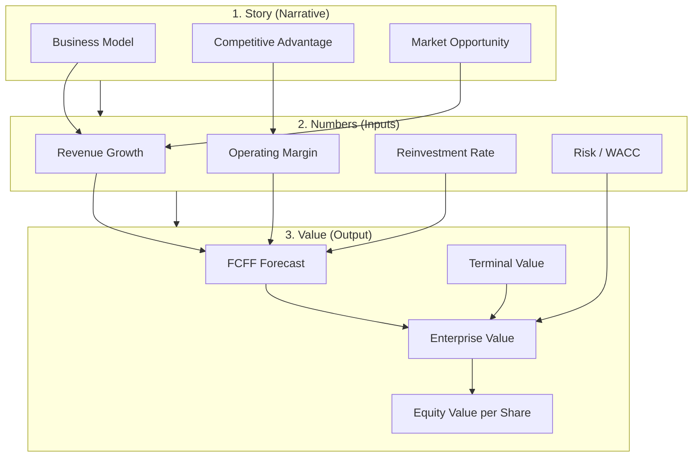
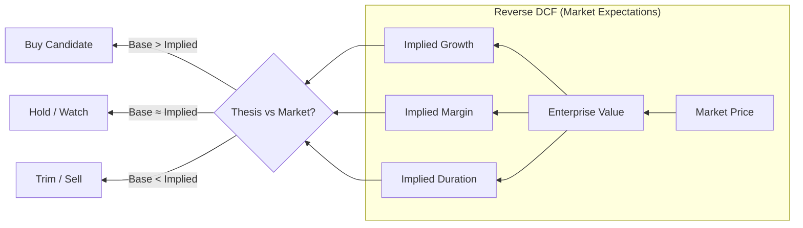

# DCF Valuation Course MOC

> [!quote] Professor's Welcome
> ผมคือ Aswath Damodaran. คอร์สนี้จะสอนคุณประเมินมูลค่ากิจการด้วย DCF ตั้งแต่พื้นฐานจนถึงการใช้งานจริง

## Course Overview


## Course Structure

| # | Topic | Key Concepts | Status |
|---|-------|--------------|--------|
| 01 | [[01 - DCF Fundamentals]] | Time Value of Money, Cash Flow vs Earnings, When DCF Works | ✅ |
| 02 | [[02 - Free Cash Flow]] | FCFF, FCFE, Working Capital, CapEx | ✅ |
| 03 | [[03 - Forecasting Cash Flows]] | Revenue Growth, Margins, Reinvestment | ✅ |
| 04 | [[04 - Discount Rate WACC]] | CAPM, Beta, Cost of Debt, Capital Structure | ✅ |
| 05 | [[05 - Terminal Value]] | Gordon Growth, Exit Multiple, Common Mistakes | ✅ |
| 06 | [[06 - Complete DCF Example Apple]] | Full DCF Walkthrough, Sensitivity Analysis | ✅ |
| 07 | [[07 - DCF Thai Market Practical Guide]] | พารามิเตอร์ไทย, Beta, ERP, Conservative Approach | ✅ |
| 08 | [[08 - Reverse DCF Fundamentals]] | Market Expectations, Implied Growth, Implied Margin | ✅ |
| 09 | [[09 - Estimating Growth Rate Realistic Approaches]] | Top-down/Bottom-up Growth, Fade Rates, Sector Patterns | ✅ |
| 10 | [[10 - Reverse DCF Practical Application]] | Apple/Amazon/Thai Cases, Implied Matrix, Buy/Hold/Sell Framework | ✅ |

---

## DCF Framework Visual



## Reverse DCF Framework



---

## Key Formulas Reference

### DCF Core Formula
$$
Value = \sum_{t=1}^{n}\frac{FCFF_t}{(1+WACC)^t} + \frac{Terminal\ Value}{(1+WACC)^n}
$$

### Free Cash Flow to Firm
$$
FCFF = EBIT(1-Tax) + D\&A - CapEx - \Delta Working\ Capital
$$

### WACC
$$
WACC = w_e \cdot k_e + w_d \cdot k_d \cdot (1-Tax)
$$

### Cost of Equity (CAPM)
$$
k_e = R_f + \beta \cdot (ERP) + Country\ Risk\ Premium
$$

### Terminal Value (Gordon Growth)
$$
TV_n = \frac{FCFF_{n+1}}{WACC - g}
$$

### Reverse DCF Core Concept
$$
Market\ Price \xrightarrow{Reverse} Implied\ Growth + Implied\ Margin + Implied\ Duration
$$

### Growth-Reinvestment Identity
$$
g = Reinvestment\ Rate \times ROIC
$$

---

## Learning Path

### สำหรับผู้เริ่มต้น
1. อ่าน [[01 - DCF Fundamentals]] → เข้าใจ concept
2. อ่าน [[02 - Free Cash Flow]] → เรียนรู้การคำนวณ
3. ทำ exercise ในแต่ละบท

### สำหรับผู้มีพื้นฐาน
1. Review [[03 - Forecasting Cash Flows]] → ฝึก forecasting
2. Review [[04 - Discount Rate WACC]] → เข้าใจ risk
3. Review [[05 - Terminal Value]] → หลีกเลี่ยง mistakes

### สำหรับผู้ต้องการประยุกต์ (ตลาดไทย)
1. อ่าน [[07 - DCF Thai Market Practical Guide]] → พารามิเตอร์ไทย
2. ใช้ตัวอย่าง CPALL เป็น template
3. ทำ DCF กับหุ้นไทยที่สนใจ
4. เทียบผลกับ market price

### สำหรับผู้ต้องการเข้าใจ Market Expectations (Reverse DCF)
1. อ่าน [[08 - Reverse DCF Fundamentals]] → เข้าใจแนวคิด Market-Implied
2. อ่าน [[09 - Estimating Growth Rate Realistic Approaches]] → ประเมิน growth แบบมีหลักการ
3. อ่าน [[10 - Reverse DCF Practical Application]] → ตัวอย่าง Apple, Amazon, หุ้นไทย
4. สร้าง Implied Growth Matrix และตัดสินใจลงทุน

---

## Common DCF Mistakes Checklist

- [ ] ใช้ growth rate สูงเกินจริงยาวเกินไป
- [ ] ใช้ discount rate เดียวกับทุกบริษัท
- [ ] ใช้ earnings แทน cash flow
- [ ] ลืม reinvestment (working capital + CapEx)
- [ ] Terminal growth > GDP growth
- [ ] ไม่ทำ sensitivity analysis
- [ ] เชื่อ point estimate เดียว

---

## Related Notes

```dataview
LIST
FROM "Knowledge/DCF Valuation"
WHERE file.name != this.file.name
SORT file.name ASC
```

---

## External Resources

- [Damodaran Online](https://pages.stern.nyu.edu/~adamodar/) - Data & Spreadsheets
- [Invest Excel - DCF Models](https://investexcel.net/) - Excel Templates

---

> [!tip] Next Step
> เริ่มต้นที่ [[01 - DCF Fundamentals]] หรือถ้ามีพื้นฐานแล้ว ไปที่ [[06 - Complete DCF Example Apple]] เลย
>
> สำหรับ Reverse DCF (อ่านราคาตลาด): เริ่มที่ [[08 - Reverse DCF Fundamentals]]
