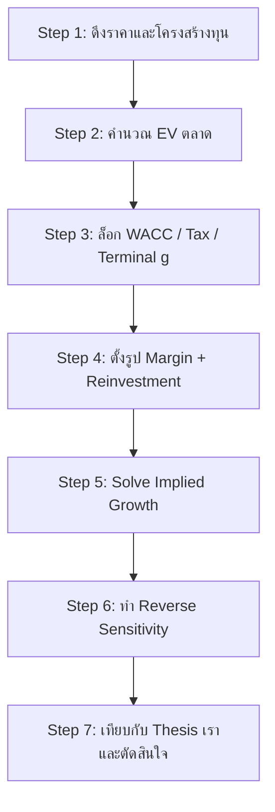
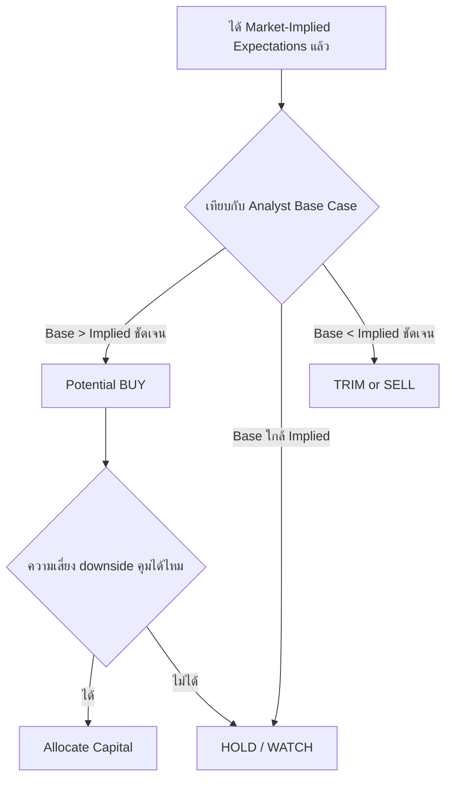

[[08 - Reverse DCF Fundamentals]] | [[09 - Estimating Growth Rate Realistic Approaches]] | [[07 - DCF Thai Market Practical Guide]]

# 10) Reverse DCF Practical Application

> [!important]
> ชุดตัวเลขในเอกสารนี้เป็น "teaching cases" ที่ตั้งใจให้ realistic และคำนวณเดินตามได้  
> ใช้เพื่อฝึกถอดรหัสราคาตลาด (market-implied expectations) ไม่ใช่คำแนะนำการลงทุนรายตัว

## 1) Workflow มาตรฐานที่ใช้ทุกเคส



สูตรหลักเหมือน [[08 - Reverse DCF Fundamentals]]:
$$
EV = \sum\frac{FCFF_t}{(1+WACC)^t}+\frac{TV}{(1+WACC)^N}
$$

## 2) Case A: Apple-style Mature Compounder

### 2.1 Input Set

| รายการ | ค่า |
|---|---:|
| Market Cap | 2,850 bn |
| Debt | 120 bn |
| Cash | 70 bn |
| EV ตลาด | 2,900 bn |
| Revenue TTM | 400 bn |
| EBIT Margin ปัจจุบัน | 31% |
| Tax | 21% |
| WACC (base) | 8.5% |
| Terminal g | 2.5% |
| Terminal EBIT Margin | 30% |

### 2.2 Reverse Solve (Base Case)
เมื่อใช้ margin path 31% -> 30% และ reinvestment efficiency ตาม Sales-to-Capital 2.2 -> 1.8
ได้คำตอบโดยประมาณ:
- Implied 10Y revenue CAGR: **6.6%**
- Implied ปี 1 growth: **~10%** และ fade ต่อเนื่อง

### 2.3 Apple Implied Growth Matrix
ตารางนี้ตอบคำถามว่า "ถ้า WACC/Margin ต่างกัน ตลาดต้องการ growth เท่าไร"

| WACC \ Terminal Margin | 28% | 30% | 32% |
|---|---:|---:|---:|
| 7.5% | 6.2% | 5.4% | 4.6% |
| 8.5% | 7.4% | 6.6% | 5.8% |
| 9.5% | 8.8% | 8.0% | 7.2% |

การอ่านผล:
- ถ้าคุณคิด WACC จริงควรเป็น 9.5% แต่ margin ยาวแค่ 30%  
  ตลาดกำลังต้องการ CAGR ~8.0% (เข้มขึ้นมาก)

> [!tip]
> Matrix ทำให้เห็นว่า "เราไม่เห็นด้วยกับตลาดเพราะอะไร" ชัดเจนกว่า fair value เดียว

## 3) Case B: Amazon-style Reinvestment Heavy Platform

### 3.1 Input Set

| รายการ | ค่า |
|---|---:|
| Market Cap | 1,950 bn |
| Debt | 170 bn |
| Cash | 95 bn |
| EV ตลาด | 2,025 bn |
| Revenue TTM | 680 bn |
| EBIT Margin ปัจจุบัน | 11% |
| Tax | 20% |
| WACC (base) | 8.8% |
| Terminal g | 2.7% |
| Terminal EBIT Margin | 12% |

### 3.2 Reverse Solve (Base Case)
ภายใต้สมมติฐานว่าธุรกิจ core commerce margin ค่อยๆ ดีขึ้น และ cloud margin ทรงตัวสูง
- Implied 10Y revenue CAGR: **9.8%**
- Implied terminal margin: **~12%**
- Reinvestment requirement สูงกว่าบริษัท mature ทั่วไปอย่างมีนัย

### 3.3 Reverse Sensitivity ของ Amazon

| สมมติฐานที่เปลี่ยน | ผลต่อ Implied CAGR |
|---|---:|
| WACC +1.0% | +1.4% |
| Terminal margin -1.0% | +0.9% |
| Terminal g -0.5% | +0.7% |
| Sales-to-Capital แย่ลง 0.3x | +0.8% |

อ่านแบบ Damodaran:
- หุ้นแบบ reinvestment heavy ไวต่อ discount rate และ reinvestment efficiency มาก
- ถ้าคุณ conservative เรื่อง efficiency ต้องเรียก growth สูงขึ้นเพื่อ justify ราคา

## 4) Case C: หุ้นไทย (CPALL-style Retail Compounder)

### 4.1 Input Set (หน่วย: ล้านบาท)

| รายการ | ค่า |
|---|---:|
| Market Cap | 580,000 |
| Debt | 260,000 |
| Cash | 35,000 |
| EV ตลาด | 805,000 |
| Revenue TTM | 980,000 |
| EBIT Margin ปัจจุบัน | 5.2% |
| Tax | 20% |
| WACC (THB) | 7.8% |
| Terminal g | 2.8% |
| Terminal EBIT Margin | 6.0% |

### 4.2 Reverse Solve (Base Case)
ตั้งสมมติฐานว่าการขยายสาขา + same-store sales growth เดินต่อ แต่ margin ขยับจำกัด
ได้คำตอบโดยประมาณ:
- Implied 10Y revenue CAGR: **5.6%**
- Implied margin ระยะยาว: **~6.0%**

### 4.3 Thai Reverse Matrix (WACC vs Margin)

| WACC \ Terminal Margin | 5.5% | 6.0% | 6.5% |
|---|---:|---:|---:|
| 6.8% | 5.4% | 4.8% | 4.2% |
| 7.8% | 6.2% | 5.6% | 5.0% |
| 8.8% | 7.1% | 6.5% | 5.9% |

ข้อสรุป:
- ถ้าคุณใช้ WACC สูงกว่าตลาด 1% growth ที่ต้องเชื่อเพิ่มขึ้นชัดเจน
- นี่คือเหตุผลที่ valuation หุ้นไทยไวมากกับ ERP/Rf update

## 5) วิธีสร้าง Implied Growth Matrix ด้วยตัวเอง

1. ล็อก EV = ราคาตลาด
2. เลือกแกน X เป็น terminal margin (หรือ WACC)
3. เลือกแกน Y เป็น WACC (หรือ margin)
4. ในแต่ละเซลล์ ใช้ Goal Seek หา growth ที่ทำให้ EV model = EV ตลาด
5. เก็บผลเป็นตาราง heatmap

Pseudo-algorithm:
```text
for each wacc in wacc_grid:
  for each margin in margin_grid:
    solve g_star such that EV_model(g_star, wacc, margin) = EV_market
    store g_star
```

> [!note]
> Matrix นี้คือเครื่องมือสื่อสารที่ดีที่สุดเวลา debate investment committee เพราะทุกคนเห็นทันทีว่า "ต้องเชื่ออะไร"

## 6) Reverse Sensitivity Analysis แบบที่ควรทำจริง

Traditional sensitivity:
- เปลี่ยน growth/margin แล้วดูมูลค่า

Reverse sensitivity:
- ล็อกราคา แล้วเปลี่ยน input อื่น เพื่อดู implied growth/margin ที่ตลาดต้องการ

ตาราง template:

| Scenario | WACC | Terminal g | Terminal Margin | Implied 10Y CAGR |
|---|---:|---:|---:|---:|
| Bear assumptions | 9.5% | 2.0% | 28% | 9.1% |
| Base assumptions | 8.5% | 2.5% | 30% | 6.6% |
| Bull assumptions | 7.5% | 3.0% | 32% | 4.9% |

การตีความ:
- ถ้า base implied growth = 6.6% แต่ thesis เราคือ 4% เท่านั้น ราคาอาจสะท้อนข่าวดีไปเยอะแล้ว
- ถ้า base implied growth = 6.6% แต่เรามั่นใจ 9% อย่างมีหลักฐาน อาจเป็นโอกาส

## 7) Decision Framework: When to Buy / Sell / Hold



กติกาเชิงปฏิบัติที่ใช้ได้จริง:

| สถานะ | เงื่อนไขขั้นต่ำ | การกระทำ |
|---|---|---|
| BUY candidate | Base CAGR สูงกว่า implied >= 2% และ narrative มี evidence | สะสมแบบทยอย + ติดตาม KPI รายไตรมาส |
| HOLD | Base กับ implied ต่างกันไม่เกิน +/-1% | ถือและรอดู data ใหม่ |
| SELL/TRIM candidate | Base ต่ำกว่า implied >= 2% หรือ margin ที่ตลาดต้องการไม่ realistic | ลดน้ำหนัก/ขายตามวินัย |

> [!warning]
> อย่า BUY เพียงเพราะ "ดูถูก" จากโมเดลเดียว  
> ต้องมี catalyst และ evidence ว่าตลาดจะปรับความคาดหวัง

## 8) KPI Monitoring หลังทำ Reverse DCF

หลังเปิดสถานะ ต้องตาม "ตัวแปรที่ราคา imply" ไม่ใช่ดูแค่กำไรสุทธิ

| Driver | KPI ที่ควรติดตาม | ความหมาย |
|---|---|---|
| Growth | Revenue growth by segment, order growth, user growth | ตลาดจะเชื่อ growth story ต่อไหม |
| Margin | Gross margin, EBIT margin, fulfillment cost ratio | margin path ยังตรงกับ implied ไหม |
| Reinvestment | CapEx/Sales, working capital intensity, R&D capitalization | growth มาพร้อม reinvestment ที่สมเหตุผลไหม |
| Return | ROIC trend | บริษัทยังสร้าง value spread เหนือ WACC หรือไม่ |

## 9) ข้อผิดพลาดที่เจอบ่อยในงานจริง

1. ใช้ราคาหุ้นแต่ลืมปรับ net debt ทำให้ EV ผิด
2. ใช้ FCF ที่มี one-off โดยไม่ normalize
3. terminal growth สูงเกินจริง
4. ไม่คิด dilution จาก SBC
5. ใช้ implied growth เดียวโดยไม่ทำ matrix
6. ทำ model ละเอียดแต่ไม่มี narrative รองรับ

## 10) Practical Playbook (Checklist)

```markdown
[ ] Convert Price -> EV ถูกต้อง
[ ] Normalize operating earnings
[ ] Lock WACC/Tax/Terminal g พร้อมเหตุผล
[ ] Build growth-margin-reinvestment schedule
[ ] Solve implied variable (growth/margin/duration)
[ ] Build implied matrix + reverse sensitivity
[ ] Compare with own thesis
[ ] Define buy/hold/sell rule ก่อนลงเงิน
[ ] Track KPI ที่ผูกกับ implied assumptions
```

## 11) สรุปสั้นแบบ Damodaran

Reverse DCF คือภาษาที่ใช้คุยกับตลาด  
ถ้าคุณอยากชนะตลาด คุณต้องรู้ก่อนว่าตลาดเชื่ออะไร แล้วชนะที่ "คุณภาพของความคาดหวัง" ไม่ใช่ชนะที่ความมั่นใจเสียงดัง

ลิงก์อ้างอิงภายในชุด:
- [[08 - Reverse DCF Fundamentals]]
- [[09 - Estimating Growth Rate Realistic Approaches]]
- [[07 - DCF Thai Market Practical Guide]]
