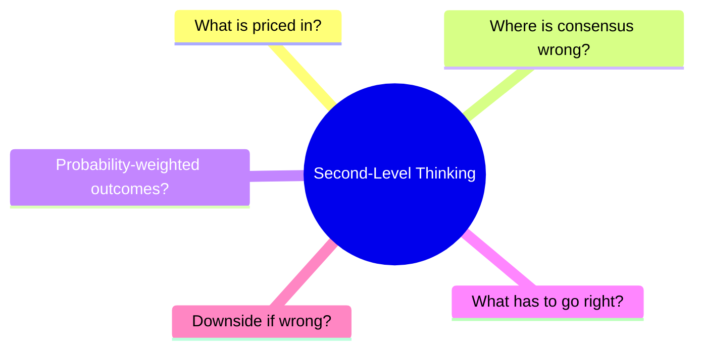
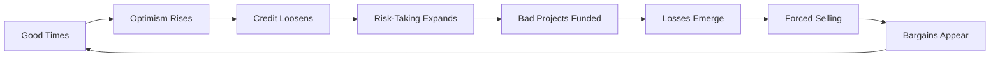
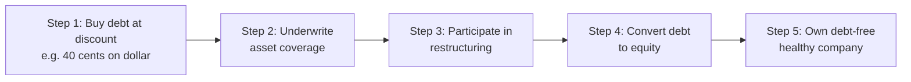
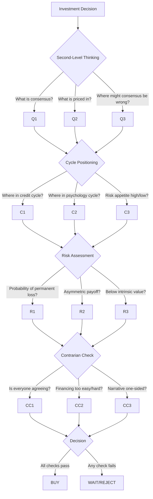

# Howard Marks' Market Cycle & Risk Framework

> **"If we avoid the losers, the winners will take care of themselves."**
> — Howard Marks, Oaktree Capital

> **"You can't predict. You can prepare."**
> — Howard Marks

---

## 🎯 Executive Summary

**Oaktree Capital Approach:** [[Defensive Value Investing]] บน [[Distressed Debt]] และสินทรัพย์ที่ตลาดทอดทิ้ง

| Element | Description |
|---------|-------------|
| **Core Philosophy** | Risk-First Investing + Second-Level Thinking |
| **Expertise** | Distressed Debt, High Yield Bonds, Special Situations |
| **Track Record** | 35+ years, $100B+ AUM, Consistent risk-adjusted returns |
| **Key Edge** | Cycle Positioning + Psychological Awareness |
| **Bestselling Book** | *The Most Important Thing* (Buffett reads every memo) |

### 🔑 The Marks Advantage

> **Buffett:** *"I drop everything to read Howard Marks's memos"*

---

## 🧠 Part 1: Second-Level Thinking

### First-Level vs Second-Level Thinking

Marks โต้แย้งว่าการเอาชนะตลาด (alpha) เป็นไปไม่ได้ถ้าคุณคิดเหมือนคนส่วนใหญ่

| First-Level (คนส่วนใหญ่) | Second-Level (Marks) |
|:---|:---|
| "บริษัทดี → ซื้อหุ้น" | "บริษัทดี แต่ทุกคนคิดว่ายิ่งกว่าดี → ราคาเกินพอดี → ขาย" |
| "เศรษฐกิจแย่ → ขาย" | "เศรษฐกิจแย่ แต่ทุกคนขายตื่น → ราคาต่ำกว่ามูลค่า → ซื้อ" |
| "บริษัทเติบโต 20% → ซื้อ" | "เติบโต 20% แต่ตลาดคาด 30% → ผิดคาด → ราคาจะตก" |
| "หุ้นตก → อันตราย" | "หุ้นตก → ราคาถูกลง → โอกาส" |

> 💡 **กฎเหล็ก:** Outperformance ต้องการการคิดที่ **both different AND better** than consensus — ผิดคนเดียวไม่พอ ต้องผิดแล้วถูกด้วย

### คำถามที่ Second-Level Thinker ต้องถามเสมอ



**The 5 Questions:**

1. **"What is priced in?"** — ตลาดคาดหวังอะไรไว้แล้ว?
2. **"Where is consensus wrong?"** — ฉันทามติผิดตรงไหน?
3. **"What are probability-weighted outcomes?"** — ผลลัพธ์ที่เป็นไปได้ทั้งหมดมีอะไรบ้าง?
4. **"What has to go right to justify current valuation?"** — อะไรต้องเป็นไปตามที่คาดเพื่อให้ราคาปัจจุบันสมเหตุผล?
5. **"What is downside if consensus is wrong?"** — ถ้าฉันทามติผิด ขาดทุนเท่าไหร่?

---

## 🔄 Part 2: Market Cycles

### The Cycle Mechanism

Marks ไม่เชื่อในการทำนายอนาคต แต่เชื่อในการรู้ว่า **"ตอนนี้เราอยู่ตรงไหนของวัฏจักร"**



### ประเภทของ Cycles ที่ Marks เน้น

| Cycle | ลักษณะ | สิ่งที่ต้องสังเกต | Importance |
|:---|:---|:---|:---:|
| **Economic Cycle** | GDP growth เป็นตัวขับเคลื่อน | ช้าและคงที่ ไม่ค่อยเปลี่ยนเร็ว | ⭐⭐ |
| **Credit Cycle** ⭐ | เงินกู้หลัก/รอง | "Worst loans made in best of times" | ⭐⭐⭐ |
| **Psychology Cycle** | อารมณ์ของนักลงทุน | Fear ↔ Greed | ⭐⭐⭐ |
| **Risk Appetite Cycle** | ความเสี่ยงที่ยอมรับได้ | ช่วงดีรับสูง ช่วงแย่หนี | ⭐⭐⭐ |

### 🔔 Credit Cycle Signals

> **"The cycle in financial markets goes from 'I won't do it' to 'I won't miss it'."**

**ช่วง Late Cycle (ระวัง):**
- [ ] เงินกู้ง่าย ดอกเบี้ยต่ำ
- [ ] Covenant อ่อนแอ
- [ ] บริษัทแย่ได้เงินกู้ง่าย
- [ ] LBO เกิดขึ้นบ่อย
- [ ] Yield spread แคบผิดปกติ

**ช่วง Crisis (โอกาส):**
- [ ] ตลาดเงินแข็งตัว
- [ ] แม้แต่บริษัทดีกู้ยาก
- [ ] Forced selling ทั่วทุกแห่ง
- [ ] Yield spread กว้างมาก
- [ ] "Nobody is buying"

### The Pendulum Metaphor

Marks เปรียบตลาดเหมือนลูกตุ้มนาฬิกาที่แกว่งไปมาระหว่าง:

```
DEPRESSION ────────────────── FAIR VALUE ────────────────── EUPHORIA
   (Fear)                      (Rarely here)                 (Greed)
    ↓                                                            ↓
Undervalued                                                   Overvalued
High Returns                                                  Low Returns
Low Risk                                                      High Risk
```

> 💬 **คำคม:** *"Most things will prove to be cyclical. Some of the greatest opportunities for gain and loss come when other people forget this."*

---

## 🛡️ Part 3: Risk Management

### นิยามความเสี่ยงของ Marks

| Approach | นิยาม |
|:---|:---|
| **Academic Finance** | Risk = Volatility (Beta) |
| **Howard Marks** | **Risk = Probability of Permanent Capital Loss** |

### Defensive Investing Framework

Marks ไม่ได้หมายถึง "หลีกเลี่ยงความเสี่ยงทั้งหมด" แต่หมายถึง:

| ❌ หลีกเลี่ยง | ✅ ทำ |
|:---|:---|
| ❌ สินทรัพย์ไม่มีคุณภาพ | ✅ Underwrite อย่างละเอียด |
| ❌ จ่ายเกินมูลค่า | ✅ ซื้อต่ำกว่า Intrinsic Value |
| ❌ Leverage ที่บังคับขายได้ | ✅ ถือ Cash สำรอง |
| ❌ หลงลืมวินัยช่วงตลาดดี | ✅ รักษามาตรฐานเข้มงวด |

### Risk vs Return Reality

**❌ แบบผิด (Traditional):**
```
Risk →→→→→→→→→→ Return
(สูงขึ้นเรื่อยๆ)
```

**✅ แบบถูก (Marks):**
```
Risk →→ [Variance of Outcomes] →→
         ↑                ↑
    Higher Returns    Devastating Losses
    (Possible)           (Also Possible)
```

### 4 ความจริงเรื่อง Risk

> **"You only find out who is swimming naked when the tide goes out."** — Warren Buffett

1. **Risk ซ่อนอยู่** — มองไม่เห็นจนกว่าจะถูกทดสอบ
2. **Risk สูงสุดตอนที่ทุกคนคิดว่าปลอดภัย** (ช่วง Greed)
3. **Risk ต่ำสุดตอนที่ทุกคนกลัว** (ช่วง Panic)
4. **Risk ไม่ใช่ Volatility** — ขายทุนหายถาวรต่างจากขึ้นลงชั่วคราว

---

## 📜 Part 4: Famous Memos (1990-2025)

### Memos สำคัญที่ต้องรู้

| Memo | ปี | บทเรียนหลัก |
|:---|:-:|:---|
| **The Route to Performance** | 1990 | หลีกเลี่ยงหายนะดีกว่าสวนโลก |
| **You Can't Predict. You Can Prepare.** | 2001 | ทำนายไม่ได้ แต่เตรียมตัวได้ |
| **Risk / Risk Revisited Again** | 2006/2015 | Risk หลายมิติ วัดไม่ครบ |
| **Dare to Be Great** | 2006 | ผลตอบแทนพิเศษต้องกล้าผิดคน |
| **The Race to the Bottom** | 2007 | เงินทุนเยอะ + มาตรฐานต่ำ = วิกฤตใกล้ |
| **The Limits to Negativism** | 2008 | ตอนกลัวสุด = ซื้อ |
| **It's Not Easy** | 2015 | Second-Level Thinking จำเป็น |
| **I Beg to Differ** | 2022 | Active investing = zero-sum game |
| **Sea Change** | 2022 | โลกเปลี่ยน (Rates regime shift) |
| **On Bubble Watch** | 2025 | ตลาดแพง ≠ ฟองสบู่ |
| **The Indispensability of Risk** | 2024 | ไม่มีความเสี่ยง = ไม่มีผลตอบแทน |

### 🏆 Case Study: The Limits to Negativism (Oct 2008)

**สถานการณ์:**
- หนี้ซื้อขายที่ 30 cents on the dollar
- ทุกคนกลัวสุดๆ
- "End of the world" narrative

**สิ่งที่ Marks ทำ:**
- ระดมเงิน $10.9B fund
- ซื้อ distressed assets หนัก
- ผล: กำไรมหาศาลจาก recovery

**บทเรียน:** เมื่อ fear ข้ามเลย fundamentals → ซื้อ

---

## 🏗️ Part 5: The 20 Most Important Things

หนังสือของ Marks มี 20 "Most Important Things" ที่จริงๆ แล้วต้องทำพร้อมกัน

### 5 Pillars ของ Marks Framework

```mermaid
graph TB
    subgraph HOWARD_MARKS_FRAMEWORK[Howard Marks Framework]
        THINKING[🧠 Thinking Edge]
        VALUE[💎 Value Discipline]
        RISK[🛡️ Risk Architecture]
        CYCLE[🔄 Cycle Behavior]
        EXECUTION[⚡ Execution Under Uncertainty]
    end

    THINKING --> Second[Second-Level Thinking]
    THINKING --> Efficiency[Market Efficiency Limits]
    THINKING --> Unknown[Knowing What You Don't Know]

    VALUE --> Intrinsic[Intrinsic Value]
    VALUE --> Gap[Price-Value Gap]
    VALUE --> Bargain[Bargain Hunting]

    RISK --> Understanding[Understanding Risk]
    RISK --> Recognizing[Recognizing Risk]
    RISK --> Controlling[Controlling Risk]

    CYCLE --> Cycles[Cycles]
    CYCLE --> Pendulum[Pendulum Psychology]
    CYCLE --> Where[Where We Stand]

    EXECUTION --> Contrarian[Contrarianism]
    EXECUTION --> Opportunism[Patient Opportunism]
    EXECUTION --> Pitfalls[Avoiding Pitfalls]
```



### 20 Most Important Things (สรุป)

**Thinking:**
1. Second-Level Thinking
2. Understanding Market Efficiency
3. Value
4. Price vs Value
5. Risk

**Risk Management:**
6. Understanding Risk
7. Recognizing Risk
8. Controlling Risk
9. Defensive Investing

**Cycles:**
10. Cycles
11. Pendulum
12. Luck

**Execution:**
13. Contrarianism
14. Patient Opportunism
15. Aggressive Positioning (at extremes)
16. Building a Portfolio

**Mindset:**
17. Minimizing Losses
18. Avoiding Pitfalls
19. Adding Value
20. Pulling It All Together

---

## 🎭 Part 6: Contrarian Approach

> **"To buy when others are despondently selling and to sell when others are euphorically buying takes the greatest courage, but provides the greatest profit."**

Marks **ไม่ใช่** contrarian ตลอดเวลา — เขา contrarian เฉพาะตอนที่ consensus ขับราคาไปสู่ขีดสุด

### เมื่อไหร่ควร Contrarian

| สถานการณ์ | Action | Reason |
|:---|:---|:---|
| Consensus ขาวสด (ทุกคนเห็นตรงกัน) | ⚠️ ระวัง | No edge |
| Financing ง่ายเกินไป | ⚠️ ระวัง | Late cycle |
| Valuations พุ่งพรวด | ⚠️ ระวัง | Euphoria |
| Panic selling ทั่วทุกแห่ง | ✅ ซื้อ | Opportunity |
| ไม่มีใครกล้าพูดถึง sector | ✅ สนใจ | Forgotten value |
| "End of world" narrative | ✅ ซื้อหนัก | Extreme fear |

### "Catching Falling Knives"

คำแนะนำทั่วไป: "อย่ารับมีดที่กำลังตก" (ไม่ซื้อตอนราคาตก)

**Marks:** Value investors **ต้อง**รับมีดที่ตก — ถ้ารอจนฝุ่นจะเซ็ตเคลียร์ ราคาถูกจะหายไปแล้ว

**เงื่อนไข:** ต้องใส่ถุงมือเหล็ก (fundamental valuation แน่นแฟ้น)

### Historical Extremes ที่ Marks อ้างถึง

1. **Nifty Fifty Unwind** (1970s)
2. **Dot-com Bust** (2000)
3. **Global Financial Crisis** (2008)
4. **COVID Dislocation** (2020)

---

## 💰 Part 7: Distressed Debt Expertise

Marks และ Bruce Karsh เป็นผู้บุกเบิก distressed debt investing ในทศวรรษ 1980

### 🎯 Core Thesis

> **"Good Business, Bad Balance Sheet"**

ซื้อหนี้ของบริษัทที่:
- ธุรกิจพื้นฐานแข็งแกร่ง
- แต่มีหนี้สินมากเกินไป
- และถูกบีบจากภาวะเศรษฐกิจชั่วคราว

### Distressed Debt Playbook



### ทำไม Distressed Debt ดีกว่า Equity บางครั้ง

| Distressed Debt | Equity |
|:---|:---|
| มีสิทธิ์เหนือกว่าในการชำระหนี้ | อยู่ล่างสุดของ capital structure |
| กำหนดได้ว่าจะได้อะไรคืน | ขึ้นกับ turnaround |
| มีกฎหมายคุ้มครอง (Chapter 11) | ไม่มีการคุ้มครองพิเศษ |
| ควบคุม restructuring process | ผู้ถือหนี้เป็นคนตัดสินใจ |

---

## 🧠 Part 8: Key Quotes & Mental Models

### 💬 คำคมสำคัญ

> *"You can't predict. You can prepare."*
>
> *"If we avoid the losers, the winners will take care of themselves."*
>
> *"To buy when others are despondently selling and to sell when others are euphorically buying takes the greatest courage, but provides the greatest profit."*
>
> *"Experience is what you got when you didn't get what you wanted."*
>
> *"Rule No. 1: Most things will prove to be cyclical. Rule No. 2: Some of the greatest opportunities for gain and loss come when other people forget Rule No. 1."*
>
> *"Being too far ahead of your time is indistinguishable from being wrong."*
>
> *"There is no such thing as a good or bad asset, only a good or bad price."*

### Mental Models ที่ Marks ใช้ซ้ำๆ

| Model | ความหมาย | การใช้งาน |
|:---|:---|:---|
| **Pendulum** | จิตวิทยาตลาดแกว่งเกินพอดีทั้งสองทิศทาง | หาจุดขีดสุด |
| **Cycle Positioning** | รู้ว่าอยู่ตรงไหนของวัฏจักร | ปรับความก้าวร้าว |
| **Asymmetry** | Upside/Downside สำคัญกว่าเรื่องราว | มอง risk/reward |
| **Probability vs Outcome** | Process ดีอาจ outcome แย่ชั่วคราว | อย่าตัดสินจากผลลัพธ์สั้นๆ |
| **Price-Value Gap** | ช่องว่างระหว่างราคากับมูลค่า | แหล่งของ alpha |

---

## 📋 Part 9: Practical Application

### Checklist ก่อนซื้อทุกครั้ง



### One-Page Checklist

```markdown
✅ SECOND-LEVEL THINKING
□ What is consensus expectation?
□ What is priced in?
□ Where might consensus be wrong?
□ What are all possible outcomes?

✅ CYCLE POSITIONING
□ Where are we in the credit cycle?
□ Where are we in the psychology cycle?
□ Is risk appetite high or low?
□ Are we near an extreme?

✅ RISK ASSESSMENT
□ What is probability of permanent loss?
□ What is asymmetric payoff (upside/downside)?
□ Is price below conservative intrinsic value?
□ Can I survive if wrong?

✅ CONTRARIAN CHECK
□ Is everyone agreeing on the same thing?
□ Is financing too easy / too hard?
□ Is narrative one-sided?
□ Am I comfortable being uncomfortable?

✅ PORTFOLIO CALIBRATION
□ Should I be more aggressive or defensive?
□ Do I have enough liquidity for dislocations?
□ Am I sized by downside risk?
□ Am I maintaining discipline?

✅ BEFORE ACTING
□ Am I thinking differently AND better?
□ Do I have a margin of safety?
□ Can I explain why the market is wrong?
□ Am I prepared to be early (and look wrong)?
```

### Portfolio Rules แบบ Marks

| Rule | คำอธิบาย |
|:---|:---|
| **Position-size by downside** | ขนาดสถานะตามความเสี่ยง ไม่ใช่ conviction อย่างเดียว |
| **Keep liquidity for dislocations** | เก็บ Cash รอช่วง panic |
| **Reduce when standards deteriorate** | ลด exposure ตอน valuations + underwriting แย่ลง |
| **Add when fear creates bargains** | เพิ่ม exposure ตอน panic |

---

## 🔗 Related Concepts

- [[Value Investing]] - รากฐานของ approach
- [[Margin of Safety]] - ซื้อถูกป้องกัน downside
- [[Distressed Debt]] - ความเชี่ยวชาญพิเศษ
- [[Market Cycle]] - เข้าใจจังหวะ
- [[Contrarian Investing]] - ผิดคนตอนไหน
- [[Risk Management]] - First priority
- [[Seth Klarman's Margin of Safety Framework]] - Deep value peer
- [[Second-Level Thinking]] - Core mental model

---

## 📚 References

- *The Most Important Thing* (2011) by Howard Marks
- *Mastering the Market Cycle* (2018) by Howard Marks
- Oaktree Capital Memos (1990-2025)
- *Unknown Market Wizards* (2020) by Jack Schwager

---

## 📊 Quick Reference Card

### Key Metrics

| Concept | Formula/Rule |
|:---|:---|
| **Risk** | Probability of Permanent Capital Loss |
| **Cycle Position** | Where are we now? (not where will we be) |
| **Required Return** | Asymmetric payoff > Downside |

### Cycle Signals

| Signal | Bullish | Bearish |
|:---|:---|:---|
| **Sentiment** | Fear, panic | Euphoria, complacency |
| **Credit** | Tight, expensive | Loose, cheap |
| **Valuations** | Below intrinsic | Above intrinsic |
| **Media** | Negative headlines | "This time is different" |

> 🔑 **สิ่งที่ Marks ใช้จริง:** เขาเขียน memos มา 35+ ปี และ Buffett กล่าวว่า "This is the first thing I read when I see it" — ไม่ใช่ทฤษฎี แต่เป็น framework ที่ prove แล้วจากการจัดการเงิน $100B+ ด้วยความสม่ำเสมอ

---

*Last updated: 2026-04-02*
