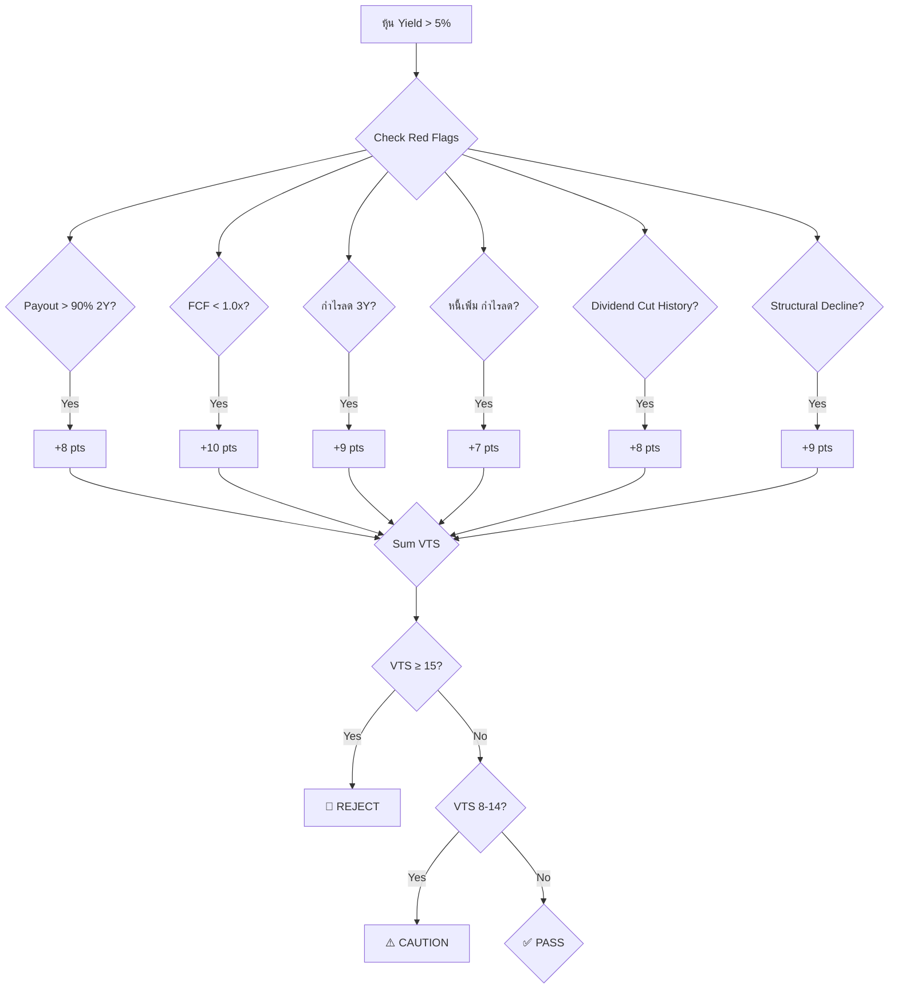
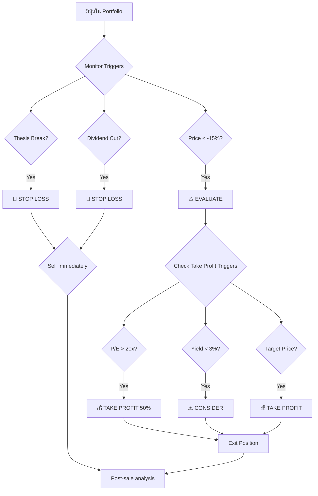

# Dividend Play - Work Flow

## 📋 5-Phase Workflow

```mermaid
flowchart TD
    A[🎯 START: พบหุ้น Yield > 5%] --> B{คัดกรอง Phase 0: Gate 0}
    B -->| C{✅ Pass Gate 0}
    C -->| D{📊 Phase 1: Yield Screen}
    D -->| E{✅ Yield > 5%?}
    E -->| No| F[🚫 REJECT]
    E -->| Yes| G{📊 Phase 2: Quality Check}
    G -->| H{FCF > 1.2x & ROE > 10%?}
    H -->| No| F[🚫 REJECT]
    H -->| Yes| I{🇹 Phase 3: Thai Checks}
    I -->| J{RPT OK? Governance OK?}
    J -->| No| K[⚠️ CAUTION]
    J -->| Yes| L{📉 Phase 4: Entry Decision}
    L -->| M{Value Trap Score < 8?}
    M -->| No| N[⚠️ CAUTION: ตรวจสอบ Red Flags]
    M -->| Yes| O{✅ BUY]
    
    N[⚠️ CAUTION] --> P{Yellow Flags?}
    P -->| Few| Q[✅ BUY with smaller position]
    P -->| Many| R[🚫 PASS]
    
    F[🚫 REJECT] --> S[🛑️ RISK LOG]
    R[🚫 PASS] --> S[📝 WATCH LOG]
```

---

## 📊 Phase Details

### Phase 0: Gate 0 (Thai Market Hygiene)

| Check | Pass Criteria |
|-------|---------------|
| ESG Rating | ≥ B |
| Free Float | ≥ 20% |
| Auditor | Big 4 |
| RPT | < 20% of Revenue |

### Phase 1: Yield Screen

| Metric | Pass | Fail |
|--------|------|------|
| Dividend Yield | > 5% | < 5% |
| Payout Ratio | < 80% | > 80% |

### Phase 2: Quality Check
| Metric | Pass | Fail |
|--------|------|------|
| FCF Cover | > 1.2x | < 1.0x |
| ROE | > 10% | < 8% |
| D/E Ratio | < 1.0 | > 1.5 |
| Dividend History | No cuts in 5Y | Cut in 3Y |

### Phase 3: Thai Checks
| Check | Pass | Caution |
|-------|------|---------|
| Regulated Sector | ไม่ใช่กฟก./ปตท. | ใช่ (ต้องตรวจพิเศษ) |
| RPT Traffic Light | Green | Yellow/Red |
| Land Valuation | ตรวจสอบแล้ว | ไม่ชัดเจน |
| Major Shareholder | ไม่ขัดแย้ง | มีปัญหา |

### Phase 4: Entry Decision
| Factor | BUY | PASS |
|--------|-----|------|
| VTS Score | < 8 | ≥ 15 |
| MOS | > 30% | < 15% |
| Catalyst | มี | ไม่มี |
| Rate Environment | เหมาะ | ไม่เหมาะ |

---

## 🔄 Position Sizing Flow

```mermaid
flowchart TD
    A[หุ้นใหม่] --> B{Tier Classification}
    B --> C{Tier A: 8%}
    B --> D{Tier B: 6%}
    B --> E{Tier C: 4%}
    
    C --> F{VTS Score?}
    D --> F
    E --> F
    
    F -->| G{VTS < 8?}
    G -->| Yes| H[Base Position]
    G -->| No| I{Reduced Position}
    I -->| I{Base × 0.5 or 0.75}
    
    H --> J{Check Sector Limit}
    J --> K{Sector < 25%?}
    K -->| Yes| L[✅ FINAL POSITION]
    K -->| No| M[⚠️ REDUCE or SKIP]
```

---

## 🛡️ Value Trap Detection Flow



---

## 📅 Exit Strategy Flow



---

## 🔗 Related

- [[Dividend-Play-Thesis]] - Full Thesis v2.0
- [[Deep-Value-Thesis]] - Alternative approach
- [[Valuation-Framework]] - DDM methods
