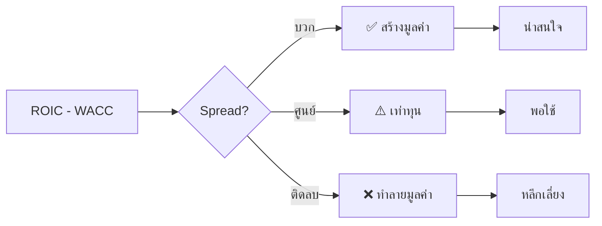

# 📊 ROIC-WACC: คู่มือฉบับสมบูรณ์

> **วิธีเลือกหุ้นที่สร้างมูลค่าจริง**

---

| สำหรับ | ผู้ลงทุนทุกระดับ — เริ่มจากศูนย์ก็เข้าใจได้ |
|-------|------------------------------------------|
| เป้าหมาย | อ่านจบ → เอาไปใช้กรองหุ้นได้ทันที |
| Methodology | @damodaran |
| Updated | 2026-04-01 |

---

## 🎯 ภาพรวม



---

## 📌 ก่อนอื่น: ทำไมต้องรู้เรื่องนี้?

### ❓ คุณเคยเจอแบบนี้ไหม?

> [!question] สถานการณ์ที่สับสน
> - **กำไรเพิ่มทุกปี** แต่ราคาหุ้นไม่ขึ้น?
> - **P/E ต่ำมาก** แต่ซื้อไปแล้วยิ่งต่ำลงเรื่อยๆ?
> - **บริษัทใหญ่โต** มีชื่อเสียง แต่ผลตอบแทนแย่?

> [!danger] คำตอบ
> **กำไรทางบัญชี ≠ การสร้างมูลค่า**

---

### 💡 ตัวอย่างที่ทำให้เห็นภาพ

| ตัวเลข | บริษัท A | บริษัท B |
|--------|----------|----------|
| กำไร | 100 ล้านบาท | 100 ล้านบาท |
| เงินลงทุน | 2,000 ล้านบาท | 500 ล้านบาท |
| **ผลตอบแทน** | **5%** | **20%** |
| คำตอบ | ⚠️ พอใช้ | ✅ ดีมาก |

> [!tip] บทเรียน
> **กำไรเท่ากัน แต่บริษัท B ดีกว่ามาก!**
>
> คำถามที่ถูกต้องไม่ใช่ "ทำกำไรไหม"
> แต่ต้องถามว่า **"ทำกำไรคุ้มไหมเทียบกับเงินที่ลงไป"**

---

### 🧠 หัวใจสำคัญ

> [!success] จำประโยคนี้ไว้
> **การลงทุนที่ดี = ผลตอบแทนสูงกว่าต้นทุนเงินทุน**

---

## 🎯 แนวคิดหลัก: ROIC และ WACC

### 📊 ภาพรวมสูตรหลัก

```
╔═══════════════════════════════════════════════════════════════════╗
║                                                                   ║
║    ROIC ────────┐                                                ║
║      ↓          │                                                ║
║    ─────────────┼──► SPREAD ──► บอกว่าสร้าง/ทำลายมูลค่า?         ║
║      ↓          │                                                ║
║    WACC ────────┘                                                ║
║                                                                   ║
║    Spread = ROIC - WACC                                          ║
║                                                                   ║
╚═══════════════════════════════════════════════════════════════════╝
```

---

### 1️⃣ ROIC = ผลตอบแทนจากการลงทุน

> [!info] นิยาม
> **ROIC (Return on Invested Capital)** คือผลตอบแทนที่บริษัทได้จากเงินทุนที่ลงไป

```
┌─────────────────────────────────────────────────────────────────┐
│                        ROIC FORMULA                              │
├─────────────────────────────────────────────────────────────────┤
│                                                                  │
│         NOPAT                                                    │
│  ROIC = ─────────────────────                                   │
│         Invested Capital                                         │
│                                                                  │
│  NOPAT = EBIT × (1 - Tax Rate)                                  │
│  Invested Capital = Equity + Debt - Cash                        │
│                                                                  │
└─────────────────────────────────────────────────────────────────┘
```

**แปลเป็นภาษาคน:**

| ถ้าบริษัทใช้เงิน... | แล้วได้กำไร... | ROIC = | คำตัดสิน |
|---------------------|----------------|--------|----------|
| 100 บาท | 15 บาท | **15%** | ✅ ดี |
| 100 บาท | 5 บาท | **5%** | ⚠️ ต่ำ |

---

### 2️⃣ WACC = ต้นทุนเงินทุน

> [!info] นิยาม
> **WACC (Weighted Average Cost of Capital)** คือ "ราคา" ของเงินทุนที่บริษัทใช้

```
┌─────────────────────────────────────────────────────────────────┐
│                        WACC FORMULA                              │
├─────────────────────────────────────────────────────────────────┤
│                                                                  │
│  WACC = (E/V × Ke) + (D/V × Kd × (1 - T))                       │
│                                                                  │
│  E = มูลค่าหุ้น          Ke = ต้นทุนหุ้น                        │
│  D = มูลค่าหนี้          Kd = ต้นทุนหนี้                        │
│  V = E + D              T  = อัตราภาษี                          │
│                                                                  │
└─────────────────────────────────────────────────────────────────┘
```

**แปลเป็นภาษาคน:**

> [!example] ความหมาย
> ถ้า WACC = 10% หมายความว่า **บริษัทต้องทำผลตอบแทนอย่างน้อย 10% ถึงจะคุ้ม**

> [!note] ทำไมต้นทุนหุ้นสูงกว่าหนี้?
> เพราะ **ผู้ถือหุ้นเสี่ยงกว่า** — ไม่รับประกันผลตอบแทน

---

### 3️⃣ Spread = หัวใจของการวิเคราะห์

```
╔═══════════════════════════════════════════════════════════════════╗
║                                                                   ║
║                    Spread = ROIC - WACC                          ║
║                                                                   ║
╚═══════════════════════════════════════════════════════════════════╝
```

| สถานการณ์ | ค่า Spread | ความหมาย | การตัดสินใจ |
|-----------|-----------|----------|-------------|
| ROIC > WACC | **บวก (+)** | ✅ สร้างมูลค่า | น่าสนใจ |
| ROIC = WACC | **ศูนย์ (0)** | ⚠️ เท่าทุน | พอใช้ |
| ROIC < WACC | **ติดลบ (-)** | ❌ ทำลายมูลค่า | หลีกเลี่ยง |

> [!example] ตัวอย่างจริง
> | บริษัท | ROIC | WACC | Spread | คำตัดสิน |
> |-------|------|------|--------|----------|
> | ADVANC | 18% | 8% | **+10%** | ✅ สร้างมูลค่าสูงมาก |
> | IRPC | 1% | 5% | **-4%** | ❌ ทำลายมูลค่า |

---

## 📊 ตัวเลขสำคัญที่ต้องจำ

> [!tip] Cheat Sheet — บันทึกไว้ใกล้ตัว

### 🏆 เกณฑ์ประเมินคุณภาพหุ้น

| Metric | ✅ ดีมาก | ⚠️ ระวัง | ❌ อันตราย |
|:-------|:--------:|:--------:|:----------:|
| **Spread (ROIC-WACC)** | > 5% | 1-5% | < 1% |
| **ROIC (5 ปีเฉลี่ย)** | > 15% | 10-15% | < 10% |
| **Spread คงที่** | 4+ ปีติด | 2-3 ปี | < 2 ปี |
| **D/E Ratio** | < 1x | 1-2x | > 2x |
| **FCF Conversion** | > 80% | 50-80% | < 50% |

---

## 🔧 วิธีคำนวณ ROIC (Step by Step)

### 📋 Overview

```
Step 1: EBIT ──► Step 2: NOPAT ──► Step 3: Invested Capital ──► Step 4: ROIC
```

---

### 📝 Step 1: หา EBIT

```
EBIT = กำไรก่อนดอกเบี้ยและภาษี
```

| ดูจากไหน | ปรับปรุงอย่างไร |
|----------|-----------------|
| งบกำไรขาดทุน | ลบรายการพิเศษออก (ขายที่ดิน, ค่าเสียหายครั้งเดียว) |

---

### 📝 Step 2: คำนวณ NOPAT

```
╔═══════════════════════════════════════════════════════════════════╗
║                                                                   ║
║              NOPAT = EBIT × (1 - อัตราภาษี)                       ║
║                                                                   ║
╚═══════════════════════════════════════════════════════════════════╝
```

**อัตราภาษีไทย:**
| ประเภท | อัตรา |
|--------|-------|
| อัตราตามกฎหมาย | 20% |
| อัตราที่ใช้จริง (เฉลี่ย 5 ปี) | 15-18% |

---

### 📝 Step 3: หา Invested Capital

```
╔═══════════════════════════════════════════════════════════════════╗
║                                                                   ║
║     Invested Capital = ส่วนผู้ถือหุ้น + หนี้สิน - เงินสด          ║
║                                                                   ║
╚═══════════════════════════════════════════════════════════════════╝
```

| ดูจากไหน | ปรับปรุงอย่างไร |
|----------|-----------------|
| งบดุล | ลบเงินสดส่วนเกินออก (เก็บไว้แค่เงินหมุนเวียน) |

> [!warning] ระวัง!
> ตรวจสอบ [[Related Party Transactions\|ธุรกรรมกับบริษัทในเครือ]] — อาจมีเงินรั่วออก

---

### 📝 Step 4: คำนวณ ROIC

```
         NOPAT
ROIC = ─────────────────────
         Invested Capital
```

> [!tip] Pro Tip
> ใช้เฉลี่ย Invested Capital ต้นปี + ปลายปี เพื่อความแม่นยำ

---

## 📈 วิธีคำนวณ WACC (ตลาดไทย)

### 📋 Overview

```
Cost of Equity ──┬──► WACC
Cost of Debt ───┘
```

---

### 📝 Step 1: หา Cost of Equity

```
╔═══════════════════════════════════════════════════════════════════╗
║                    COST OF EQUITY (CAPM)                         ║
╠═══════════════════════════════════════════════════════════════════╣
║                                                                   ║
║  Cost of Equity = Rf + β × ERP + CRP                             ║
║                                                                   ║
║  Rf  = พันธบัตรรัฐบาลไทย 10 ปี = 2.5-3%                          ║
║  β   = Beta (ความผันผวน vs ตลาด)                                 ║
║  ERP = Equity Risk Premium = 6-7%                                ║
║  CRP = Country Risk Premium = 2-3% (สำหรับไทย)                   ║
║                                                                   ║
╚═══════════════════════════════════════════════════════════════════╝
```

**ต้นทุนหุ้นโดยประมาณ:**

| Sector | Beta | Cost of Equity |
|--------|:----:|:--------------:|
| ธนาคาร | 0.8-1.0 | 8-10% |
| พลังงาน | 1.0-1.2 | 10-12% |
| อุตสาหกรรม | 0.9-1.1 | 9-11% |
| ผู้บริโภค | 0.7-0.9 | 8-10% |
| เทคโนโลยี | 1.2-1.5 | 11-14% |

---

### 📝 Step 2: หา Cost of Debt

```
Cost of Debt = ดอกเบี้ยจ่าย / หนี้สินที่มีดอกเบี้ย
```

> [!note] ทางเลือก
> ใช้ YTM ของพันธบัตรบริษัท (ถ้ามี) จะแม่นยำกว่า

---

### 📝 Step 3: คำนวณ WACC

```
╔═══════════════════════════════════════════════════════════════════╗
║                        WACC FORMULA                              ║
╠═══════════════════════════════════════════════════════════════════╣
║                                                                   ║
║  WACC = (E/V × Ke) + (D/V × Kd × (1 - T))                       ║
║                                                                   ║
║  E  = มูลค่าหุ้น                                                   ║
║  D  = มูลค่าหนี้                                                   ║
║  V  = E + D                                                       ║
║  Ke = Cost of Equity                                              ║
║  Kd = Cost of Debt                                                ║
║  T  = อัตราภาษี                                                   ║
║                                                                   ║
╚═══════════════════════════════════════════════════════════════════╝
```

> [!example] ตัวอย่างคำนวณ
> ```
> บริษัทมี:
> • หุ้น 60% ต้นทุน 10%
> • หนี้ 40% ต้นทุน 5% ภาษี 20%
> 
> WACC = (0.6 × 10%) + (0.4 × 5% × 0.8)
>      = 6% + 1.6%
>      = 7.6%
> ```

---

## 🏰 Economic Moat: ทำไมบางบริษัท ROIC สูงกว่า?

### 🤔 Moat คืออะไร?

> [!quote] เปรียบเหมือน
> **[[Economic Moat|คูเศรษฐกิจ]] = คูน้ำรอบปราสาท**
>
> ยิ่งกว้าง = ยิ่งปลอดภัยจากการโจมตีของคู่แข่ง

---

### 🏛️ 5 ประเภทของ Moat

```
╔═══════════════════════════════════════════════════════════════════════════╗
║                    5 ECONOMIC MOAT TYPES (Morningstar)                    ║
╠═══════════════════════════════════════════════════════════════════════════╣
║                                                                           ║
║  1️⃣ NETWORK EFFECT (เครือข่าย)                                            ║
║     "ใช้ยิ่งมากยิ่งคุ้ม"                                                    ║
║     → ยิ่งมีคนใช้เยอะ ยิ่งมีคนอยากใช้                                        ║
║     → ตัวอย่าง: Facebook, LINE, ADVANC                                   ║
║                                                                           ║
║  2️⃣ INTANGIBLE ASSETS (ทรัพย์สินที่จับต้องไม่ได้)                           ║
║     "แบรนด์, สิทธิบัตร, ใบอนุญาต"                                         ║
║     → ลูกค้ายอมจ่ายแพงกว่าเพราะ brand                                     ║
║     → ตัวอย่าง: CPALL, ADVANC, HMPRO                                     ║
║                                                                           ║
║  3️⃣ COST ADVANTAGE (ต้นทุนต่ำ)                                            ║
║     "ทำได้ถูกกว่า"                                                        ║
║     → ขนาดใหญ่, เทคโนโลยี, ที่ตั้ง                                          ║
║     → ตัวอย่าง: CPF, HMPRO                                               ║
║                                                                           ║
║  4️⃣ SWITCHING COSTS (ต้นทุนการเปลี่ยน)                                    ║
║     "ย้ายยาก ย้ายแพง"                                                     ║
║     → ลูกค้าไม่อยากเปลี่ยนเพราะเสียเวลา/เงิน                               ║
║     → ตัวอย่าง: ซอฟต์แวร์องค์กร, ธนาคาร                                  ║
║                                                                           ║
║  5️⃣ EFFICIENT SCALE (ขนาดมีประสิทธิภาพ)                                  ║
║     "ตลาดเล็ก ผู้เล่นน้อย"                                                ║
║     → ตลาดรองรับได้ไม่กี่คน คนใหม่เข้ามาไม่คุ้ม                            ║
║     → ตัวอย่าง: โรงไฟฟ้า, ทางด่วน                                        ║
║                                                                           ║
╚═══════════════════════════════════════════════════════════════════════════╝
```

---

### ⚡ Quick Moat Check (5 คำถาม)

```
┌─────────────────────────────────────────────────────────────────┐
│                    5 คำถามตรวจ Moat                             │
├─────────────────────────────────────────────────────────────────┤
│                                                                  │
│  Q1: ลูกค้าย้ายยากไหม? ──── Yes → SWITCHING COSTS               │
│                                                                  │
│  Q2: มีแบรนด์/สิทธิบัตร? ─── Yes → INTANGIBLE ASSETS             │
│                                                                  │
│  Q3: ต้นทุนต่ำกว่าคู่แข่ง? ── Yes → COST ADVANTAGE                │
│                                                                  │
│  Q4: ใช้ยิ่งมากยิ่งคุ้ม? ──── Yes → NETWORK EFFECT                 │
│                                                                  │
│  Q5: ตลาดเล็ก ผู้เล่นน้อย? ─ Yes → EFFICIENT SCALE               │
│                                                                  │
└─────────────────────────────────────────────────────────────────┘
```

---

### 📊 Moat Scorecard (100 คะแนน)

| ปัจจัย | น้ำหนัก | ใส่คะแนน 0-5 | คำนวณ |
|--------|:-------:|:-------------:|:-----:|
| ROIC-WACC Spread | 25% | `___` | × 5 = `___`/25 |
| Margin Stability | 20% | `___` | × 4 = `___`/20 |
| Excess Return Persistence | 20% | `___` | × 4 = `___`/20 |
| FCF Conversion | 15% | `___` | × 3 = `___`/15 |
| Capital Discipline | 20% | `___` | × 4 = `___`/20 |
| **รวม** | 100% | | **`___`/100** |

> [!success] แปลผล
> | คะแนน | ระดับ | ความหมาย |
> |:-----:|:-----:|----------|
> | **80+** | 🏰 Wide Moat | คูน้ำกว้าง ปลอดภัยมาก |
> | **60-79** | 🏠 Narrow Moat | คูน้ำแคบ ยังพอป้องกัน |
> | **< 60** | ❌ No Moat | ไม่มีคูน้ำ เสี่ยงสูง |

---

## 🚨 Value Trap: เมื่อหุ้นถูกแต่ไม่ควรซื้อ

### ❓ Value Trap คืออะไร?

> [!danger] นิยาม
> **[[Value Trap|กับดักมูลค่า]]** = หุ้นที่ดูถูก (P/E ต่ำ, ราคาต่ำ)
> แต่ **ถูกต้องเพราะพื้นฐานแย่**

> [!warning] จำไว้
> **"ถูก" ไม่ได้แปลว่า "คุ้ม"**

---

### ⚠️ 5 อันตรายที่สุด (Red Flags)

| # | Red Flag | ความหมาย | ทำไมอันตราย |
|:-:|----------|----------|-------------|
| 1 | **ROIC < WACC 3+ ปีติด** | ทำลายมูลค่าต่อเนื่อง | ไม่ใช่ชั่วคราว |
| 2 | **D/E > 2.5x** | หนี้สินสูงมาก | เสี่ยงล้มละลาย |
| 3 | **FCF ติดลบ 2+ ปี** | ไม่สร้างเงินสด | ต้องกู้เพิ่ม |
| 4 | **Related Party เยอะ** | ธุรกรรมกับเจ้าของ | เงินรั่วออก |
| 5 | **Goodwill Impairment** | ซื้อกิจการไม่คุ้ม | ตัดสินใจผิดพลาด |

---

### 🔍 ประเภทของ Value Destruction

```
╔═══════════════════════════════════════════════════════════════════════════╗
║                    ทำไมบริษัททำลายมูลค่า?                                 ║
╠═══════════════════════════════════════════════════════════════════════════╣
║                                                                           ║
║  1️⃣ STRUCTURAL (โครงสร้างแย่) → ❌ แก้ยาก                                ║
║     • ไม่มี moat, ขาย commodity, ถูก disrupt                             ║
║     • ตัวอย่าง: IRPC, THCOM                                              ║
║                                                                           ║
║  2️⃣ BEHAVIORAL (ผู้บริหารแย่) → ⚠️ แก้ได้ถ้าเปลี่ยนคน                    ║
║     • Empire building, M&A ไม่คุ้ม, เอาเปรียบผู้ถือหุ้น                   ║
║     • ตัวอย่าง: บริษัทที่ RPT สูง                                         ║
║                                                                           ║
║  3️⃣ CYCLICAL (วัฏจักรแย่) → ✅ แก้เองเมื่อ cycle กลับ                    ║
║     • อุตสาหกรรมตกต่ำ, ราคาสินค้าตก                                     ║
║     • ตัวอย่าง: SCC (chemicals downcycle), AAV (post-COVID)              ║
║                                                                           ║
╚═══════════════════════════════════════════════════════════════════════════╝
```

---

### ❓ วิธีแยก Cyclical vs Structural

**ถาม 3 คำถาม:**

| # | คำถาม | ถ้าใช่ = |
|:-:|-------|----------|
| 1 | **อุตสาหกรรมเป็นไหม?** (ทุกคนได้รับผลกระทบ?) | อาจเป็น cyclical |
| 2 | **บริษัทแย่กว่าคู่แข่งไหม?** | มีปัญหาเฉพาะตัว |
| 3 | **Moat ยังอยู่ไหม?** | มีโอกาสฟื้น |

---

## 🔄 4 ขั้นตอนกรองหุ้น

### 📊 Screening Framework Overview

```
╔═══════════════════════════════════════════════════════════════════════════╗
║                        4-STEP SCREENING PROCESS                           ║
╠═══════════════════════════════════════════════════════════════════════════╣
║                                                                           ║
║  STEP 1          STEP 2          STEP 3          STEP 4                  ║
║  SPREAD    ──►   PERSIST   ──►   VALUE     ──►   QUALITY                 ║
║  30-40           15-20           8-12            5-8 stocks               ║
║  stocks          stocks          stocks          → Deep dive             ║
║                                                                           ║
╚═══════════════════════════════════════════════════════════════════════════╝
```

---

### Step 1️⃣ : Spread Filter (กรองด้วยผลตอบแทน)

```
┌─────────────────────────────────────────────────────────────────┐
│                    STEP 1: SPREAD FILTER                        │
├─────────────────────────────────────────────────────────────────┤
│                                                                  │
│  เงื่อนไข:                                                       │
│  • ROIC - WACC > 3%                                             │
│  • หรือ Spread vs Sector: Top 30%                                │
│                                                                  │
│  ผลลัพธ์: 30-40 หุ้นจาก SET 100                                  │
│                                                                  │
└─────────────────────────────────────────────────────────────────┘
```

---

### Step 2️⃣ : Persistence Filter (กรองด้วยความคงทน)

```
┌─────────────────────────────────────────────────────────────────┐
│                  STEP 2: PERSISTENCE FILTER                     │
├─────────────────────────────────────────────────────────────────┤
│                                                                  │
│  เงื่อนไข:                                                       │
│  • Spread บวก 3+ ปีติดกัน                                        │
│  • แนวโน้ม: ปีนี้ดีกว่าเฉลี่ย 3 ปี                                 │
│                                                                  │
│  ผลลัพธ์: 15-20 หุ้น                                              │
│                                                                  │
└─────────────────────────────────────────────────────────────────┘
```

---

### Step 3️⃣ : Valuation Filter (กรองด้วยราคา)

```
┌─────────────────────────────────────────────────────────────────┐
│                   STEP 3: VALUATION FILTER                      │
├─────────────────────────────────────────────────────────────────┤
│                                                                  │
│  เงื่อนไข:                                                       │
│  • P/E vs Sector < 1.0x                                         │
│  • EV/EBITDA vs Sector < 1.0x                                   │
│  • ราคา < 90% ของ Fair Value                                    │
│                                                                  │
│  ผลลัพธ์: 8-12 หุ้น                                               │
│                                                                  │
└─────────────────────────────────────────────────────────────────┘
```

---

### Step 4️⃣ : Quality Filter (กรองด้วยคุณภาพ)

```
┌─────────────────────────────────────────────────────────────────┐
│                    STEP 4: QUALITY FILTER                       │
├─────────────────────────────────────────────────────────────────┤
│                                                                  │
│  เงื่อนไข:                                                       │
│  • Debt/EBITDA < 3.0x                                           │
│  • Interest Coverage > 5.0x                                     │
│  • Earnings Stability: StdDev < 20%                             │
│                                                                  │
│  ผลลัพธ์: 5-8 หุ้น → Deep dive 3-5 หุ้น                           │
│                                                                  │
└─────────────────────────────────────────────────────────────────┘
```

---

## 🛒 ตารางตัดสินใจ Buy/Hold/Sell

> [!tip] Decision Matrix — Print & Keep

| Spread | Moat | Valuation | Action | Position |
|:------:|:----:|:---------:|:------:|:--------:|
| **> 5%** | 🏰 Wide | P/FV < 0.8 | ✅ **BUY** | 5-8% |
| **> 5%** | 🏠 Narrow | P/FV < 0.9 | ✅ **BUY** | 3-5% |
| **1-5%** | OK | P/FV < 0.9 | ⚠️ **HOLD/WATCH** | — |
| **< 1%** | Any | Any | ❌ **AVOID/SELL** | — |
| Any | Any | P/FV > 1.2 | ✂️ **TRIM 50%** | — |
| Any | Any | P/FV > 1.35 | 🚫 **SELL ALL** | — |

---

## 🇹🇭 ข้อพิเศษสำหรับตลาดไทย

### ⚠️ สิ่งที่ต้องระวังเป็นพิเศษ

| Red Flag | คำอธิบาย | ตรวจสอบที่ไหน |
|----------|----------|---------------|
| **[[Related Party Transactions]]** | ทำธุรกรรมกับบริษัทในเครือ | Footnotes, 56-1 |
| **Land Revaluation** | ปรับประเมินที่ดินเพิ่ม | Balance Sheet Notes |
| **Family Control** | ตระกูลถือหุ้นใหญ่ | Shareholder Structure |
| **Auditor Rotation** | เปลี่ยน auditor บ่อย | 56-1, Governance Report |

---

### 📐 การปรับ WACC สำหรับไทย

```
╔═══════════════════════════════════════════════════════════════════╗
║                    THAI WACC ADJUSTMENT                          ║
╠═══════════════════════════════════════════════════════════════════╣
║                                                                   ║
║  Thai WACC = Standard WACC + 2-3% (Country Risk Premium)         ║
║                                                                   ║
║  ตัวอย่าง:                                                        ║
║  • คำนวณ WACC ปกติได้ 8%                                         ║
║  • ปรับสำหรับไทย: 8% + 2.5% = 10.5%                              ║
║                                                                   ║
╚═══════════════════════════════════════════════════════════════════╝
```

---

### ✅ Governance Quick Check

```
┌─────────────────────────────────────────────────────────────────┐
│                  ตรวจสอบก่อนลงทุน                               │
├─────────────────────────────────────────────────────────────────┤
│                                                                  │
│  □ Board Independence: > 40%                                    │
│  □ Audit Committee: Independent chair                           │
│  □ Related Party Policy: เปิดเผยชัดเจน                          │
│  □ Voting Structure: 1 หุ้น = 1 เสียง                            │
│  □ Dividend Policy: สม่ำเสมอ                                    │
│  □ SET CG Score: > 70 (ถ้ามี)                                   │
│                                                                  │
└─────────────────────────────────────────────────────────────────┘
```

---

## 📚 ตัวอย่าง Case Studies

### ✅ บริษัทที่สร้างมูลค่า (Value Creators)

| Company | ROIC | WACC | Spread | Moat Type |
|:-------:|:----:|:----:|:------:|-----------|
| **ADVANC** | 18% | 8% | **+10%** | Network Effect + Switching Cost |
| **HMPRO** | 15% | 8% | **+7%** | Category Killer + Location |
| **CPALL** | 13% | 7% | **+6%** | Network Density + Brand |
| **CPF** | 9% | 6% | **+3%** | Cost Advantage + Scale |

> [!success] สิ่งที่เหมือนกัน
> - 🏰 Moat ชัดเจน
> - 💰 Capital allocation มีวินัย
> - 💵 FCF แข็งแกร่ง

---

### ❌ บริษัทที่ทำลายมูลค่า (Value Destroyers)

| Company | ROIC | WACC | Spread | ปัญหาหลัก |
|:-------:|:----:|:----:|:------:|-----------|
| **AAV** | -3% | 5% | **-8%** | High Fixed Cost, COVID Impact |
| **IRPC** | 1% | 5% | **-4%** | Commodity Trap, No Moat |
| **SCC** | 2% | 4% | **-2%** | Chemicals Downcycle, LSP Drag |
| **ANAN** | -1% | 6%* | **-7%** | Condo Trap, Balance Sheet Weak |

> [!danger] สิ่งที่เหมือนกัน
> - ❌ ไม่มี moat หรือ moat ถูกทำลาย
> - 📉 Capital allocation แย่
> - 🔴 FCF อ่อนแอหรือติดลบ

---

## 📝 Checklist ก่อนลงทุน

### ✅ Pre-Investment Checklist

```
╔═══════════════════════════════════════════════════════════════════════════╗
║                        PRE-INVESTMENT CHECKLIST                           ║
╠═══════════════════════════════════════════════════════════════════════════╣
║                                                                           ║
║  □ STEP 1: คำนวณ Spread                                                  ║
║    └─ ROIC - WACC > 3% ไหม?                                               ║
║    └─ ต่อเนื่อง 3+ ปีไหม?                                                 ║
║                                                                           ║
║  □ STEP 2: ตรวจ Moat                                                     ║
║    └─ มีข้อได้เปรียบไหม?                                                   ║
║    └─ Moat Score > 60 ไหม?                                                ║
║                                                                           ║
║  □ STEP 3: ตรวจ Quality                                                  ║
║    └─ D/E < 2x ไหม?                                                       ║
║    └─ FCF positive ไหม?                                                   ║
║    └─ OCF > Net Income ไหม?                                               ║
║                                                                           ║
║  □ STEP 4: ตรวจ Governance                                               ║
║    └─ RPT ต่ำไหม?                                                         ║
║    └─ Board independent พอไหม?                                            ║
║                                                                           ║
║  □ STEP 5: ตรวจ Valuation                                                ║
║    └─ ราคา < Fair Value ไหม?                                              ║
║    └─ P/E vs Sector ต่ำกว่าไหม?                                           ║
║                                                                           ║
║  □ STEP 6: หา Catalyst                                                   ║
║    └─ อะไรจะทำให้ตลาดรู้ค่า?                                              ║
║    └─ Timeline ชัดเจนไหม?                                                 ║
║                                                                           ║
╚═══════════════════════════════════════════════════════════════════════════╝
```

---

### ⚠️ Value Trap Checklist

> [!danger] ถ้าติ๊ก 3+ ข้อ → **AVOID**

```
□ ROIC < WACC 3+ ปีติด
□ D/E > 2.5x
□ FCF ติดลบ 2+ ปี
□ RPT สูง
□ Goodwill impairment บ่อย
□ Auditor เปลี่ยนบ่อย
□ Management turnover สูง
□ ไม่จ่ายปันผล + ไม่ buyback
```

---

## 🎓 สรุป: สิ่งที่ต้องจำ

### 💎 3 หลักการสำคัญ

```
╔═══════════════════════════════════════════════════════════════════════════╗
║                           3 CORE PRINCIPLES                               ║
╠═══════════════════════════════════════════════════════════════════════════╣
║                                                                           ║
║  1️⃣ ROIC > WACC = สร้างมูลค่า                                            ║
║     ไม่ใช่แค่ทำกำไร แต่ต้องทำกำไรคุ้มกับเงินที่ลงไป                       ║
║                                                                           ║
║  2️⃣ Moat ปกป้อง ROIC                                                    ║
║     ถ้าไม่มี moat คู่แข่งจะแย่งส่วนต่างไปจนหมด                          ║
║                                                                           ║
║  3️⃣ ราคาสำคัญ                                                           ║
║     • หุ้นดีราคาแพง = ไม่ดี                                               ║
║     • หุ้นแย่ราคาถูก = กับดัก                                             ║
║                                                                           ║
╚═══════════════════════════════════════════════════════════════════════════╝
```

---

### 🚀 4 ขั้นตอน Action Plan

| Step | Action | คำอธิบาย |
|:----:|:------:|----------|
| 1 | **CALCULATE** | คำนวณ ROIC และ WACC |
| 2 | **VALIDATE** | ตรวจ Moat และ Quality |
| 3 | **PRICE** | เช็ค Valuation |
| 4 | **DECIDE** | Buy/Hold/Sell |

---

### 📇 Cheat Card — ตัวเลขต้องจำ

| Metric | ✅ Good | ⚠️ Warning | ❌ Danger |
|:-------|:-------:|:----------:|:---------:|
| **Spread** | > 5% | 1-5% | < 1% |
| **Persistence** | 4+ yr | 2-3 yr | < 2 yr |
| **D/E** | < 1x | 1-2x | > 2x |
| **FCF Conversion** | > 80% | 50-80% | < 50% |

---

## 🔗 Related Notes

### 📚 งานวิจัยพื้นฐาน

- [[A1-EVA-Literature-Review]] — พื้นฐานทางวิชาการ
- [[A2-Data-Methodology]] — วิธีการคำนวณละเอียด

### 📊 Case Studies

- [[B1-High-Spread-Companies]] — บริษัทที่สร้างมูลค่า
- [[B2-Negative-Spread-Companies]] — บริษัทที่ทำลายมูลค่า

### 🧠 Synthesis

- [[B3-Moat-Analysis-Framework]] — การวิเคราะห์ Moat
- [[B4-Value-Destruction-Analysis]] — การตรวจจับ Value Trap
- [[B5-Market-Pricing-Patterns]] — รูปแบบการตั้งราคาของตลาด

### 🛠️ Practical Tools

- [[ROIC-WACC-Practical-Framework]] — คู่มือปฏิบัติการเต็ม
- [[Quick-Reference-Card]] — การ์ดอ้างอิงด่วน

### 💡 Concepts

- [[Economic Moat]] — คูเศรษฐกิจ
- [[Value Creation]] — การสร้างมูลค่า
- [[Value Trap]] — กับดักมูลค่า
- [[Capital Allocation]] — การจัดสรรเงินทุน
- [[Related Party Transactions]] — ธุรกรรมกับบริษัทในเครือ
- [[Quality Swing Investor]] — ปรัชญาการลงทุน

---

## 📚 Sources

### 🎓 Academic

| Study | Contribution |
|-------|--------------|
| Stewart (1991) | EVA Framework |
| Ohlson (1995), Feltham-Ohlson (1995) | Residual Income Model |
| Frankel & Lee (1998) | Predictive Power |
| Novy-Marx (2013) | Profitability Factor |

### 💼 Practitioner

| Source | Contribution |
|--------|--------------|
| Damodaran | ROIC & Valuation |
| Mauboussin | Mean Reversion |
| Morningstar | Moat Framework |
| AQR (Asness et al.) | Quality Factor |

---

*Synthesis: Synapse-O*
*Methodology: @damodaran*
*Created: 2026-04-01*
*Language: Thai with English terms*
*For: All levels of investors*
