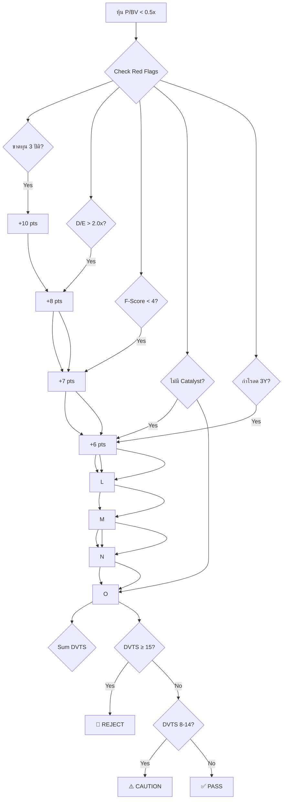

# Deep Value - Work Flow

## 📋 4-Phase Workflow

```mermaid
flowchart TD
    A[🎯 START: พบหุ้น P/BV < 0.5x] --> B{คัดกรอง Phase 0: Gate 0}
    B -->| ✅ Pass Gate 0 | C{📊 Phase 1: Discount Check}
    C -->| D{P/BV < 0.5x OR NCAV < 0.67×Price?}
    D -->| No| E[🚫 REJECT: Too Expensive]
    D -->| Yes| F{📊 Phase 2: Quality Check}
    F -->| G{F-Score ≥ 6 & D/E < 1.5x?}
    G -->| No| H[🚫 REJECT: Poor Quality]
    G -->| Yes| I{🇹 Phase 3: Thai Checks}
    I -->| J{RPT < 20%? Governance OK?}
    J -->| No| K[🚫 REJECT: Governance Risk]
    J -->| Yes| L{📉 Phase 4: Entry Decision}
    L -->| M{MOS > 30% & Catalyst Exists?}
    M -->| No| N[🟡 WATCH: Wait for better price]
    M -->| Yes| O[✅ BUY]
```

---

## 📊 Phase Details

### Phase 0: Gate 0 (Knockout Criteria)

| Check | Pass Criteria |
|-------|---------------|
| ESG Rating | ≥ B |
| Free Float | ≥ 20% |
| Auditor | Big 4 |
| RPT | < 20% of Revenue |

### Phase 1: Discount Check

| Metric | Pass | Fail |
|--------|------|------|
| P/BV | < 0.5x | > 0.7x |
| NCAV | Price < 0.67×NCAV | Price > NCAV |
| NNWC | Price < NNWC | Price > NNWC |

### Phase 2: Quality Check

| Metric | Pass | Fail |
|--------|------|------|
| F-Score | ≥ 6 | < 4 |
| D/E Ratio | < 1.5x | > 2.0x |
| Interest Coverage | > 2.0x | < 1.5x |
| ROE | > 8% | < 5% |

### Phase 3: Thai Checks

| Check | Pass | Caution |
|-------|------|---------|
| Regulated Sector | ไม่ใช่กฟก./ปตท. | ใช่ (ต้องตรวจพิเศษ) |
| RPT Traffic Light | Green | Yellow/Red |
| Land Valuation | ตรวจสอบแล้ว | ไม่ชัดเจน |
| Major Shareholder | ไม่ขัดแย้ง | มีปัญหา |

### Phase 4: Entry Decision

| Factor | BUY | PASS |
|--------|-----|------|
| MOS | > 30% | < 20% |
| Catalyst | ระบุได้ชัดเจน | ไม่มี |
| Catalyst Timeline | < 24 months | > 36 months |
| Liquidity | Free Float > 15% | Free Float < 10% |

---

## 🔄 Position Sizing Flow

```mermaid
flowchart TD
    A[หุ้นใหม่] --> B{Tier Classification}
    B --> C{Tier A: 5%}
    B --> D{Tier B: 3%}
    B --> E{Tier C: 2%}
    
    C --> F{Liquidity Check}
    D --> F
    E --> F
    
    F -->| G{Free Float > 20%?}
    G -->| Yes| H[Base Position]
    G -->| No| I{Reduced Position}
    I -->| I{Base × 0.5}
    
    H --> J{Check Sector Limit}
    J --> K{Sector < 20%?}
    K -->| Yes| L[✅ FINAL POSITION]
    K -->| No| M[⚠️ REDUCE or SKIP]
```

---

## 🛡️ Value Trap Detection Flow



---

## 📅 Exit Strategy Flow

```mermaid
flowchart TD
    A[มีหุ้นใน Portfolio] --> B{Monitor Triggers}
    
    B --> C{Catalyst Real?}
    B --> D{Time Stop?}
    B --> E{Thesis Break?}
    
    C -->| Yes| F[💰 TAKE PROFIT]
    D -->| Yes| G[🚨 STOP LOSS]
    E -->| Yes| H[🚨 STOP LOSS]
    
    F --> H[⚠️ EVALUATE]
    G --> H[Hold / Reduce]
    
    F --> I{Check Take Profit triggers}
    
    I --> J{Price ≥ IV?}
    I --> K{Price ≥ 1.2×IV?}
    I --> L{24 months elapsed?}
    
    J -->| Yes| K[💰 TAKE PROFIT 25%]
    K -->| Yes, L[💰 TAKE PROFIT 50%]
    L -->| Yes, M[🚨 STOP LOSS]
    
    J --> Q[Check Position limit]
    K --> L --> M
    M --> N[Exit Position]
    G --> N
    H --> N
```

---

## 🔗 Related

- [[Deep-Value-Thesis]] - Full Thesis v2.0
- [[Dividend-Play-Thesis]] - Alternative approach
- [[Valuation-Framework]] - DCF methods
