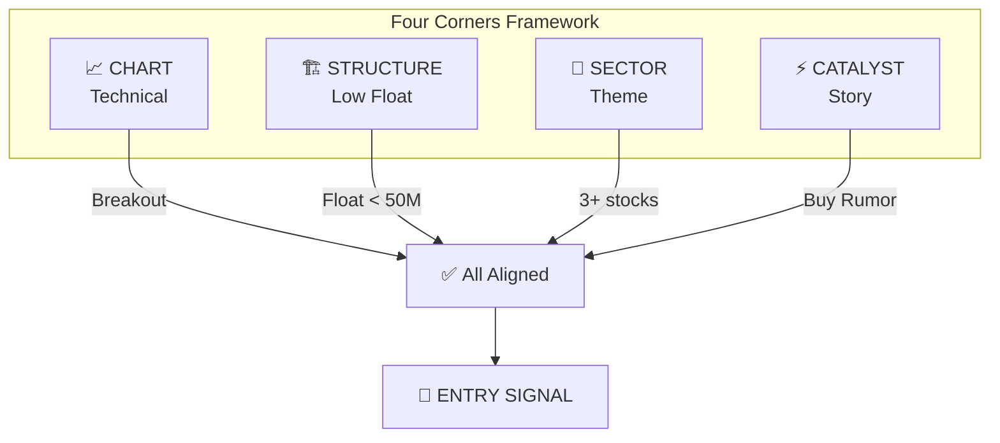
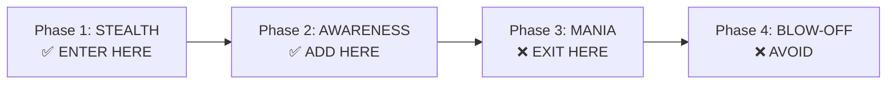
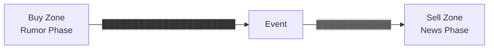
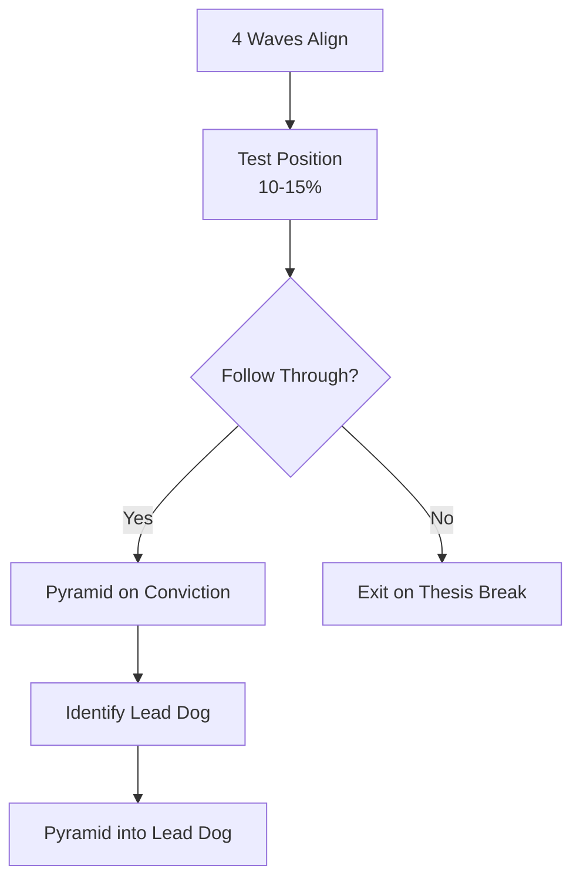

# Jeffrey Neumann's Four Corners System

> **"ผมไม่ได้เล่นตลาด ผมรอให้ทุกอย่างเรียงตัวสวย"**
> — Jeffrey Neumann

---

## 🎯 Executive Summary

**The Neumann Story:** เปลี่ยน $2,500 เป็น $50M+ (2,000,000% return) โดยไม่เคยโดน Cut จากเกม

| Element | Description |
|:---|:---|
| **Starting Capital** | $2,500 |
| **Current Wealth** | $50M+ |
| **Return** | 2,000,000% |
| **Key Edge** | **Four Corners Alignment** + Patience |
| **Focus** | Microcap Breakout ($0.50-$10) |
| **Timeframe** | Swing (สัปดาห์-เดือน) |

### 🔑 The Neumann Philosophy

> **"ผมไม่ได้เล่นตลาด ผมรอให้ทุกอย่างเรียงตัวสวยก่อน"**

คนส่วนใหญ่รีบเข้า ผมรอ คนส่วนใหญ่ FOMO ผมค่อยเข้า

---

## 📐 Part 1: The Four Corners Framework

### 4 เกณฑ์ที่ต้องพร้อมพร้อมกัน

ผมไม่มองหุ้นเป็นตัวๆ ไป แต่มองว่าหุ้นแต่ละตัวต้องผ่าน "4 มุม" นี้พร้อมกัน ขาดมุมไหน = ไม่เข้า (รอต่อ)



### Four Corners Matrix

```
┌─────────────┬─────────────┐
│   CHART     │  STRUCTURE  │
│ (Technical) │ (Low Float) │
├─────────────┼─────────────┤
│   SECTOR    │  CATALYST   │
│   (Theme)   │   (Story)   │
└─────────────┴─────────────┘
```

| Corner | คำถามหลัก | หาย ไม่ผ่าน |
|:---|:---|:---|
| **CHART** | "หุ้นตัวนี้กำลังตื่นจากการพักตัวไหม?" | ยังไม่มี Breakout |
| **STRUCTURE** | "โครงสร้างหุ้นตัวนี้พร้อมระเบิดไหม?" | Float ใหญ่/Dilution |
| **SECTOR** | "เงินกำลังไหลเข้า sector นี้ไหม?" | ตัวเดียวพุ่ง |
| **CATALYST** | "ทำไมราคาต้องเคลื่อนไหวตอนนี้?" | ไม่มีเหตุผลชัดเจน |

### เปรียบเทียบ: Four Corners เหมือนโต๊ะอาหาร 4 ขา

```
ถ้าโต๊ะมี 4 ขา → นั่งได้สบาย
ถ้าโต๊ะขาด 1 ขา → โต๊ะล้ม
ถ้าหุ้นขาด 1 Corner → เทรดล้ม
```

### Neumann vs คนทั่วไป

| คนทั่วไป | Neumann |
|:---|:---|
| เห็นหุ้นตัวหนึ่งดี → ซื้อเลย | เห็นหุ้นดี → รอ 4 Corners align |
| ไม่สนใจ Sector | ต้องมี Sector Momentum |
| ไม่อ่าน Dilution | อ่านทุก Filing |
| ใช้ Hard Stop | ใช้ Mental Stop ตาม Thesis |
| เล่นทุกวัน | รอจังหวะที่ดีที่สุด |

---

## 🌊 Wave 1: STRUCTURAL FILTER (โครงสร้างพร้อมระเบิด)

คนส่วนใหญ่มองถึงราคาและ Chart ก่อน ผมมอง **โครงสร้าง** ก่อน

### เปรียบเทียบ: โครงสร้างหุ้น เหมือน รถยนต์

```
โครงสร้างดี   = Ferrari สภาพดี → เตาะก็บิน
โครงสร้างแย่ = Ferrari พัง → กดแก๊สก็ไม่ไป
```

### 5 เกณฑ์โครงสร้าง (Daily Batch)

#### ① Float ต้องน้อย ⭐⭐⭐

ทำไม Float ต่ำสำคัญ? Float ต่ำ = คนถือน้อย เมื่อคนมาซื้อพร้อมกัน ราคาบินได้แรงมาก

```
เปรียบเทียบ:
Float 100M = คน 100 คนแบ่งกินเค้ก 1 ผืน → คนละนิดเดียว
Float 5M   = คน 5 คนแบ่งกินเค้ก 1 ผืน → คนละเยอะมาก
```

| Float | Rating | ความหมาย |
|:---|:-:|:---|
| < 10M | ★★★ | ระเบิดได้ทุกเมื่อ แต่ bid-ask กว้าง |
| 10-50M | ★★★ | ดีเยี่ยม ศักยภาพสูง |
| 50-200M | ★★ | ผ่านขั้นต่ำ |
| > 200M | ★ | ตัดออก (ต้องการเงินเยอะเกินไป) |

**ตรวจสอบได้ที่:** Finviz → Shs Float

#### ② Insider Ownership (Skin in the Game) ⭐⭐⭐

ทำไม Insider สำคัญ? ถ้าผู้บริหารไม่ถือหุ้นตัวเอง = เขาไม่สนใจว่าราคาจะไปไหน

```
Insider 30%+ = ผู้บริหารมีเลือดเหลืองกับหุ้นนี้
Insider < 15% = ผู้บริหารถือเหมือนคนธรรมดา = ไม่แคร์
```

| Insider % | Rating | ความหมาย |
|:---|:-:|:---|
| > 30% | ★★★ | ดีมาก ผู้บริหารมีแรงจูงใจสูง |
| 15-30% | ★★ | ผ่านขั้นต่ำ |
| < 15% | ★ | ไม่มี skin in the game |

#### ③ Institutional Ownership ต่ำ ⭐⭐

ทำไหม Institutional ต่ำดี? Institutional ต่ำ = คุณเข้าก่อน Big Money

```
Institutional < 10% = ยังไม่มีสถาบันเข้ามา = โอกาสร่วมกับ Smart Money
Institutional > 30% = สถาบันถือเยอะแล้ว = รอช้าไปแล้ว
```

| Institutional % | Rating | ความหมาย |
|:---|:-:|:---|
| < 10% | ★★★ | แทบไม่มีสถาบันถือเลย |
| 10-20% | ★★ | ดีมาก |
| 20-30% | ★ | ผ่านขั้นต่ำ |
| > 30% | ✗ | สถาบันถือเยอะเกินไป |

#### ④ Price Range ($0.50 - $10) ⭐

| Price Range | ปัญหา |
|:---|:---|
| < $0.50 | มักเป็นหุ้นที่ "กำลังจะตาย" อาจถูก delist |
| $0.50 - $10 | ✅ Sweet spot สำหรับ micro-caps |
| > $10 | ต้องการเงินทุนมากขึ้น ศักยภาพจำกัด |

> ⚠️ **ความผิดพลาด:** ผมเคยซื้อหุ้น $0.30 ที่ดูถูก แต่มันไปไหนไม่ได้ เพราะคนกลัวว่าจะตาย (Going Concern)

#### ⑤ ไม่มี Dilution ล่าสุด ⭐⭐⭐

> **Dilution = ศัตรูร้ายแรงที่สุด** บริษัทขายหุ้นเพิ่ม = ราคาโดนกด

| Filing | ความหมาย | Impact |
|:---|:---|:-:|
| S-3 (Shelf) | อาจขายได้ทุกเมื่อ | -30 pts |
| 424B (Prospectus) | กำลังขายอยู่ | -50 pts |
| ATM Offering | ขายทีละน้อยทุกวัน | -50 pts |

**Keywords อันตรายใน Filing:**
```
- "At-The-Market"
- "ATM offering"
- "From time to time we may offer"
- "Sales Agreement with [Broker]"
- "Equity Line of Credit"
```

**ตรวจสอบได้ที่:** SEC EDGAR → ค้นหา Ticker → ดู S-3, 424B, 8-K

---

## 📈 Wave 2: TECHNICAL IGNITION (จับจังหวะตื่น)

โครงสร้างดีแล้ว ตอนนี้รอจังหวะ "ตื่น"

### เปรียบเทียบ: Technical Ignition เหมือน จุดระเบิด

```
โครงสร้างดี = ดินระเบิดวางไว้แล้ว
Technical Ignition = จุดระเบิดติดไฟ
```

### 5 เกณฑ์ทางเทคนิค (Realtime)

#### ① Long-Term Basing Pattern ⭐⭐⭐

หุ้นที่จะบินต้อง "นอนตัว" นานๆ ก่อน

```
ราคา
  │
$5│     ╱╲
  │    ╱  ╲
$3│   ╱    ╲────────────────────╱╲
  │  ╱                      ╱╲ ╱  ╲
$1│ ╱      Basing Zone     ╱  ╲    ╲──► Breakout!
  │╱   (1-2 years of death)╱
  └────────────────────────────────────────► เวลา
```

| Basing Period | Rating |
|:---|:-:|
| > 365 days | ★★★ ดีมาก |
| 180-365 days | ★★ ผ่าน |
| < 180 days | ★ ยังไม่พร้อม |

#### ② Price Compression (Squeeze) ⭐⭐

Squeeze คืออะไร? ราคาถูกบีบอัดในกรอบแคบๆ เหมือนสปริง

```
Bollinger Band บอก Squeeze ได้:
BB Width = (Upper Band - Lower Band) / Middle Band
```

| BB Width Percentile | Rating |
|:---|:-:|
| < 10th | ★★★ Super Squeeze |
| 10-20th | ★★ Squeeze |
| > 20th | ★ ยังไม่บีบอัดพอ |

#### ③ RVOL Spike (Relative Volume) ⭐⭐⭐

> **Volume = Footprint ของ Smart Money** ถ้าไม่มี Volume สูง Breakout ปลอม

```
RVOL = Volume วันนี้ / Volume เฉลี่ย 20 วัน

ตัวอย่าง:
- Volume วันนี้: 50 ล้านหุ้น
- Volume เฉลี่ย 20 วัน: 5 ล้านหุ้น
- RVOL = 50 / 5 = 10x
```

| RVOL | Rating | Action |
|:---|:-:|:---|
| > 10x | ★★★ | สัญญาณแรงมาก |
| 5-10x | ★★ | สัญญาณแรง |
| 2-5x | ★ | เริ่มสนใจ |
| < 2x | ✗ | ปกติ |

#### ④ RSI Historic Oversold ⭐

RSI Oversold = หุ้นถูกทุ่มจนเกินไป = โอกาส Bounce

| RSI Level | Rating |
|:---|:-:|
| < 20 (historic) | ★★★ Extreme oversold |
| 20-30 (first time in year) | ★★ Historic oversold |
| 30-40 | ★ Oversold ปกติ |
| > 40 | ✗ ไม่ oversold |

#### ⑤ Downtrend Line Breakout + Volume Confirm ⭐⭐⭐

Breakout ต้องมากับ Volume สูง ไม่งั้นปลอม

| Breakout แบบไหน | Volume | ผลลัพธ์ |
|:---|:---|:---|
| Breakout + Volume สูง | RVOL > 5x | ✅ Valid breakout |
| Breakout + Volume ต่ำ | RVOL < 1x | ✗ Fake-out (หลอก) |

---

## 🌊 Wave 3: SECTOR CLUSTER (เงินไหลเข้ากลุ่ม)

> **นี่คือ Secret Sauce ที่แยกผมจากคนอื่น ผมไม่ซื้อหุ้นเดี่ยว ผมซื้อ Sector**

### เปรียบเทียบ: Sector Cluster เหมือน คลื่นน้ำ

```
หุ้นเดี่ยวพุ่ง = หยดน้ำตก → อาจเป็นความบังเอิญ
Sector พุ่ง   = คลื่นน้ำทะเล → แน่นอนว่ามีแรง
```

### 4 เกณฑ์ Sector (Realtime)

#### ① Cluster Breakout (3+ stocks) ⭐⭐⭐

| จำนวนหุ้นพุ่ง | ความหมาย |
|:---|:---|
| 1 ตัว | อาจเป็นข่าวเฉพาะตัว |
| 2 ตัว | อาจเป็นความบังเอิญ |
| 3+ ตัว | ✅ เงินไหลเข้า sector แน่นอน! |

> ⚠️ **ความผิดพลาด:** ผมเคยซื้อหุ้นเดี่ยวที่ดูเจ๋ง แต่ Sector ไม่ไปไหน สุดท้ายราคากลับมาเท่าเดิม

#### ② Relative Strength (หา Lead Dog) ⭐⭐⭐

> **Lead Dog = หุ้นที่แรงที่สุดใน Sector = ซื้อตัวนี้หนักสุด**

```
RS = (ราคาหุ้น / ราคา Index) / เฉลี่ย 50 วัน

ตัวอย่าง:
Sector: 3D Printing
├── DDD:  RS = 2.1  ◄── Lead Dog!
├── SSYS: RS = 1.8
├── XONE: RS = 1.5
├── ONVO: RS = 1.2
└── VJET: RS = 0.9

ซื้อทุกตัว → Pyramid เข้า DDD (Lead Dog)
```

#### ③ Sector Lifecycle Phase ⭐⭐

รู้ว่า Sector อยู่ Phase ไหน = รู้ว่าควรซื้อหรือขาย



| Phase | Characteristics | Action |
|:---|:---|:---|
| **1. STEALTH** | Smart money เข้า, ยังไม่มีใครพูดถึง | ✅ ENTER HERE |
| **2. AWARENESS** | Early adopters เข้า, Media เริ่มพูดถึง | ✅ ADD HERE |
| **3. MANIA** | Mass public FOMO, ทุกคนพูดถึง | ❌ EXIT HERE |
| **4. BLOW-OFF** | Crash | ❌ AVOID |

> 🔑 **"Golf Course Indicator":** ถ้าได้ยินคนทั่วไปพูดถึง sector นั้นบนสนามกอล์ฟ = Mania Phase = EXIT

#### ④ Shotgun Approach ⭐⭐

วิธีซื้อ Sector ของผม:

```
1. ระบุ Hot Sector
       ↓
2. ซื้อ Basket 5-10 ตัวใน sector
       ↓
3. ดูว่าตัวไหนแรงสุด = Lead Dog
       ↓
4. Pyramid เข้า Lead Dog
       ↓
5. ตัดตัวที่อ่อน (Cut laggards)
```

---

## ⚡ Wave 4: CATALYST AUDIT (เหตุผลเคลื่อนไหว)

หุ้นดีต้องมี "เรื่องเล่า" ที่ทำให้ราคาเคลื่อนไหว

### เปรียบเทียบ: Catalyst เหมือน น้ำมันเชื้อเพลิง

```
โครงสร้างดี + Technical ดี = รถพร้อมแล้ว
Catalyst = น้ำมัน = รถวิ่ง!
```

### 4 เกณฑ์ Catalyst (Manual)

#### ① Hard Catalyst (แรงสุด) ⭐⭐⭐

| Type | Example | วิธีตรวจ |
|:---|:---|:---|
| FDA Approval | PDUFA date | BioPharmCatalyst |
| Legislative | Bill vote date | Congress calendar |
| Earnings | Quarterly report | Earnings calendar |
| Product Launch | iPhone release | Company IR |

#### ② Volume Catalyst (แรงรองลงมา) ⭐⭐

```
Volume พุ่ง 200 ล้านหุ้น
       ↓
ไม่มีข่าวอะไร
       ↓
แสดงว่า: มีคนรู้อะไรบางอย่าง
       ↓
Follow the smart money!
```

#### ③ Thematic Catalyst ⭐

| Theme | Catalyst |
|:---|:---|
| AI | ChatGPT launch |
| Clean Energy | Government subsidies |
| EV | Tesla success |
| Cannabis | Legalization |

#### ④ Buy the Rumor, Sell the News ⭐⭐⭐

> **กฎทองคำของผม:**



**Timeline:**
```
─────────────────────────────────────────────────────
         │                    │
    Buy Zone              Event          Sell Zone
    (Rumor)                              (News)
         │                    │              │
    ██████████████████████   │   ▓▓▓▓▓▓▓▓▓▓▓▓
    (Accumulation)           │   (Distribution)
                         Event จริง
```

**กฎ:**
- **ก่อน Event** = BUY (Rumor phase)
- **วัน Event** = SELL (News phase)
- **หลัง Event** = AVOID (Priced in)

> 💡 **ความผิดพลาด:** ผมเคยถือหุ้นหลัง FDA Approved คิดว่าจะวิ่งต่อ สุดท้ายราคา Dump เพราะคนขายข่าว

---

## 📊 Part 6: NEUMANN SCORE

เมื่อ 4 Corners ผ่านหมด ผมจะให้คะแนน เพื่อตัดสินใจว่าคุ้มไหม

### Formula

```
Neumann Score = (W1 × 0.20) + (W2 × 0.30) + (W3 × 0.20) + (W4 × 0.30)

W1 = Structure Score (Wave 1)
W2 = Technical Score (Wave 2)
W3 = Sector Score (Wave 3)
W4 = Catalyst Score (Wave 4)
```

### ทำไมน้ำหนักไม่เท่ากัน?

| Wave | Weight | เหตุผล |
|:---|:-:|:---|
| W2 (Technical) | 30% | จับจังหวะเข้าสำคัญที่สุด |
| W4 (Catalyst) | 30% | เหตุผลเคลื่อนไหวสำคัญที่สุด |
| W1 (Structure) | 20% | โครงสร้างดี แต่ไม่จำเป็นต้องสมบูรณ์ |
| W3 (Sector) | 20% | ช่วยได้ แต่หุ้นเดี่ยวก็ได้ |

### Thresholds

| Score | Action | ความหมาย |
|:---|:---|:---|
| **> 75** | **HIGH CONVICTION** | Deep Dive ทันที พร้อมเข้า |
| **60-75** | **WATCHLIST** | รอ Technical setup |
| **< 60** | **DISCARD** | ไม่ตอบโจทย์ |

---

## 🛡️ Part 7: Risk Management

> **ผมเรียนรู้จากการเทรดมานับทศวรรษว่า Risk Management สำคัญกว่า Entry**

### กฎเหล็ก 5 ข้อของ Neumann

#### ① Never Average Down ⭐⭐⭐

```
หุ้นลงหลังซื้อ → ออกทันที
ห้ามเติมขาดทุนเด็ดขาด
```

> ผมเคย Average Down แล้วโดน Deep Down มาแล้ว อย่าทำ

#### ② Avoid the Crowd ⭐⭐

```
หลีกเลี่ยงหุ้นที่คนพูดถึงเยอะ
"Golf Course Indicator" = ถ้าทุกคนพูดถึง = สายเกินไป
```

#### ③ No Hard Stops ⭐⭐

```
ใช้ mental stops ตาม thesis
ถ้า thesis break = Exit immediately
ไม่ใช่รอให้ราคาแตะ stop loss
```

#### ④ Know the Filings ⭐⭐⭐

```
อ่าน SEC filings ให้รู้เรื่อง
ตรวจ S-3, 424B, ATM keywords
Dilution = ศัตรู
```

#### ⑤ Wait for the Turn ⭐⭐⭐

```
รอจนกว่า 4 Corners align
ไม่รีบเข้า
"ผมไม่ได้เล่นตลาด ผมรอให้ทุกอย่างเรียงตัวสวย"
```

---

## 📋 Part 8: Entry & Exit Rules

### Entry Strategy



### Exit Strategy

| สัญญาณ | Action |
|:---|:---|
| Thesis break | Exit immediately (ไม่รอ stop loss) |
| Catalyst realized | Sell on news |
| Sector rotation | Exit laggards first |
| Record Weekly Range + Overextended | ขายบางส่วน |

---

## 📚 Part 9: Neumann vs Stine Comparison

### ตารางเปรียบเทียบ

| Aspect | Jesse Stine | Jeffrey Neumann |
|:---|:---|:---|
| **Source** | Superstock (Self-published) | Unknown Market Wizards (Schwager) |
| **Return** | 100-1000%+ | $2,500 → $50M+ (2,000,000%) |
| **Timeframe** | Swing (สัปดาห์-เดือน) | Swing (สัปดาห์-เดือน) |
| **Focus** | Microcap Breakout | Microcap Breakout |
| **เน้นพิเศษ** | Base + Magic Line | **Four Corners** + Sector Cluster |
| **Sector View** | ดู Theme แต่ไม่ซื้อ basket | **Shotgun Approach** ซื้อ basket |
| **Catalyst** | ต้องมี แต่ไม่เน้น timing | **Buy Rumor, Sell News** timing ชัดเจน |
| **Stop Loss** | Hard stop ใต้ base | **Mental stop** ตาม thesis |
| **Dilution** | Secondary Offering = Sell | **S-3/ATM keywords** = -30 to -50 pts |

### สิ่งที่เหมือนกัน:

- โดนใจ Microcap (< $300M)
- เน้น Breakout จาก Base
- เน้น Volume สูง
- เน้น Insider Buying
- ไม่ Average Down

### สิ่งที่ต่างกัน:

- **Stine** ซื้อหุ้นเดี่ยวที่ดีที่สุด
- **Neumann** ซื้อ Basket ใน Sector แล้ว Pyramid เข้า Lead Dog
- **Stine** ใช้ Hard Stop
- **Neumann** ใช้ Mental Stop ตาม Thesis
- **Stine** เน้น Base + Magic Line
- **Neumann** เน้น Four Corners align

---

## ✅ One-Page Checklist

```markdown
✅ WAVE 1: STRUCTURE (Daily Batch)
□ Float < 200M? (Best < 50M)
□ Insider > 15%? (Best > 30%)
□ Institutional < 30%? (Best < 20%)
□ Price $0.50 - $10?
□ No S-3/ATM dilution?

✅ WAVE 2: TECHNICAL (Realtime)
□ Basing > 180 days?
□ Price Compression (BB Width < 20th %ile)?
□ RVOL > 5x? (Strong > 10x)
□ RSI Historic Oversold?
□ Breakout + Volume Confirm?

✅ WAVE 3: SECTOR (Realtime)
□ 3+ stocks break out together?
□ Lead Dog identified (highest RS)?
□ Sector in Stealth/Awareness phase?
□ Ready for Shotgun approach?

✅ WAVE 4: CATALYST (Manual)
□ Hard Catalyst with date?
□ OR Volume Catalyst (RVOL spike)?
□ In Buy Zone (Rumor phase)?
□ No active dilution?

✅ SCORE CHECK
□ Neumann Score > 75? → HIGH CONVICTION
□ Score 60-75? → WATCHLIST
□ Score < 60? → DISCARD

✅ BEFORE PRESSING BUY
□ Stop Loss กำหนดแล้ว? (Thesis break level)
□ Position sizing ตาม conviction?
□ Ready to pyramid on Lead Dog?

✅ SELL SIGNAL
□ Thesis broken?
□ Catalyst realized (sell on news)?
□ Record Weekly Range + Overextended?
□ Golf Course people talking about it?
```

---

## 🔗 Related Concepts

- [[Jesse Stine's Superstock System]] - คล้ายกันแต่ต่าง Focus
- [[Swing Trading]] - ฐานการเทรดระยะกลาง
- [[Sector Rotation]] - อ่าน Sector Momentum
- [[Technical Analysis]] - อ่าน Chart Pattern
- [[SEC Filings]] - อ่าน S-3, 424B

---

## 📚 References

- *Unknown Market Wizards* (2020) by Jack Schwager - Chapter on Jeffrey Neumann

---

## 📊 Quick Reference Card

### 4 Corners Summary

| Corner | Key Requirement |
|:---|:---|
| **Chart** | Basing > 180 days, Breakout + Volume |
| **Structure** | Float < 50M, Insider > 30% |
| **Sector** | 3+ stocks, Lead Dog identified |
| **Catalyst** | Buy Rumor, Sell News timing |

### Key Thresholds

| Metric | Good | Warning |
|:---|:---|:---|
| Float | < 50M | > 200M |
| Insider | > 30% | < 15% |
| RVOL | > 5x | < 2x |
| Neumann Score | > 75 | < 60 |

### คำสั่งเสียจาก Jeffrey Neumann

1. **รอให้ทุกอย่างเรียงตัว** — 4 Corners ต้อง align ถึงจะเข้า
2. **อย่า Average Down** — หุ้นลงหลังซื้อ = Thesis break = ออก
3. **หลีกเลี่ยง Crowd** — ถ้าคนทั่วไปรู้แล้ว = รอช้าแล้ว
4. **รู้ Filings ให้แม่น** — Dilution = ศัตรู
5. **ซื้อ Sector ไม่ใช่หุ้น** — Shotgun Approach ช่วยกระจายความเสี่ยง
6. **Pyramid เข้า Lead Dog** — ตัวที่แรงสุดใน Sector
7. **Sell on News** — Buy Rumor, Sell News
8. **ใช้ Mental Stops** — ตาม Thesis ไม่ใช่ Hard Stop
9. **Patience > Action** — รอจังหวะที่ดีที่สุด
10. **Discipline > Intelligence** — คนฉลาดแต่ขาดวินัยโดน Cut

---

*Last updated: 2026-04-02*
