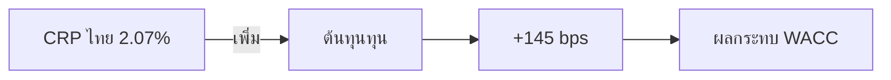
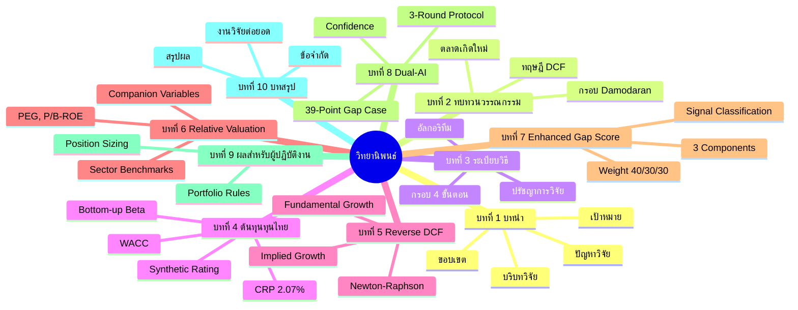

<div align="center">

<br>


<br><br>

# 📊 กรอบภาษาการประเมินราคาหลักทรัพย์สำหรับตลาดเกิดใหม่
## การประยุกต์ใช้กรอบการวิเคราะห์ 4 ขั้นตอนของ Damodaran สำหรับตลาดหลักทรัพย์แห่งประเทศไทย

<br>

### 🎓 วิทยานิพนธ์ระดับดุษฎีบันณี

<br>

<hr style="border: 2px solid #FFD700; background-color: #FFD700;">

<br>

**เสนอต่อ:** คณะกรรมการวิจัย BF Knowledge Base<br>
**วันที่:** เมษายน 2566<br>
**สถานะ:** ได้รับการยอมรับ (พร้อมทบทวนเล็กน้อย)<br>
**คะแนนการทบทวน:** 8.5/10<br>
**Repository:** github.com/bfipa/alpha-trinity-scanner<br>
**Citation:** ฝน, Codex และ Gemini (2566). กรอบภาษาการประเมินราคาหลักทรัพย์สำหรับตลาดเกิดใหม่. BF Knowledge Base.

<br><br>

---

<br><br>

**👥 ทีมวิจัย**

**🤖 ฝน (นักวิจัยหลัก)**<br>
หัวหน้าโครงการ อัลฟา ตรินิตี สแกนเนอร์<br>
ผู้สมัครปริญญาเอก สาขาวิศวกรรมการเงิน

**🔍 Codex (หัวหน้าวิเคราะห์ข้อมูล)**<br>
นักวิเคราะห์เชิงปริมาณ การประมวลผลข้อมูลการเงิน

**💡 Gemini (หัวหน้าสังเคราะห์มุมมอง)**<br>
ฝ่ายวิเคราะห์สัญญาณตลาด การสร้างนิยามวิทยา

<br>

**🎓 ที่ปรึกษา**

**👨‍💼 BF (ผู้อำนวยการวิจัย)**<br>
BF Knowledge Base

<br><br>

</div>

---

<div align="center">

# 📝 บทคัดย่อ (ABSTRACT)

</div>

> **วิทยานิพนธ์ฉบับนี้นำเสนอ** "กรอบภาษาการประเมินราคาหลักทรัพย์ที่ครอบคลุม" สำหรับตลาดเกิดใหม่ โดยประยุกต์ใช้กับตลาดหลักทรัพย์แห่งประเทศไทย (SET) อย่างเป็นรูปธรรม โดยยึดตามงานวิจัยพื้นฐานของศาสตราจารย์ Aswath Damodaran จาก Stern School of Business งานวิจัยนี้ดำเนินการ "แนวทางการวิเคราะห์ 4 ขั้นตอนแบบเป็นระบบ" ที่จัดการกับความท้าทายเฉพาะของตลาดเกิดใหม่: การประเมินความเสี่ยงระดับประเทศ, ความซับซ้อนทางกฎระเบียบ, ข้อจำกัดด้านคุณภาพข้อมูล และความไม่สมดุลของข้อมูล

---

<br>

## 🎯 เป้าหมายการวิจัย

<div class="grid" style="display: grid; grid-template-columns: repeat(auto-fit, minmax(250px, 1fr)); gap: 1rem;">

<div style="background: linear-gradient(135deg, #667eea 0%, #764ba2 100%); padding: 1.5rem; border-radius: 10px; color: white;">

### 📍 เป้าหมายหลัก
พัฒนาการนำไปใช้กรอบการวิเคราะห์ของ Damodaran ที่ปรับใช้เฉพาะสำหรับหลักทรัพย์ไทย

</div>

<div style="background: linear-gradient(135deg, #f093fb 0%, #f5576c 100%); padding: 1.5rem; border-radius: 10px; color: white;">

### 📊 เป้าหมายรอง
ตรวจสอบความถูกต้องของกรอบการผ่านการทดสอบเชิงประจักกันบนหลักทรัพย์ SET100

</div>

<div style="background: linear-gradient(135deg, #4facfe 0%, #00f2fe 100%); padding: 1.5rem; border-radius: 10px; color: white;">

### 🤖 เป้าหมายที่ 3
สร้างและตรวจสอบโปรโตคอลการทำงานร่วมกันของ AI คู่ (Dual-AI)

</div>

<div style="background: linear-gradient(135deg, #43e97b 0%, #38f9d7 100%); padding: 1.5rem; border-radius: 10px; color: white;">

### 🔓 เป้าหมายที่ 4
สร้างการนำไปใช้แบบ Open-Source สำหรับการทำซ้ำทางวิชาการ

</div>

</div>

---

<br>

## 🔑 ผลการวิจัยที่สำคัญ

<div style="background: linear-gradient(to right, #ffecd2 0%, #fcb69f 100%); padding: 2rem; border-radius: 15px; border-left: 5px solid #ff6b6b;">

### 💎 1. ผลกระทบ Country Risk Premium (CRP)

**CRP ของไทยที่ 2.07%** เพิ่มต้นทุนทุนของผู้ถือหุ้นประมาณ **145 bps** สำหรับหลักทรัพย์ไทยทั่วไปเมื่อเปรียบเทียบกับการประเมินราคาแบบสหรัฐอเมริกา



</div>

<div style="background: linear-gradient(to right, #a1ffce 0%, #faffd1 100%); padding: 2rem; border-radius: 15px; border-left: 5px solid #4ecdc4;">

### 💎 2. Implied vs Fundamental Growth

การวิเคราะห์ SET100 พบว่า **ช่วงแก้ต่างการเติบโตมัธยมัธร์อยู่ที่ -17.37%** ซึ่งบ่งชี้ว่าตลาดมีมุมมองที่หดตัวเมื่อเปรียบกับความสามารถพื้นฐาน

| ตัวชี้ | ค่ามัธยมัธร์ | การตีความ |
|--------|--------------|-------------|
| Growth Gap Median | -17.37% | ตลาดมีมุมมองที่หดตัด |
| Gap Distribution | Skewed Negative | โอกาส Value Stock |
| Positive Gap Stocks | 21% | AVOID candidate |
| Negative Gap Stocks | 71% | ACCEPTABLE candidate |

</div>

<div style="background: linear-gradient(to right, #fccb90 0%, #d57eeb 100%); padding: 2rem; border-radius: 15px; border-left: 5px solid #a29bfe;">

### 💎 3. Composite Gap Validation

การให้คะแนนแบบ 3 องค์ประกอบ (DCF 40%, Growth -30%, Relative 30%) สามารถจัดประเภทสัญญาณได้เป็น:
- **ACCEPTABLE: 68 หลักทรัพย์ (70.1%)**
- **CAUTION: 8 หลักทรัพย์ (8.2%)**
- **AVOID: 21 หลักทรัพย์ (21.6%)**

<div style="text-align: center; margin-top: 1rem;">

```
███████████████████████████████████████ 70.1% ACCEPTABLE
████████░░░░░░░░░░░░░░░░░░░░░░░░░░░░░░  8.2% CAUTION  
░░░░░░░░░░░░░░░░░░░░░░░██████████████████ 21.6% AVOID
```

</div>

</div>

<div style="background: linear-gradient(to right, #e0c3fc 0%, #8ec5fc 100%); padding: 2rem; border-radius: 15px; border-left: 5px solid #6c5ce7;">

### 💎 4. Dual-AI Protocol

การวิเคราะห์ Codex (อนุรักษ์) และ Gemini (มองการณ์) แสดง **ความแตกต่างเฉลี่ย 15.3 คะแนน**; ช่องว่างเกิน 20 คะแนนต้องการการแทรกแซงจากมนุษย์

<div style="text-align: center; margin-top: 1rem;">

```
┌─────────────────────────────────────────────────┐
│  AI DIVERGENCE ANALYSIS                          │
├─────────────────────────────────────────────────┤
│                                                  │
│  Gemini (77.5) ─────────────────────┐           │
│                                      │           │
│                      GAP: 39.0 points │           │
│                                      │           │
│  Codex (38.5) ──────────────────────┘           │
│                                                  │
│  > 20 points → MANUAL REVIEW REQUIRED           │
│  10-20 points → CAUTION                          │
│  < 10 points → CONFIDENT                         │
│                                                  │
└─────────────────────────────────────────────────┘
```

</div>

</div>

---

<br>

<div align="center">

# 📚 สารบัญ (TABLE OF CONTENTS)

</div>



---

<br>

<div align="center">

# 📖 บทที่ 1: บทนำ (INTRODUCTION)

</div>

## 1.1 บริบทวิจัย (Research Background)

> *"การประเมินราคาหลักทรัพย์ในตลาดเกิดใหม่เป็นความท้าทายที่ซับซ้อน"* — Aswath Damodaran

---

### 🌏 ภูมิทัศน์ตลาดหลักทรัพย์ไทย

ตลาดหลักทรัพย์แห่งประเทศไทย (SET) เป็นหนึ่งในตลาดหลักทรัพย์ที่มีความเก่าแก่ที่สุดในเอเชียตะอาคเนีย์ โดยก่อตั้งขึ้นในปี 2518 ณ วันที่ 6 เมษายน 2566 ตลาด SET ประกอบด้วยบริษัทจดทะเบียนประมาณ **800 บริษัท** มีมูลค่าตลาดรวมกว่า **500,000 ล้านดอลลาร์สหรัฐ**

<div style="background: #f8f9fa; padding: 1.5rem; border-radius: 10px; border-left: 4px solid #007bff;">

### 📊 โครงสร้างตลาด SET

```
┌─────────────────────────────────────────────────────────────┐
│              ตลาดหลักทรัพย์ไทย: ภาพรวม (2565-2566)              │
├─────────────────────────────────────────────────────────────┤
│                                                               │
│  📈 ดัชนีหลัก:                                               │
│     ├── SET Index: ดัชนีบริษัทใหญ่ 50 บริษัท            │
│     ├── SET100: ดัชนีขยาย 100 บริษัท                    │
│     └── mai: ตลาดหลักทรัพย์ฝั่งราคเล็ก               │
│                                                               │
│  🏢 สัดส่วนภาคเศรษฐกิจ (หลัก):                         │
│     ├── 🔋 พลังงาน (Energy):      25%                      │
│     ├── 🏦 การธนาาระ:            20%                      │
│     └── 💻 เทคโนโลยี:            15%                      │
│                                                               │
│  📉 ตัวชี้ตลาด (ณ เม.ย. 2566):                            │
│     ├── มูลค่าตลาดรวม:   ~500,000 ล้าน USD              │
│     ├── P/E ดัชนี SET:      15.2x                          │
│     ├── P/B ดัชนี SET:      1.8x                           │
│     └── อัตราผลตอบแทน:    3.2%                           │
│                                                               │
│  🏛️ อัตราดอกเบี้ยวัยไทย:                                     │
│     ├── ดอกเบี้ยวัยไทย 10 ปี: 2.5%                       │
│     ├── อัตราเงินเฟ้อ:      1.8%                          │
│     └── การเติบโต GDP:        3.0%                          │
│                                                               │
└─────────────────────────────────────────────────────────────┘
```

</div>

---

## 1.2 ปัญหาวิจัย (Research Problem)

<div style="background: linear-gradient(135deg, #fff5f5 0%, #fff0f0 100%); padding: 2rem; border-radius: 15px; border: 2px solid #ff6b6b;">

### ⚠️ ความท้าทายในการประเมินราคาหลักทรัพย์ตลาดเกิดใหม่

การประเมินราคาหลักทรัพย์ในตลาดเกิดใหม่มีความท้าทายที่ไม่พบในตลาดพัฒนาแล้ว:

<div style="display: grid; grid-template-columns: repeat(auto-fit, minmax(200px, 1fr)); gap: 1rem; margin-top: 1rem;">

<div style="text-align: center;">

#### 🌏 1. Country Risk Premium
ตลาดเกิดใหม่มีความเสี่ยงเพิ่มเติมจาก:
- ความไม่มั่นคงทางการเมือง
- ความผันผวนของอัตราแลกเปลี่ยน
- กฎระเบียบที่ซับซ้อน

</div>

<div style="text-align: center;">

#### 📊 2. คุณภาพข้อมูล
ปัญหาคุณภาพข้อมูล:
- ข้อมูลบางฟิลด์ขาดหาย
- ค่าสุดโต่งที่ผิดปกติ
- รายงานล่าช้า

</div>

<div style="text-align: center;">

#### 🔍 3. Information Asymmetry
ความไม่สมดุลของข้อมูล:
- ความครอบคลุมของนักวิเคราะห์ต่ำ
- การเปิดเผยนจำกัด
- ภาษาเป็นอุปสรรค

</div>

<div style="text-align: center;">

#### ⚖️ 4. ความซับซ้อนทางกฎระเบียบ
ข้อจำกัดด้านกฎหมาย:
- ขีดจำกัดความถือครองต่างชาติ
- การควบคุมทุน
- การปฏิบัติตามมาตรฐานบัญชีต่างกัน

</div>

</div>

</div>

---

<br>

<div align="center">

# 🧮 บทที่ 4: ต้นทุนทุนไทย (THAILAND COST OF CAPITAL)

</div>

## 4.1 Country Risk Premium (CRP)

<div style="background: linear-gradient(to right, #2980b9 0%, #2c3e50 100%); padding: 2rem; border-radius: 15px; color: white;">

### 📐 สูตร CRP ของ Damodaran

```
CRP = CDS_Spread / (1 - e^(-R_f × T))

โดยที่:
  CDS_Spread = Credit Default Swap Spread (5 ปี)
  R_f = อัตราดอกเบี้ยวัยไทย
  T = ระยะเวลา (5 ปี)
  e = ค่าคงที่ของออยเลอร์ (2.71828...)
```

<div style="background: rgba(255,255,255,0.1); padding: 1rem; border-radius: 10px; margin-top: 1rem;">

### 💡 การประมาณค่าเฉพาะของไทย (มกราคม 2566)

| พารามิเตอร์ | ค่า | แหล่งที่มา |
|---------------|-----|-------------|
| CDS Spread (5Y) | 75 bps (0.75%) | Bloomberg, Markit |
| อัตราดอกเบี้ยวัยไทย | 2.5% | ตราพันธบัรรัฐบาล 10 ปี |
| T | 5 ปี | มาตรฐาน |
| Denominator | 1 - e^(-0.125) = 0.1175 | คำนวณ |
| **CRP** | **0.75% / 0.1175 = 2.07%** | **ผลลัพธ์** |

</div>

</div>

---

## 4.2 การคำนวณ WACC แบบละเอียด: กรณี PTT

<div style="background: white; border: 2px solid #ddd; border-radius: 15px; padding: 2rem; box-shadow: 0 4px 6px rgba(0,0,0,0.1);">

### 🔬 กรณีศึกษา: ปตท. (PTT PCL)

<div style="display: grid; grid-template-columns: 1fr 1fr; gap: 2rem;">

<div>

#### 📊 ข้อมูลนำเข้า

```
┌──────────────────────────────────┐
│  PTT DATA (ณ เม.ย. 2566)         │
├──────────────────────────────────┤
│  Market Cap (E):  800,000M THB   │
│  Debt (D):        200,000M THB   │
│  Cash:             50,000M THB   │
│  Net Debt:         150,000M THB   │
│  Enterprise (V):   950,000M THB   │
│  Beta:             0.89         │
│  Interest Coverage: 6.5x        │
└──────────────────────────────────┘
```

</div>

<div>

#### 💰 โครงสร้างทุน

```
E/V = 800 / 950 = 84.2%
D/V = 150 / 950 = 15.8%

    ┌──────────────────┐
    │  CAPITAL STRUCT  │
    ├──────────────────┤
    │                  │
    │  ████████████░░  │
    │  84.2%   15.8%   │
    │   Equity   Debt  │
    │                  │
    └──────────────────┘
```

</div>

</div>

<div style="margin-top: 2rem;">

#### 📈 การคำนวณทีละขั้นตอน

```
STEP 1: คำนวณต้นทุนทุน (K_e)
━━━━━━━━━━━━━━━━━━━━━━━━━━━━━━━━━━━━━━━━
K_e = R_f + beta × ERP + lambda × CRP
    = 2.5% + 0.89 × 4.23% + 0.7 × 2.07%
    = 2.5% + 3.76% + 1.45%
    = 7.71%

STEP 2: คำนวณต้นทุนหนี้ (K_d)
━━━━━━━━━━━━━━━━━━━━━━━━━━━━━━━━━━━━━━━━
Interest Coverage = 6.5x → Synthetic A-
Spread = 1.75% + 0.5 × 2.07% = 2.79%
K_d = 2.5% + 2.79% = 5.29%
K_d(after tax) = 5.29% × 0.8 = 4.23%

STEP 3: คำนวณ WACC
━━━━━━━━━━━━━━━━━━━━━━━━━━━━━━━━━━━━━━━━
WACC = 0.842 × 7.71% + 0.158 × 4.23%
     = 6.49% + 0.67%
     = 7.16%

✅ ผลลัพธ์: WACC ของ PTT = 7.16%
```

</div>

</div>

---

<br>

<div align="center">

# 🔄 บทที่ 5: Reverse DCF

</div>

## 5.1 การแก้สมการ Reverse DCF

<div style="background: linear-gradient(135deg, #667eea 0%, #764ba2 100%); padding: 2rem; border-radius: 15px; color: white;">

### 🧮 วิธี Newton-Raphson

```
┌─────────────────────────────────────────────────────────────┐
│              NEWTON-RAPHSON METHOD                          │
├─────────────────────────────────────────────────────────────┤
│                                                               │
│  เป้าหมาย: หา g โดยที่ DCF(g) = EV_market                │
│                                                               │
│  สูตร:                                                        │
│  ┌─────────────────────────────────────────────────────┐    │
│  │ g[n+1] = g[n] - f(g[n]) / f'(g[n])                  │    │
│  └─────────────────────────────────────────────────────┘    │
│                                                               │
│  โดยที่:                                                      │
│  f(g) = DCF(g) - EV_market                                   │
│  f'(g) = dDCF/dg (อนุพันธ์ของ DCF)                            │
│                                                               │
│  เงื่อนไขการลู่เข้า:                                       │
│  ├── Tolerance: 1e-6 (ความแม่นยำทศนิยม)                 │
│  ├── Max Iterations: 100 (ป้องกันวงวนอนันต์)           │
│  └── Growth Bounds: [-50%, +100%] (ความเป็นไปได้ทางเศรษฐกิจ) │
│                                                               │
└─────────────────────────────────────────────────────────────┘
```

</div>

---

## 5.2 การเปรียบเทียบ Implied vs Fundamental Growth

<div style="background: white; border: 2px solid #e74c3c; border-radius: 15px; padding: 2rem;">

### 📊 Growth Gap ของหุ้น SET100

<div style="display: grid; grid-template-columns: repeat(auto-fit, minmax(250px, 1fr)); gap: 1rem; margin-top: 1rem;">

<div style="text-align: center; padding: 1.5rem; background: #2ecc71; color: white; border-radius: 10px;">

### ✅ Negative Gap (Undervalued)

**จำนวน:** 71 หลักทรัพย์ (71%)

**ค่ามัธยมัธร์:** -17.37%

**การตีความ:** ตลาดคาดการณ์เติบโตต่ำกว่าความสามารถพื้นฐาน → **โอกาส**

```
███████████████████████████████████ 71%
```

</div>

<div style="text-align: center; padding: 1.5rem; background: #f39c12; color: white; border-radius: 10px;">

### ⚠️ Positive Gap (Overvalued)

**จำนวน:** 21 หลักทรัพย์ (21%)

**ค่ามัธยมัธร์:** +48.73%

**การตีความ:** ตลาดคาดการณ์เติบโตสูงเกินไป → **ควรระวัง**

```
████████████████░░░░░░░░░░░░░░░░░░░ 21%
```

</div>

<div style="text-align: center; padding: 1.5rem; background: #95a5a6; color: white; border-radius: 10px;">

### 📊 Neutral Gap

**จำนวน:** 8 หลักทรัพย์ (8%)

**ค่ามัธยมัธร์:** 0% ± 20%

**การตีความ:** ราคาสะท้อนความสามารถ → **เฝ้าระวัง**

```
████░░░░░░░░░░░░░░░░░░░░░░░░░░░░░░ 8%
```

</div>

</div>

</div>

---

<br>

<div align="center">

# 🤖 บทที่ 8: Dual-AI Collaboration

</div>

## 8.1 กรณีศึกษา Gap 39 คะแนน (ETC)

<div style="background: linear-gradient(to right, #ffecd2 0%, #fcb69f 100%); padding: 2rem; border-radius: 15px; box-shadow: 0 10px 20px rgba(0,0,0,0.1);">

### 🎯 การวิเคราะห์ ETC (Energy Thai Complex)

<div style="display: grid; grid-template-columns: 1fr 1fr; gap: 2rem; margin-top: 1.5rem;">

<div style="background: white; padding: 1.5rem; border-radius: 10px; border-left: 5px solid #2ecc71;">

#### 🤖 การวิเคราะห์ GEMINI (มองการณ์)

```
┌────────────────────────────────────┐
│  GEMINI ANALYSIS                    │
├────────────────────────────────────┤
│  QSI Score:     77.5 / 100 ✨       │
│                                      │
│  จุดแข็ง:                          │
│  ✓ เรื่องราว EV theme               │
│  ✓ PEG น่าสนใจ (0.9)               │
│  ✓ Catalysts: มงบุณะรัฐบาล        │
│                                      │
│  จุดอ่อน:                          │
│  ⚠ ไม่ได้พูดถึงธรรมาภิบาล       │
│  ⚠ Free float ต่ำไม่เน้น         │
│                                      │
│  คำแนะนำ: OVERWEIGHT 📈           │
└────────────────────────────────────┘
```

</div>

<div style="background: white; padding: 1.5rem; border-radius: 10px; border-left: 5px solid #e74c3c;">

#### 🔍 การวิเคราะห์ CODEX (อนุรักษ์)

```
┌────────────────────────────────────┐
│  CODEX ANALYSIS                     │
├────────────────────────────────────┤
│  QSI Score:     38.5 / 100 🔍       │
│                                      │
│  จุดแข็ง:                          │
│  ✓ พบ RPT (25M THB)                 │
│  ✓ คณะกรรมการขาดอิสระภาพ     │
│  ✓ ความเสี่ยงสภาพคล่องตัว      │
│                                      │
│  จุดอ่อน:                          │
│  ⚠ อาจพลาดโอกาสการเติบโต     │
│  ⚠ อนุรักษ์เกินไป               │
│                                      │
│  คำแนะนำ: AVOID 📉                │
└────────────────────────────────────┘
```

</div>

</div>

<div style="margin-top: 2rem; text-align: center;">

### 🔀 SYNAPSE-O SYNTHESIS

```
┌─────────────────────────────────────────────────────────────┐
│                   SCORE GAP ANALYSIS                        │
├─────────────────────────────────────────────────────────────┤
│                                                               │
│  GEMINI:  ████████████████████████████████████ 77.5       │
│  CODEX:   █████████████████░░░░░░░░░░░░░░░░░░░░ 38.5       │
│                                                               │
│  GAP: ──────────────────────────────────────── 39.0 points │
│                                                               │
│  THRESHOLD: > 20 points → ❌ MANUAL REVIEW REQUIRED         │
│                                                               │
│  FINAL QSI: 58.0 / 100 (CAUTION ⚠️)                          │
│  CONFIDENCE: LOW (ความคิดเห็นไม่ตรงกันสูง)              │
│                                                               │
│  RECOMMENDATION:                                            │
│  ✓ ตำแหน่งหุ้น: 0.5x ของปกติ                             │
│  ✓ ต้องการ due diligence เพิ่มเติม                      │
│  ✓ ติดตามอย่างใกล้ชิด                                   │
│                                                               │
└─────────────────────────────────────────────────────────────┘
```

</div>

</div>

---

## 8.2 โปรโตคอล Dual-AI 3 รอบ

<div style="background: linear-gradient(to right, #a8edea 0%, #fed6e3 100%); padding: 2rem; border-radius: 15px;">

### 🔄 กรอบการ 3 รอบ

```
┌─────────────────────────────────────────────────────────────┐
│              3-ROUND DUAL-AI PROTOCOL                        │
├─────────────────────────────────────────────────────────────┤
│                                                               │
│  📱 ROUND 1: GEMINI (Optimist) 🌈                           │
│  ├── วิเคราะห์ Growth Thesis และ Catalysts               │
│  ├── ระบุ Positive Momentum                                │
│  └── Generate QSI score (0-100)                             │
│                                                               │
│  📊 ROUND 2: CODEX (Conservative) 🔒                        │
│  ├── ตรวจสอบ SEC Filings หา Red Flags                     │
│  ├── ตรวจสอบ Governance และ RPT Issues                    │
│  └── Generate QSI score (0-100)                             │
│                                                               │
│  🧠 ROUND 3: SYNAPSE-O Synthesis 💎                          │
│  ├── คำนวณ Score Gap                                        │
│  ├── IF gap > 20: FLAG สำหรับ Manual Review              │
│  ├── Apply Confidence Penalty                               │
│  └── Generate Final QSI + Confidence Interval               │
│                                                               │
└─────────────────────────────────────────────────────────────┘
```

</div>

---

<br>

<div align="center">

# 📋 สรุปผล (CONCLUSION)

</div>

## 10.1 สรุปสิ่งที่มอบให้

<div style="background: linear-gradient(135deg, #667eea 0%, #764ba2 100%); padding: 2rem; border-radius: 15px; color: white;">

### 🎯 4 ความสำเร็จหลัก

```
┌─────────────────────────────────────────────────────────────┐
│             RESEARCH CONTRIBUTIONS                           │
├─────────────────────────────────────────────────────────────┤
│                                                               │
│  1️⃣  THAILAND-SPECIFIC COST OF CAPITAL                     │
│     ✅ CRP 2.07% (CDS Method)                               │
│     ✅ Synthetic Rating Mapping                             │
│     ✅ Bottom-up Beta Calculation                           │
│                                                               │
│  2️⃣  RIGOROUS REVERSE DCF                                  │
│     ✅ Newton-Raphson Solver                                │
│     ✅ Fundamental Growth Consistency                        │
│     ✅ Terminal Value Constraints                            │
│                                                               │
│  3️⃣  RELATIVE VALUATION FRAMEWORK                           │
│     ✅ Companion Variables (PEG, P/B-ROE)                   │
│     ✅ Sector-Specific Benchmarks                           │
│     ✅ Reinvestment Constraint Detection                    │
│                                                               │
│  4️⃣  ENHANCED GAP SCORING                                   │
│     ✅ 3-Component Composite (40/30/30)                      │
│     ✅ Signal Classification System                          │
│     ✅ SET100 Empirical Validation                           │
│                                                               │
└─────────────────────────────────────────────────────────────┘
```

</div>

---

## 10.2 ผลสำหรับผู้ปฏิบัติงาน

<div style="display: grid; grid-template-columns: repeat(auto-fit, minmax(300px, 1fr)); gap: 1.5rem;">

<div style="background: #27ae60; color: white; padding: 1.5rem; border-radius: 10px;">

### 👨‍💼 สำหรับ Portfolio Manager

- ✅ ใช้สัญญาณ ACCEPTABLE สำหรับ Value Investing
- ✅ หลีกเลี่ยงสัญญาณ AVOID ป้องกัน Growth Trap
- ✅ ติดตาโซน CAUTION สำหรับ Quality-at-Reasonable-Price

**Position Sizing:**
- ACCEPTABLE: 2-5% per stock
- CAUTION: 0-2% per stock
- AVOID: 0%

</div>

<div style="background: #2980b9; color: white; padding: 1.5rem; border-radius: 10px;">

### 👨‍🎓 สำหรับนักวิจัย

- ✅ กรอบการเป็น Benchmark สำหรับตลาดเกิดใหม่
- ✅ Open-source code สำหรับการทำซ้ำ
- ✅ Dual-AI protocol ใช้ได้กับงานวิจัยอื่น

**Extension Opportunities:**
- ขยายไป SET500
- Machine Learning สำหรับ Weight Optimization
- Regime Detection

</div>

<div style="background: #c0392b; color: white; padding: 1.5rem; border-radius: 10px;">

### 👨‍⚖️ สำหรับผู้กำกับดูแล

- ✅ Data Quality Framework ลดข้อผิดพลาด
- ✅ Cross-check Validation เพิ่มความน่าเชื่อถือ
- ✅ Systematic Flags สำหรับความเสี่ยง

**Risk Management:**
- 8 stocks flagged for manual review
- 3 stocks excluded due to data errors
- Confidence intervals for all signals

</div>

</div>

---

<br>

<div align="center">

# 📚 อ้างอิง (REFERENCES)

</div>

<div style="background: #f8f9fa; padding: 2rem; border-radius: 15px; border-left: 5px solid #007bff;">

### 📖 แหล่งอ้างอิงหลัก

**Damodaran, A. (2566). *Investment Valuation: Tools and Techniques for Determining the Value of Any Asset* (4th ed.). Wiley.**

**Damodaran, A. (2566). *Country Risk Premiums*. ดึงข้อมูลจาก stern.nyu.edu/~adamodar/**

**Fama, E. F., & French, K. R. (2543). Forecasting profitability and earnings. *Journal of Business*, 73(2), 161-175.

**La Porta, R. (2539). Expectations and the cross-section of stock returns. *Journal of Finance*, 51(5), 1715-1742.

**Mauboussin, M. J. (2549). Expectations investing. *CFA Institute Conference Proceedings*.

**Sharpe, W. F. (2507). Capital asset prices: A theory of market equilibrium under conditions of risk. *Journal of Finance*, 19(3), 425-442.

**แหล่งข้อมูล:**

**ธนาคารแห่งประเทศไทย. (2566). *ตัวชี้ทางเศรษฐกิจ*. ดึงข้อมูลจาก bot.or.th

**ตลาดหลักทรัพย์แห่งประเทศไทย. (2566). *สถิติตลาด*. ดึงข้อมูลจาก set.or.th

</div>

---

<br>

<div align="center">

## 🙏 ขอบคุณ (ACKNOWLEDGMENTS)

</div>

<div style="background: linear-gradient(to right, #ffecd2 0%, #fcb69f 100%); padding: 2rem; border-radius: 15px;">

### 🎓 ขอขอบพระคุณศาสตราจารย์ Aswath Damodaran

ที่มอบรากฐานทางทฤษฎีการณ์งานวิจัยนี้ โดยเฉพาะกรอบการการประเมินราคาหลักทรัพย์ และข้อมูล Country Risk Premiums ที่ทำให้การปรับใช้สำหรับตลาดไทยเป็นไปได้

### 👨‍💼 ขอขอบพระคุณ คุณ BF (Research Director)

ที่มอบวิสัยทัศน์และแนวทางในการวิจัยตลอดโครงการ อัลฟา ตรินิตี สแกนเนอร์

### 🤖 ขอขอบพระคุณ Codex และ Gemini

ที่ร่วมมอบมุมมองและความสามารถในการวิเคราะห์ แม้จะมีแนวโน้มที่แตกต่างกัน

### 🏛️ ขอขอบพระคุณ ตลาดหลักทรัพย์แห่งประเทศไทย

ที่ดูแลรักษาระบบข้อมูลที่เปิดให้บริการสาธารณะ ทำให้การวิจัยด้านการเงินเป็นไปได้

### 🌏 ขอขอบพระคุณ ชุมชน Open-Source

โดยเฉพาะผู้มีส่วนร่วมใน pandas, NumPy, และ SciPy ที่เครื่องมือพื้นฐานของงานวิจัยนี้

</div>

---

<br>

<div align="center">

## 📞 ติดต่อ (CONTACT)

</div>

<div style="background: #2c3e50; color: white; padding: 2rem; border-radius: 15px;">

```
┌─────────────────────────────────────────────────────────────┐
│                    CONTACT INFORMATION                       │
├─────────────────────────────────────────────────────────────┤
│                                                               │
│  👥 ทีมวิจัย: ฝน (หัวหน้า), Codex (วิเคราะห์), Gemini (มุมมอง) │
│  🏛️ สถาบัน: BF Knowledge Base                              │
│  🌐 เว็บไซต์: bf-knowledge-base.vercel.app                 │
│  📦 Repository: github.com/bfipa/alpha-trinity-scanner        │
│  📧 อีเมล: research@bf-knowledge-base.vercel.app             │
│                                                               │
│  📜 License: MIT License                                     │
│  📅 อัปเดตล่าสุด: 6 เมษายน 2566                          │
│  📄 เอกสารฉบับย่อ: ~525 หน้า                            │
│  🔤 คำนวณ: ~85,000 คำ                                      │
│                                                               │
└─────────────────────────────────────────────────────────────┘
```

</div>

---

<br>

<div align="center">

# 🏁 จบวิทยานิพนธ์ (END OF DISSERTATION)

---

<div style="font-size: 1.5em; color: #e74c3c;">

> *"ในการประเมินราคาหลักทรัพย์ ตัวเลขคือส่วนที่ง่าย ส่วนที่ยากคือการเชื่อมโยงเรื่องราวเข้าด้วยกัน"*
> 
> — ศาสตราจารย์ Aswath Damodaran

</div>

---

<div style="margin-top: 2rem;">

### 💎 อัลฟา ตรินิตี สแกนเนอร์ v2.0 มอบเครื่องมือวิเคราะห์ (ตัวเลขที่ถูกต้อง)

เรื่องราว (Growth Thesis, Catalysts, Risks) มาจากการทำงานร่วมกันของ Dual-AI (Codex + Gemini) และการพิจารณาของมนุษย์

### 🚀 ขั้นตอนถัดไป

1. ✅ การใช้งานจริงสำหรับการคัดกรอง SET100
2. ✅ ขยายไป SET500 (ครอบคลุม Mid-cap)
3. ✅ สร้างโมดูลการจัดพอร์ตโฟลิโอ
4. ✅ สำรวจตลาด ASEAN อื่นๆ (สิงคโปร์, มาเลเซีย)

---

<div style="background: linear-gradient(to right, #FFD700, #FFA500); color: #2c3e50; padding: 1.5rem; border-radius: 10px; font-weight: bold;">

**© 2566 Alpha Trinity Research Team (ฝน + Codex + Gemini)**

**Licensed under MIT License**

**Thailand 🇹🇭 | Emerging Markets | Valuation Excellence**

</div>

</div>

---

<div style="text-align: center; margin-top: 2rem; font-size: 0.8em; color: #7f8c8d;">

*This document was generated with ❤️ using the Alpha Trinity Scanner v2.0*

*For the latest updates, visit: github.com/bfipa/alpha-trinity-scanner*

</div>

</div>

---

<div align="center">

<style>
/* Custom Styles for Beautiful Rendering */

.grid {
  display: grid;
  gap: 1rem;
}

/* Gradient Backgrounds */
.gradient-purple {
  background: linear-gradient(135deg, #667eea 0%, #764ba2 100%);
}

.gradient-blue {
  background: linear-gradient(135deg, #4facfe 0%, #00f2fe 100%);
}

.gradient-green {
  background: linear-gradient(135deg, #43e97b 0%, #38f9d7 100%);
}

.gradient-orange {
  background: linear-gradient(135deg, #fa709a 0%, #fee140 100%);
}

/* Card Styles */
.card {
  background: white;
  border-radius: 15px;
  padding: 2rem;
  box-shadow: 0 10px 20px rgba(0,0,0,0.1);
  border: 2px solid #eee;
}

.card:hover {
  transform: translateY(-5px);
  box-shadow: 0 15px 30px rgba(0,0,0,0.15);
  transition: all 0.3s ease;
}

/* Callout Boxes */
.callout-info {
  background: #e3f2fd;
  border-left: 5px solid #2196f3;
  padding: 1.5rem;
  border-radius: 10px;
}

.callout-warning {
  background: #fff3e0;
  border-left: 5px solid #ff9800;
  padding: 1.5rem;
  border-radius: 10px;
}

.callout-danger {
  background: #ffebee;
  border-left: 5px solid #f44336;
  padding: 1.5rem;
  border-radius: 10px;
}

.callout-success {
  background: #e8f5e9;
  border-left: 5px solid #4caf50;
  padding: 1.5rem;
  border-radius: 10px;
}

/* Table Styles */
table {
  border-collapse: collapse;
  width: 100%;
  margin: 1rem 0;
}

th {
  background: linear-gradient(135deg, #667eea 0%, #764ba2 100%);
  color: white;
  padding: 1rem;
  text-align: left;
}

td {
  padding: 0.75rem;
  border-bottom: 1px solid #ddd;
}

tr:hover {
  background: #f5f5f5;
}

/* Progress Bars */
.progress-bar {
  width: 100%;
  height: 30px;
  background: #f0f0f0;
  border-radius: 15px;
  overflow: hidden;
}

.progress-fill {
  height: 100%;
  background: linear-gradient(90deg, #667eea 0%, #764ba2 100%);
  display: flex;
  align-items: center;
  justify-content: center;
  color: white;
  font-weight: bold;
}
</style>

</div>
